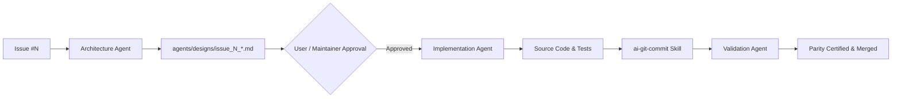

# MotionCorr Multi-Agent Development Guidelines

This project employs a multi-agent engineering workflow to safely extract, optimize, and modernize the standalone RELION motion correction engine while maintaining bit-exact numerical parity against RELION 5.1 (`commit ad0b230`).

---

## 1. Agent Roles & Responsibilities

1. **Architecture Agent (`agents/architecture_agent/`)**:
   - **Mandate**: Must be consulted for any non-trivial issue before code changes are made.
   - **Deliverable**: Architectural Decision Record / Design Specification in `agents/designs/issue_<NUM>_<slug>.md`.
   - **Key Focus**: Mathematical formulation, numerical tolerance tiers, memory staging budgets, interface contracts, and failure fallbacks.
   - **System Prompt**: [`agents/architecture_agent/SYSTEM_PROMPT.md`](agents/architecture_agent/SYSTEM_PROMPT.md)

2. **Implementation Agent**:
   - **Mandate**: Executes changes strictly according to the approved Architectural Design Specification.
   - **Deliverable**: Modular C++17, CUDA, Python, or CMake code changes with unit test fixtures.
   - **Tooling**: Uses [`skills/ai-git-commit/`](skills/ai-git-commit/SKILL.md) for clean, traceable commits.

3. **Validation & Parity Agent**:
   - **Mandate**: Executes verification against the reference outputs defined in Issue #4.
   - **Deliverable**: Parity reports certifying compliance with Tier 0 (exact CPU), Tier 1 (multithreaded CPU), or Tier 2 (accelerated backend).

---

## 2. Standard Issue Lifecycle

---

## 3. Tooling & Skills Reference

- **Design Scaffolding**: `python agents/architecture_agent/scripts/design_issue.py --issue <NUM>`
- **Automated AI Commits**: `python skills/ai-git-commit/scripts/ai_commit.py`
- **Issue Parser**: `python skills/github-issues-parser/scripts/parse_issues.py`
