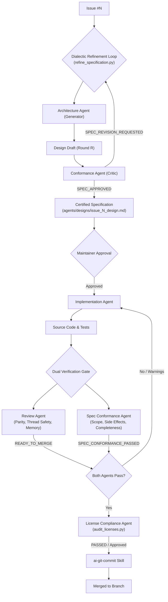

# MotionCorr Multi-Agent Development Guidelines

This project employs a multi-agent engineering workflow to safely extract, optimize, and modernize the standalone RELION motion correction engine while maintaining bit-exact numerical parity against RELION 5.1 (`commit ad0b230`).

---

## 1. Agent Roles & Responsibilities

1. **Architecture Agent (`agents/architecture_agent/`)**:
   - **Mandate**: Must be consulted for any non-trivial issue before code changes are made.
   - **Deliverable**: Architectural Decision Record / Design Specification in `agents/designs/issue_<NUM>_<slug>.md`.
   - **Key Focus**: Mathematical formulation, numerical tolerance tiers, memory staging budgets, interface contracts, and failure fallbacks.
   - **System Prompt**: [`agents/architecture_agent/SYSTEM_PROMPT.md`](agents/architecture_agent/SYSTEM_PROMPT.md)

2. **Implementation Agent**:
   - **Mandate**: Executes changes strictly according to the approved Architectural Design Specification.
   - **Deliverable**: Modular C++17, CUDA, Python, or CMake code changes with unit test fixtures.
   - **Tooling**: Uses [`skills/ai-git-commit/`](skills/ai-git-commit/SKILL.md) for clean, traceable commits.

3. **Review & Verification Agent (`agents/review_agent/`)**:
   - **Mandate**: Memoryless, isolated, strictly read-only auditor. Does NOT modify code.
   - **Deliverable**: Objective review reports concluding with an explicit verdict (`READY_TO_MERGE`, `CHANGES_REQUESTED`, `BLOCKED_BY_FAULT`).
   - **Key Focus**: Detects numerical parity regressions, OpenMP non-determinism, heap allocations in hot loops, and portability faults.
   - **System Prompt**: [`agents/review_agent/SYSTEM_PROMPT.md`](agents/review_agent/SYSTEM_PROMPT.md)

4. **Specification & Scope Conformance Agent (`agents/spec_compliance_agent/`)**:
   - **Mandate**: Works alongside the Review Agent to verify that an implementation matches the specification, and *only* the specification.
   - **Deliverable**: Conformance reports auditing forward completeness (acceptance criteria) and reverse scope isolation (detecting unintended side effects or collateral modifications).
   - **Pass Criterion**: Passes (`SPEC_CONFORMANCE_PASSED`) if and only if all specification requirements are met and zero out-of-scope side effects are detected.
   - **System Prompt**: [`agents/spec_compliance_agent/SYSTEM_PROMPT.md`](agents/spec_compliance_agent/SYSTEM_PROMPT.md)

5. **License & Open Source Compliance Agent (`agents/license_compliance_agent/`)**:
   - **Mandate**: Ensures all software and Python dependencies are certified Open Source (OSI-approved) and comply with project licensing terms (GPL-2.0).
   - **Deliverable**: Compliance audit reports flagging proprietary code, "All rights reserved" declarations lacking license grants, and non-commercial restrictions.
   - **System Prompt**: [`agents/license_compliance_agent/SYSTEM_PROMPT.md`](agents/license_compliance_agent/SYSTEM_PROMPT.md)

6. **Pull Request Analysis Agent (`agents/pr_analysis_agent/`)**:
   - **Mandate**: Discovers pull requests and conducts deep architectural, parity, concurrency, scope, and defect audits on specific PRs.
   - **Deliverable**: Actionable PR reports with quality gate matrices and merge readiness verdicts (`READY_TO_MERGE`, `CHANGES_REQUESTED`, `BLOCKED_BY_FAULT`).
   - **System Prompt**: [`agents/pr_analysis_agent/SYSTEM_PROMPT.md`](agents/pr_analysis_agent/SYSTEM_PROMPT.md)

7. **Cleanup & Repository Hygiene Agent (`agents/cleanup_agent/`)**:
   - **Mandate**: Safely scans and purges ephemeral review dumps, intermediate dialectic drafts, stale logs, and cache files while strictly protecting core source code and baselines.
   - **Deliverable**: Structured hygiene reports with dry-run previews and execution confirmations (`DRY_RUN` / `APPLIED`).
   - **System Prompt**: [`agents/cleanup_agent/SYSTEM_PROMPT.md`](agents/cleanup_agent/SYSTEM_PROMPT.md)

8. **Agent Meta-Auditor (`agents/agent_auditor/`)**:
   - **Mandate**: Audits all peer agents in the ecosystem while strictly excluding its own files.
   - **Deliverable**: Comprehensive audit reports verifying script compilation, CLI responsiveness, system prompts, templates, and cross-agent consistency.
   - **System Prompt**: [`agents/agent_auditor/SYSTEM_PROMPT.md`](agents/agent_auditor/SYSTEM_PROMPT.md)

9. **Testing & Build Agent (`agents/testing_agent/`)**:
   - **Mandate**: Autonomously manages out-of-source CMake builds, compiler verification, sanitizer instrumentation, and executes regression/parity test suites in isolated sandboxes.
   - **Deliverable**: Structured build and test verification reports concluding with an explicit verdict (`BUILD_TEST_PASSED`, `TESTS_FAILED`, `BUILD_FAILED`, `ENVIRONMENT_FAULT`).
   - **System Prompt**: [`agents/testing_agent/SYSTEM_PROMPT.md`](agents/testing_agent/SYSTEM_PROMPT.md)

10. **Visualization Agent (`agents/visualization_agent/`)**:
    - **Mandate**: General-purpose visualization engine that ingests benchmark metrics, STAR trajectory files, and timing telemetry to scaffold and maintain decoupled, standalone plotting scripts under `tools/plots/`.
    - **Deliverable**: High-resolution vector (SVG) and raster (PNG) charts (speedup scaling, stage breakdown, memory RSS, 2D motion trajectory) and markdown visual summaries.
    - **System Prompt**: [`agents/visualization_agent/SYSTEM_PROMPT.md`](agents/visualization_agent/SYSTEM_PROMPT.md)

---

## 2. Standard Issue Lifecycle

---

## 3. Tooling & Skills Reference

- **Visualization Agent & Plot Tool Generator**: `python agents/visualization_agent/scripts/visualize.py [--data <JSON/STAR>] [--type <scaling|stages|trajectory|comparative>]`
- **Standalone Benchmark Scaling Plotter**: `python tools/plots/plot_benchmark_scaling.py --input <JSON> --out-dir <DIR>`
- **Standalone Sub-Stage Timing Breakdown**: `python tools/plots/plot_stage_breakdown.py --input <JSON> --out-dir <DIR>`
- **Standalone 2D Trajectory Plotter**: `python tools/plots/plot_trajectory_drift.py --input <STAR> --out-dir <DIR>`

- **Repository Hygiene & Artifact Cleanup**: `python agents/cleanup_agent/scripts/cleanup_repo.py [--apply]`
- **Pull Request Quality & Defect Audit**: `python agents/pr_analysis_agent/scripts/analyze_pr.py --pr <NUM>`
- **GitHub PR Discovery & Fetching**: `python skills/github-pr-query/scripts/query_prs.py --state open`
- **Open Source License & Compliance Audit**: `python agents/license_compliance_agent/scripts/audit_licenses.py`
- **Dialectic Specification Refinement Loop**: `python agents/scripts/refine_specification.py --issue <NUM> --max-rounds 3`
- **Spec Conformance Audit & Spec Review**: `python agents/spec_compliance_agent/scripts/verify_spec_conformance.py --issue <NUM>`
- **Stateless Code Review**: `python agents/review_agent/scripts/review_code.py`
- **Agent Ecosystem Audit**: `python agents/agent_auditor/scripts/audit_agents.py`
- **Design Scaffolding & Generation**: `python agents/architecture_agent/scripts/generate_architecture.py --issue <NUM>`
- **Build & Regression Test Orchestration**: `python agents/testing_agent/scripts/run_build_and_test.py [--clean] [--build-type Release]`
- **Automated AI Commits**: `python skills/ai-git-commit/scripts/ai_commit.py`
- **Issue Parser**: `python skills/github-issues-parser/scripts/parse_issues.py`
