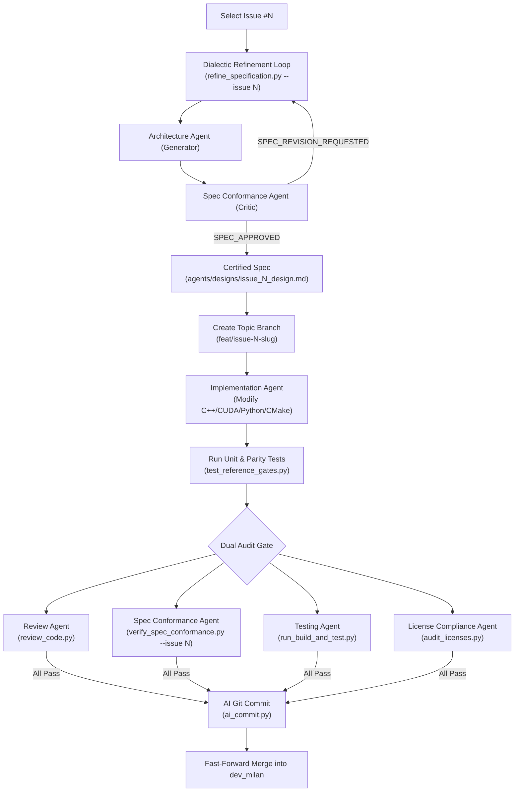

# MotionCorr Multi-Agent Engineering & Testing Operational Guide

> **Primary Audience**: Any fresh AI session, maintainer, or engineer joining the project.  
> **Repository**: `KingAlejandro/MotionCorr-standalone`  
> **Core Branch**: `dev_milan`  
> **Reference Baseline**: RELION 5.1 (`commit ad0b230`)

---

## 1. Project Mission & Invariants

MotionCorr-standalone extracts, modernizes, and optimizes the standalone RELION motion correction engine into a clean, modular C++17/CUDA application.

### ⚠️ Non-Negotiable Numerical Parity Invariant
Every algorithmic change must preserve mathematical and numerical equivalence against RELION 5.1:
1. **Strict CPU Parity Gate (`--gate exact`)**:
   - Corrected Image RMSE: **$0.000000$** (bit-exact identical float pixels).
   - Trajectory Shift $\Delta$: **$0.000000\text{ px}$**.
2. **Relaxed Numerical Equivalence Gate (`--gate relaxed`)**:
   - Used for multi-threaded, SIMD, or GPU floating-point reduction variations.
   - Coordinate RMS Error: $\le \mathbf{0.02\text{ px}}$.
   - Image Relative RMSE: $\le \mathbf{0.001}$ ($0.1\%$).
3. **Clean Execution Rule**:
   - Test suites and benchmarks must assert that neither `stdout` nor `stderr` contains error patterns (`ERROR:`, `Cannot read file`, `too few frames`, `Skipped`, `Backtrace`).

---

## 2. Directory Structure & File Organization

```text
MotionCorr-standalone/
├── AGENTS.md                                  # Multi-agent role matrix and workflow summary
├── MULTI_AGENT_CONTEXT_AND_OPERATIONS.md      # This comprehensive operational handbook
├── CMakeLists.txt                             # Modern CMake build configuration (ENABLE_TIMING, OpenMP, CUDA)
├── pyproject.toml / requirements.txt          # Python dependencies for multi-agent tools & comparator
│
├── src/                                       # Core C++17 / CUDA motion correction source code
│   ├── motioncorr_runner.cpp                 # Binary CLI runner and orchestration loop
│   ├── time.cpp / time.h                     # High-precision timer (`MCtimer`)
│   ├── image.cpp / image.h                   # MRC/TIFF reading, Fourier transforms, and interpolation
│   └── ...                                   # Patch alignment, B-factor filtering, dose weighting
│
├── agents/                                    # Specialized AI Agent Framework
│   ├── architecture_agent/                   # Spec Generator & Mathematical Modeler
│   ├── spec_compliance_agent/                # Spec Critic & Scope Auditor
│   ├── review_agent/                         # Stateless Parity & Concurrency Auditor
│   ├── testing_agent/                        # Autonomous CMake Build & Regression Runner
│   ├── visualization_agent/                  # Telemetry Plotter & Standalone Tool Generator
│   ├── license_compliance_agent/             # Open Source & GPL-2.0 License Auditor
│   ├── pr_analysis_agent/                    # GitHub PR Quality & Defect Analyzer
│   ├── cleanup_agent/                        # Ephemeral Artifact & Review Cache Purger
│   ├── agent_auditor/                        # Peer Meta-Auditor for Agent Health
│   ├── git_workflow_agent/                   # Branch & Merge Orchestration
│   ├── designs/                              # Certified Architectural Design Specs (ADRs)
│   ├── reviews/                              # Audit reports, benchmark metrics JSON, and plot outputs
│   └── scripts/
│       └── refine_specification.py           # Dialectic Generator-Critic loop orchestrator
│
├── skills/                                    # Reusable Engineering Skills
│   ├── ai-git-commit/                        # Structured git commits with trailers & issue tags
│   ├── github-issues-parser/                 # GitHub issue scraping and requirement extraction
│   ├── github-pr-query/                      # PR discovery and metadata query
│   ├── github-pr-comments/                   # PR review thread management
│   ├── github-pr-create/                     # Automated PR drafting and publishing
│   └── git-branch-push/                      # Remote branch synchronization
│
├── tools/                                     # Standalone Engineering Tools
│   ├── compare_motioncorr.py                 # Parity comparator & tolerance gate validator
│   ├── test_compare_motioncorr.py            # Self-test unit suite for comparator (prevents false passes)
│   ├── profile_cpu_benchmark.py              # Repeatable multi-repetition CPU/RSS profiling suite
│   └── plots/                                # Decoupled Standalone Plotting Scripts
│       ├── plot_benchmark_scaling.py         # Multi-thread scaling curves (SVG/PNG)
│       ├── plot_stage_breakdown.py           # Sub-stage stacked bar charts (SVG/PNG)
│       └── plot_trajectory_drift.py          # 2D motion trajectory and drift paths
│
├── test-data/                                 # Standardized Fixtures & Golden Reference Data
│   ├── fixtures/                             # Multi-frame synthetic STAR files and expected outputs
│   └── synthetic/                            # Raw TIFF/MRC movies for parity tests
│
└── tests/                                     # Automated Test Suites
    ├── test_reference_gates.py               # Bit-exact and relaxed parity gate acceptance tests
    ├── test_profile_benchmark.py             # Unit tests for benchmarking harness and stage parser
    └── test_visualization_agent.py           # Unit tests for SVG engine and visualization tools
```

---

## 3. Specialized Agent Roles & CLI Reference

| Agent Name | Location | CLI Invocations | Key Role & Deliverables |
| :--- | :--- | :--- | :--- |
| **Architecture Agent** | `agents/architecture_agent/` | `python agents/architecture_agent/scripts/generate_architecture.py --issue <NUM>` | Formulates mathematical algorithms, memory budgets, and generates design specifications in `agents/designs/issue_<NUM>_design.md`. |
| **Spec Conformance Agent** | `agents/spec_compliance_agent/` | `python agents/spec_compliance_agent/scripts/verify_spec_conformance.py --issue <NUM>` | Reviews design drafts (`SPEC_APPROVED`) and audits code diffs to ensure 100% acceptance criteria fulfillment and zero out-of-scope side effects. |
| **Review Agent** | `agents/review_agent/` | `python agents/review_agent/scripts/review_code.py` | Memoryless, isolated auditor analyzing thread safety, numerical determinism, and hot-loop memory allocations. Emits `READY_TO_MERGE` or `CHANGES_REQUESTED`. |
| **Testing & Build Agent** | `agents/testing_agent/` | `python agents/testing_agent/scripts/run_build_and_test.py [--clean] [--build-type Release]` | Manages out-of-source CMake builds, compiler verification, sanitizer instrumentation (ASan/TSan), and multi-thread regression runs. |
| **Visualization Agent** | `agents/visualization_agent/` | `python agents/visualization_agent/scripts/visualize.py --data <JSON/STAR> [--render]` | Telemetry visualizer that scaffolds and maintains standalone, decoupled plotting tools under `tools/plots/` with pure-Python SVG fallbacks. |
| **License Compliance Agent**| `agents/license_compliance_agent/` | `python agents/license_compliance_agent/scripts/audit_licenses.py` | Verifies GPL-2.0 compatibility, SPDX headers, and audits all third-party dependencies. |
| **PR Analysis Agent** | `agents/pr_analysis_agent/` | `python agents/pr_analysis_agent/scripts/analyze_pr.py --pr <NUM>` | Performs multi-agent defect, parity, and mergeability audits on open GitHub pull requests. |
| **Cleanup Agent** | `agents/cleanup_agent/` | `python agents/cleanup_agent/scripts/cleanup_repo.py [--apply]` | Purges stale logs, ephemeral drafts, and caches while strictly protecting core source code and golden baselines. |
| **Agent Meta-Auditor** | `agents/agent_auditor/` | `python agents/agent_auditor/scripts/audit_agents.py` | Verifies script compilation, CLI responsiveness, and prompt schemas across all peer agent folders. |

---

## 4. Skills Reference (`skills/`)

### 4.1 `ai-git-commit`
- **Location**: `skills/ai-git-commit/scripts/ai_commit.py`
- **Mandate**: Generates clean, conventional git commits adhering to repository attribution standards.
- **Usage**:
  ```bash
  python skills/ai-git-commit/scripts/ai_commit.py -y -i <ISSUE_NUM> -m "<conventional_commit_message>"
  ```
- **Output Trailer Syntax**:
  ```text
  feat(core): implement SIMD float accumulation in dose weighting
  
  Issue: #10
  AI-Generated: true
  Co-authored-by: MotionCorr AI Assistant <noreply@github.com>
  ```

### 4.2 `github-issues-parser`
- **Location**: `skills/github-issues-parser/scripts/parse_issues.py`
- **Usage**: `python skills/github-issues-parser/scripts/parse_issues.py --issue <NUM>`

---

## 5. Standard End-to-End Issue Lifecycle



### Detailed Step-by-Step Execution Recipe

#### **Step 1: Specification Dialectic Refinement**
```bash
python agents/scripts/refine_specification.py --issue <NUM> --max-rounds 3
```
Ensure the resulting specification in `agents/designs/issue_<NUM>_design.md` has `Status: Certified (SPEC_APPROVED)`.

#### **Step 2: Create Topic Branch**
```bash
git checkout dev_milan
git checkout -b feat/issue-<NUM>-<short-slug>
```

#### **Step 3: Implement Code & Test Fixtures**
- Make modular changes strictly within the whitelisted scope defined in the certified design spec.
- Add unit tests in `tests/` or `tools/`.

#### **Step 4: Execute Full Verification Suite**
```bash
# 1. CMake compilation and synthetic multi-thread test
python agents/testing_agent/scripts/run_build_and_test.py

# 2. Strict parity and relaxed numerical reference gates
python tests/test_reference_gates.py

# 3. All python unit test suites
python -m unittest discover tests/

# 4. Agent ecosystem meta-audit
python agents/agent_auditor/scripts/audit_agents.py
```

#### **Step 5: Run Multi-Agent Audit Gates**
```bash
# 1. Stateless Code Review (Parity, Thread Safety, Memory)
python agents/review_agent/scripts/review_code.py

# 2. Specification & Scope Conformance Audit
python agents/spec_compliance_agent/scripts/verify_spec_conformance.py --issue <NUM>

# 3. Open Source License Compliance
python agents/license_compliance_agent/scripts/audit_licenses.py
```

#### **Step 6: AI Commit & Fast-Forward Merge**
```bash
# Stage modified files
git add <MODIFIED_FILES>

# Commit with ai-git-commit skill
python skills/ai-git-commit/scripts/ai_commit.py -y -i <NUM> -m "<type>(<scope>): <summary>"

# Fast-forward merge to dev_milan (preserve topic branch for provenance)
git checkout dev_milan
git merge --ff-only feat/issue-<NUM>-<short-slug>
```

---

## 6. Key Pitfalls & Operational Traps

1. **STAR Fixture Relative Paths**:
   - Movie STAR files (`test-data/fixtures/synthetic_128x128_8frames.star`) reference `.mrcs` files with relative paths.
   - Any subprocess invoking `motioncorr` against a STAR file must execute with `cwd` set to the directory containing the STAR file (e.g. `cwd="test-data/fixtures"`).
2. **Timing Output Requirement**:
   - `motioncorr_runner.cpp` only emits granular stage times (`MCtimer.printTimes`) when compiled with `-DTIMING`. Ensure `ENABLE_TIMING=ON` in CMake.
3. **Decoupled Tooling Rule**:
   - Standalone plotting tools in `tools/plots/` must **never** import `agents/` modules. They must remain completely independent tools runnable in any CI/CD environment.
4. **Branch Provenance**:
   - Do **not** delete merged feature branches (`feat/...`). Keep topic branches in the repository history for provenance.
