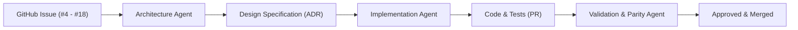

# MotionCorr Agent Ecosystem

This directory houses specialized AI agent definitions, workflows, and prompts designed to systematically implement and validate the issues and roadmap milestones of `MotionCorr-standalone`.

---

## Multi-Agent Architecture Workflow

To deliver reliable, production-grade scientific software with mathematical parity, work proceeds through specialized agent roles:



1. **Architecture Agent (`agents/architecture_agent/`)**:
   - Analyzes issue requirements, scientific algorithms, and dependency constraints.
   - Formulates mathematical models, component interfaces, memory staging plans, and numerical acceptance gates.
   - Produces a comprehensive Design Specification in `agents/designs/`.

2. **Implementation Agent**:
   - Takes the approved Design Specification and implements changes incrementally.
   - Adheres to modularity, thread safety, and memory budgets.
   - Uses the `ai-git-commit` skill for clean, traceable commits.

3. **Review & Verification Agent (`agents/review_agent/`)**:
   - **Role**: Memoryless, isolated, strictly read-only auditor.
   - **Function**: Inspects diffs and source code without retaining past conversational bias.
   - **Checks**: Numerical parity risks, OpenMP non-determinism, heap allocation in hot loops, and portability.
   - **Output**: Reports explicit verdict (`READY_TO_MERGE`, `CHANGES_REQUESTED`, `BLOCKED_BY_FAULT`) with itemized findings and remediation guidance.

---

## Directory Structure

```text
agents/
├── README.md                      # Overview of the agent framework
├── designs/                       # Generated architectural design specifications
├── architecture_agent/            # Architecture Agent tooling and specifications
│   ├── SYSTEM_PROMPT.md           # Role definition and instructions for the architect
│   ├── templates/
│   │   └── DESIGN_SPEC_TEMPLATE.md# Standardized design specification template
│   └── scripts/
│       ├── design_issue.py        # CLI helper to scaffold designs
│       └── generate_architecture.py # Autonomous architecture generator (LLM / synthesis)
└── review_agent/                  # Memoryless Review & Verification Agent
    ├── SYSTEM_PROMPT.md           # Read-only review persona and verification rules
    ├── templates/
    │   └── REVIEW_REPORT_TEMPLATE.md # Standardized review report template
    └── scripts/
        └── review_code.py         # Stateless CLI review engine
```

---

## Quick Start: Running the Agents

### 1. Designing an Architecture for an Issue
```bash
# Formulate complete architectural specification for an issue
python agents/architecture_agent/scripts/generate_architecture.py --issue 7
```

### 2. Reviewing & Verifying Code (Stateless)
```bash
# Review uncommitted working tree changes
python agents/review_agent/scripts/review_code.py

# Review staged changes only
python agents/review_agent/scripts/review_code.py --staged

# Review a specific commit range or PR branch
python agents/review_agent/scripts/review_code.py --target origin/main...HEAD
```
