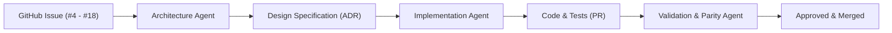

# MotionCorr Agent Ecosystem

This directory houses specialized AI agent definitions, workflows, and prompts designed to systematically implement and validate the issues and roadmap milestones of `MotionCorr-standalone`.

---

## Multi-Agent Architecture Workflow

To deliver reliable, production-grade scientific software with mathematical parity, work proceeds through specialized agent roles:



1. **Architecture Agent (`agents/architecture_agent/`)**:
   - Analyzes issue requirements, scientific algorithms, and dependency constraints.
   - Formulates mathematical models, component interfaces, memory staging plans, and numerical acceptance gates.
   - Produces a comprehensive Design Specification in `agents/designs/`.

2. **Implementation Agent**:
   - Takes the approved Design Specification and implements changes incrementally.
   - Adheres to modularity, thread safety, and memory budgets.
   - Uses the `ai-git-commit` skill for clean, traceable commits.

3. **Validation & Parity Agent**:
   - Executes numerical parity comparisons against RELION 5.1 reference baselines.
   - Verifies trajectory error, image RMSE, and STAR metadata compliance.

---

## Directory Structure

```text
agents/
├── README.md                      # Overview of the agent framework
├── designs/                       # Generated architectural design specifications
└── architecture_agent/            # Architecture Agent tooling and specifications
    ├── SYSTEM_PROMPT.md           # Role definition and instructions for the agent
    ├── templates/
    │   └── DESIGN_SPEC_TEMPLATE.md# Standardized design specification template
    └── scripts/
        └── design_issue.py        # CLI helper to scaffold and prepare designs for issues
```

---

## Quick Start: Designing an Architecture for an Issue

To scaffold an architectural design document for a specific issue (e.g. Issue #4, #7, #14, #16):

```bash
python agents/architecture_agent/scripts/design_issue.py --issue 4
```

This will:
1. Extract the issue details, dependencies, and acceptance criteria.
2. Identify affected source modules and architectural constraints.
3. Scaffold a comprehensive design specification in `agents/designs/issue_4_design.md` ready for agent or engineer review.
