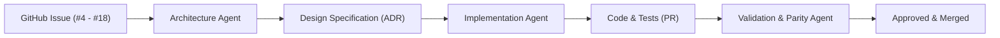

# MotionCorr Agent Ecosystem

This directory houses specialized AI agent definitions, workflows, and prompts designed to systematically implement and validate the issues and roadmap milestones of `MotionCorr-standalone`.

---

## Multi-Agent Architecture Workflow

To deliver reliable, production-grade scientific software with mathematical parity, work proceeds through specialized agent roles:



1. **Architecture Agent (`agents/architecture_agent/`)**:
   - Analyzes issue requirements, scientific algorithms, and dependency constraints.
   - Formulates mathematical models, component interfaces, memory staging plans, and numerical acceptance gates.
   - Produces a comprehensive Design Specification in `agents/designs/`.

2. **Implementation Agent**:
   - Takes the approved Design Specification and implements changes incrementally.
   - Adheres to modularity, thread safety, and memory budgets.
   - Uses the `ai-git-commit` skill for clean, traceable commits.

3. **Review & Verification Agent (`agents/review_agent/`)**:
   - **Role**: Memoryless, isolated, strictly read-only auditor.
   - **Function**: Inspects diffs and source code without retaining past conversational bias.
   - **Checks**: Numerical parity risks, OpenMP non-determinism, heap allocation in hot loops, and portability.
   - **Output**: Reports explicit verdict (`READY_TO_MERGE`, `CHANGES_REQUESTED`, `BLOCKED_BY_FAULT`) with itemized findings and remediation guidance.

4. **Specification & Scope Conformance Agent (`agents/spec_compliance_agent/`)**:
   - **Role**: Works alongside the Review Agent to verify 1:1 specification alignment.
   - **Function**: Audits forward completeness (acceptance criteria) and reverse scope isolation (flags unrequested side effects).
   - **Rule**: A feature passes (`SPEC_CONFORMANCE_PASSED`) if and only if it matches the specification and *only* the specification.

5. **License & Open Source Compliance Agent (`agents/license_compliance_agent/`)**:
   - **Role**: Open source licensing and intellectual property compliance auditor.
   - **Function**: Scans all Python dependencies, external manifests, and repository source files for OSI open source licensing, GPL-2.0 compatibility, and flags any proprietary or unlicensed code.
   - **Output**: Generates compliance audit reports (`LICENSE_COMPLIANCE_PASSED`, `LICENSE_WARNING`, `LICENSE_VIOLATION`).

6. **Pull Request Analysis Agent (`agents/pr_analysis_agent/`)**:
   - **Role**: Pull Request quality, parity, concurrency, scope, and defect analyzer.
   - **Function**: Discovers pull requests on the GitHub repository, performs deep audits on specific PR diffs, and synthesizes multi-agent quality gates into actionable merge recommendations.
   - **Output**: Generates PR analysis reports (`READY_TO_MERGE`, `CHANGES_REQUESTED`, `BLOCKED_BY_FAULT`).

7. **Cleanup & Repository Hygiene Agent (`agents/cleanup_agent/`)**:
   - **Role**: Repository cleanliness and ephemeral artifact purger.
   - **Function**: Scans for obsolete PR reviews, intermediate dialectic drafts, stale logs, temporary patches, and Python caches, offering dry-run previews and safe deletion while preserving core source and test baselines.
   - **Output**: Generates repository hygiene reports (`CLEANUP_COMPLETED`, `PENDING_CONFIRMATION`, `NOTHING_TO_CLEAN`).

8. **Agent Meta-Auditor (`agents/agent_auditor/`)**:
   - **Role**: Meta-reviewer for agent ecosystem integrity.
   - **Rule**: Inspects all peer agents in `agents/` while strictly excluding its own files.
   - **Checks**: Verifies Python script compilation (`py_compile`), CLI `--help` responsiveness, system prompt constraints, template schemas, and cross-agent consistency.
   - **Output**: Generates ecosystem health reports (`HEALTHY`, `NEEDS_ATTENTION`, `DEGRADED`).

9. **Visualization Agent (`agents/visualization_agent/`)**:
   - **Role**: General-purpose telemetry visualizer and decoupled plot script generator.
   - **Function**: Ingests benchmark metrics, STAR trajectory tables, and profiling data to scaffold and maintain standalone Python plotting tools under `tools/plots/`.
   - **Output**: High-resolution SVG/PNG charts (scaling curves, stage breakdowns, memory profiles, 2D motion drift paths) and markdown reports.

---

## Directory Structure

```text
agents/
├── README.md                      # Overview of the agent framework
├── designs/                       # Generated architectural design specifications
├── architecture_agent/            # Architecture Agent tooling and specifications
│   ├── SYSTEM_PROMPT.md           # Role definition and instructions for the architect
│   ├── templates/
│   │   └── DESIGN_SPEC_TEMPLATE.md# Standardized design specification template
│   └── scripts/
│       ├── design_issue.py        # CLI helper to scaffold designs
│       └── generate_architecture.py # Autonomous architecture generator (LLM / synthesis)
├── review_agent/                  # Memoryless Review & Verification Agent
│   ├── SYSTEM_PROMPT.md           # Read-only review persona and verification rules
│   ├── templates/
│   │   └── REVIEW_REPORT_TEMPLATE.md # Standardized review report template
│   └── scripts/
│       └── review_code.py         # Stateless CLI review engine
├── spec_compliance_agent/         # Specification & Scope Conformance Agent
│   ├── SYSTEM_PROMPT.md           # Conformance philosophy and strict 1:1 audit rules
│   ├── templates/
│   │   ├── SPEC_REVIEW_TEMPLATE.md            # Pre-implementation review template
│   │   └── SPEC_CONFORMANCE_REPORT_TEMPLATE.md# Post-implementation diff report template
│   └── scripts/
│       └── verify_spec_conformance.py # Scope and side-effect verification engine
├── license_compliance_agent/      # License & Open Source Compliance Agent
│   ├── SYSTEM_PROMPT.md           # Open source mandates and GPL-2.0 terms
│   ├── templates/
│   │   └── LICENSE_AUDIT_REPORT_TEMPLATE.md # Standardized license audit template
│   └── scripts/
│       └── audit_licenses.py      # Dependency & source file compliance auditor
├── pr_analysis_agent/             # Pull Request Analysis Agent
│   ├── SYSTEM_PROMPT.md           # PR defect detection and mergeability rules
│   ├── templates/
│   │   └── PR_ANALYSIS_REPORT_TEMPLATE.md # Standardized PR audit report template
│   └── scripts/
│       └── analyze_pr.py          # PR discovery and deep quality analysis CLI
├── testing_agent/                 # Testing & Build Agent
│   ├── SYSTEM_PROMPT.md           # Out-of-source CMake build & regression rules
│   ├── templates/
│   │   └── BUILD_TEST_REPORT_TEMPLATE.md # Standardized build & test report template
│   └── scripts/
│       └── run_build_and_test.py  # Autonomous CMake build & regression orchestrator
├── visualization_agent/           # Visualization Agent
│   ├── SYSTEM_PROMPT.md           # Role definition and standalone tool generation rules
│   ├── templates/
│   │   ├── speedup_scaling_template.py.jinja
│   │   ├── stage_breakdown_template.py.jinja
│   │   ├── trajectory_vector_template.py.jinja
│   │   ├── comparative_delta_template.py.jinja
│   │   └── VISUALIZATION_REPORT_TEMPLATE.md
│   └── scripts/
│       ├── visualize.py           # General-purpose visualization orchestrator & generator
│       └── svg_engine.py          # Pure-Python SVG vector graphics rendering library
└── agent_auditor/                 # Agent Meta-Auditor (audits all peer agents)
    ├── SYSTEM_PROMPT.md           # Meta-auditor instructions and exclusion rules
    ├── templates/
    │   └── AUDIT_REPORT_TEMPLATE.md  # Standardized audit report template
    └── scripts/
        └── audit_agents.py        # Automated peer agent audit engine
```

---

## Quick Start: Running the Agents

### 1. Designing & Refining an Architecture (Generator-Critic Loop)
```bash
# Run the automated dialectic loop between Architect and Conformance agents
# Refines the spec until certified SPEC_APPROVED before coding begins
python agents/scripts/refine_specification.py --issue 10 --max-rounds 3
```

### 2. Reviewing & Verifying Code (Dual Verification Gate)
```bash
# Code Hygiene, Parity & Concurrency Review (Review Agent)
python agents/review_agent/scripts/review_code.py

# Specification & Scope Conformance Audit (Spec Conformance Agent)
python agents/spec_compliance_agent/scripts/verify_spec_conformance.py --issue 10
```

### 3. Auditing Open Source Licenses & IP Compliance
```bash
# Scan Python modules, dependencies, and source files for open source licenses and GPL-2.0 compliance
python agents/license_compliance_agent/scripts/audit_licenses.py
```

### 4. Discovering and Analyzing Pull Requests
```bash
# List all open pull requests on the repository
python agents/pr_analysis_agent/scripts/analyze_pr.py --list

# Perform deep defect and quality audit on a specific PR
python agents/pr_analysis_agent/scripts/analyze_pr.py --pr 1
```

### 5. Cleaning Up Ephemeral Reviews, Drafts & Artifacts
```bash
# Preview cleanable files in safe dry-run mode
python agents/cleanup_agent/scripts/cleanup_repo.py

# Execute cleanup (remove ephemeral reviews, drafts, and caches)
python agents/cleanup_agent/scripts/cleanup_repo.py --apply
```

### 6. Auditing the Multi-Agent Ecosystem
```bash
# Audit all peer agents (excluding agent_auditor) for script, prompt, and template integrity
python agents/agent_auditor/scripts/audit_agents.py
```

