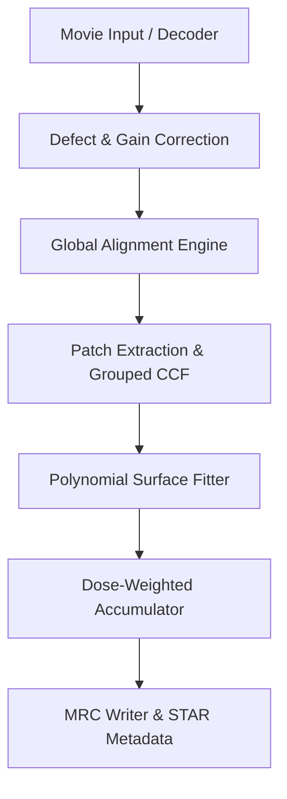

# Architectural Design Specification: [Issue Title]

- **Issue Reference**: #[Issue Number] - [Issue Title]
- **Track**: [e.g. track:validation | track:cpu | track:cuda | track:jax | track:integration]
- **Priority**: [P0 | P1 | P2]
- **Architect**: MotionCorr Architecture Agent
- **Status**: Proposed | Reviewing | Approved | Implemented
- **Target Release / Milestone**: v1.0.0

---

## 1. Executive Summary & Problem Statement

Briefly describe the purpose of this change, the underlying problem or architectural gap, and what this technical design accomplishes.

---

## 2. Architectural Objectives & Constraints

### 2.1 Functional Objectives
- [List functional capabilities added, fixed, or extended]

### 2.2 Scientific & Non-Functional Constraints
- **Numerical Parity**: [Specify exact parity requirements against RELION 5.1 reference baseline]
- **Deterministic Execution**: [Specify thread determinism or floating-point variance bounds]
- **Memory Budget**: [Specify maximum allowed peak RSS or GPU VRAM footprint]
- **Portability**: [Linux / macOS / GCC / Clang / CUDA Toolkit versions]
- **Backward Compatibility**: [Ensure default CLI flags and outputs remain undisturbed]

---

## 3. Mathematical & Algorithmic Formulation

Detail the mathematical foundation, equations, and algorithmic steps:

1. **Equations / Transformations**:
   $$\text{e.g. } CCF(r) = \mathcal{F}^{-1} \left\{ \mathcal{F}\{I_{\text{ref}}\}^* \cdot \mathcal{F}\{I_{\text{target}}\} \cdot W(k) \right\}$$
2. **Coordinate & Origin Conventions**:
   - State pixel indexing (0-based vs 1-based, half-complex Hermitian format, center of rotation).
3. **Approximations & Numerical Tolerances**:
   - State whether single-precision (float32) or double-precision (float64) is utilized for intermediate stages.

---

## 4. Component Architecture & Data Flow

### 4.1 System Diagram


### 4.2 Component Interactions & Boundary Contracts
- **Component A**: [Responsibilities and inputs/outputs]
- **Component B**: [Responsibilities and inputs/outputs]

---

## 5. Interface Contracts & Data Structures

### 5.1 C++ / CUDA / Python Data Structures
```cpp
// Explicit definition of relevant structs, classes, or types
struct AlignmentState {
    int patch_x;
    int patch_y;
    float shift_x;
    float shift_y;
    float ccf_peak_score;
    bool converged;
};
```

### 5.2 API & Function Signatures
```cpp
// Target API prototypes
class AlignmentEngine {
public:
    virtual ~AlignmentEngine() = default;
    virtual bool runGlobalAlignment(const float* movie_frames, int num_frames, ...);
};
```

---

## 6. Memory Staging & Allocation Strategy

- **Baseline Allocation Footprint**:
  - Raw Movie Buffer: $N_x \times N_y \times N_{\text{frames}} \times 4\text{ bytes} \approx \dots \text{ MB}$
  - FFT / Scratch Buffers: $\dots \text{ MB}$
- **Buffer Reuse & Lifetimes**:
  - Explain how memory allocations are hoisted out of per-frame loops.
- **Host / Device Memory Transfers (if GPU)**:
  - Pinned memory staging, asynchronous stream copy overlapping, and peak VRAM limits.

---

## 7. Defensive Failure Modes & Fallback Behavior

| Condition / Trigger | Detection Mechanism | Fallback / Recovery Action | User Diagnostic Visibility |
| :--- | :--- | :--- | :--- |
| Ill-conditioned polynomial matrix | SVD condition number $> 10^6$ | Fall back to global motion trajectory | Log warning & STAR flag |
| Non-converged patch CCF | Iteration cap reached ($\Delta < \epsilon$) | Exclude patch from polynomial regression | Valid patch count decremented |
| GPU Out-of-Memory | `cudaErrorMemoryAllocation` | Terminate gracefully or fall back to CPU | Clear actionable CLI error message |

---

## 8. Implementation Roadmap for Coding Agents

Breakdown of actionable work items for the Implementation Agent:

### Step 1: Core Data Structures & Interfaces
- **Files**:
  - `[NEW] include/motioncorr_types.h`
  - `[MODIFY] src/motioncorr_runner.cpp`

### Step 2: Algorithmic Implementation
- **Files**:
  - `[NEW] src/patch_optimizer.cpp`

### Step 3: Telemetry, Logging & Contracts
- **Files**:
  - `[MODIFY] src/motioncorr_runner.cpp`

---

## 9. Verification & Acceptance Criteria

### 9.1 Automated Test Execution
```bash
# Run unit and integration parity tests
python tests/compare_parity.py --reference reference_run/ --candidate test_run/
```

### 9.2 Acceptance Thresholds
- **Trajectory Error**: $\Delta x, \Delta y \le 10^{-4}\text{ px}$
- **Image Parity**: RMSE $\le 10^{-6}$, Max Pixel Delta $\le 10^{-5}$
- **STAR Metadata**: 100% field equivalence
- **Performance / Memory Gate**:
  - Wall-clock time change: $\le 0\%$ (or $-X\%$ speedup)
  - Peak RSS change: $\le \pm 5\%$
