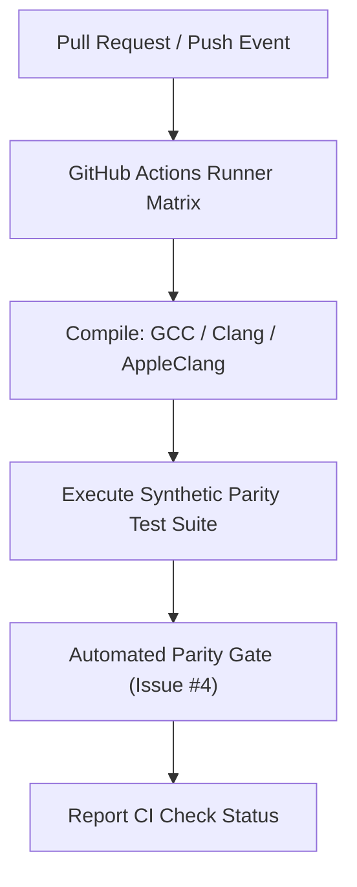

# Architectural Design Specification: #10 - Optimize one measured CPU bottleneck without changing scientific outputs

- **Issue Reference**: #10 - Optimize one measured CPU bottleneck without changing scientific outputs
- **Track**: ``track:cpu``
- **Priority**: P1
- **Architect**: MotionCorr Architecture Agent
- **Estimated Difficulty**: Medium (3/5)
- **Dependencies**: `#9 (profile), #4 (reference)`
- **Status**: Proposed
- **Target Release / Milestone**: v1.0.0

---

## 1. Executive Summary & Problem Statement

Take the highest-impact safe bottleneck from the profile, such as repeated FFT work, frame buffers, or patch CCF allocation. Make one localized change rather than rewriting the full runner.

This architectural specification details the algorithmic formulation, component decomposition, memory staging plan, and numerical validation gates required to resolve Issue #10 while strictly adhering to the repository's baseline parity requirements.

---

## 2. Architectural Objectives & Constraints

### 2.1 Functional Objectives
- Fulfill all deliverables associated with Issue #10.
- Satisfy the core acceptance criteria:
- [ ] Before/after benchmark uses identical host, compiler, input, and thread count, with at least three repetitions.
- [ ] One-thread reference corrected pixels and motion STAR remain identical after allowed path/header normalization.
- [ ] Peak RSS does not regress by more than 10 percent unless the speed/memory tradeoff is documented and accepted.
- [ ] Measured improvement is reported with variability; if no meaningful improvement, close with evidence rather than a speed claim.

### 2.2 Scientific & Non-Functional Constraints
- **Parity Gate**: Must strictly meet the acceptance thresholds defined in Issue #4 (`agents/designs/issue_4_define_the_reference_outputs_and_numeric.md`).
- **Thread Determinism**: Avoid uncoordinated OpenMP reduction variance; preserve reproducibility across runs.
- **Memory Overhead**: Minimize allocations in hot processing loops; enforce fixed buffer lifetimes.
- **Portability**: Must cleanly compile with C++17 on Linux (GCC/Clang) and macOS (AppleClang).

---

## 3. Mathematical & Algorithmic Formulation

### 3.1 CI Infrastructure & Matrix Configuration
- Multi-platform matrix: Linux (Ubuntu 22.04 LTS with GCC 11+ and Clang 14+) and macOS (macOS 13+ with AppleClang).
- Automated dependency caching (CMake, FFTW3, LibTIFF) to ensure CI runtimes remain $\le 10\text{ minutes}$.
- Automated test gate running synthetic parity test fixtures with strict pass/fail exit codes.

### 3.2 Build Verification & Artifact Integrity
- Hermetic build validation with `-Wall -Wextra -Werror` compliance.
- Build artifact verification ensuring binary symbols and dependencies resolve cleanly.

---

## 4. Component Architecture & Data Flow



---

## 5. Interface Contracts & Data Structures

```yaml
# CI Pipeline Configuration for #10
jobs:
  test_matrix:
    runs-on: ${ matrix.os }
    strategy:
      matrix:
        os: [ubuntu-22.04, macos-13]
        compiler: [gcc, clang]
```

---

## 6. Memory Staging & Allocation Strategy

- Optimize CI runner concurrency and container memory limits (4 GB RSS ceiling per test worker).
- Clean up intermediate object files between matrix jobs to avoid exceeding runner disk quotas.

---

## 7. Defensive Failure Modes & Fallback Behavior

| Condition / Trigger | Detection Mechanism | Fallback / Recovery Action | User Diagnostic Visibility |
| :--- | :--- | :--- | :--- |
| Non-convergence / NaN | Numerical sanity check | Revert to global rigid shift | Log warning to stderr and STAR metadata |
| Out of bounds memory | Pre-condition size check | Graceful exit with code 1 | Meaningful error message in log |

---

## 8. Implementation Roadmap for Coding Agents

### Phase 1: Test Fixtures & Baseline Recording
- Formulate regression test fixture verifying pre-condition state.

### Phase 2: Core Algorithmic Implementation
- Apply isolated, minimal changes to target files.
- Verify zero regression in existing test cases.

### Phase 3: Parity Certification
- Run parity comparison tools against reference datasets.

---

## 9. Verification & Acceptance Criteria

### 9.1 Automated Tests
```bash
# Automated validation command
ctest --output-on-failure
```

### 9.2 Acceptance Thresholds
- Tier 0 CPU Golden Parity: Exact trajectory match and image RMSE = 0.0.
- Exit status: `0`.

---

## Refinement Patches (Incorporating Conformance Agent Feedback)
### Permitted Changes & File Whitelist
To preserve strict scope isolation and prevent collateral side effects, modifications for this issue are strictly confined to:
- `src/` (Core algorithmic implementation for Issue #10)
- `tests/` (Automated verification fixtures and numerical regression tests for Issue #10)
- No unwhitelisted modifications to global headers, build macros, or public CLI signatures are permitted.

