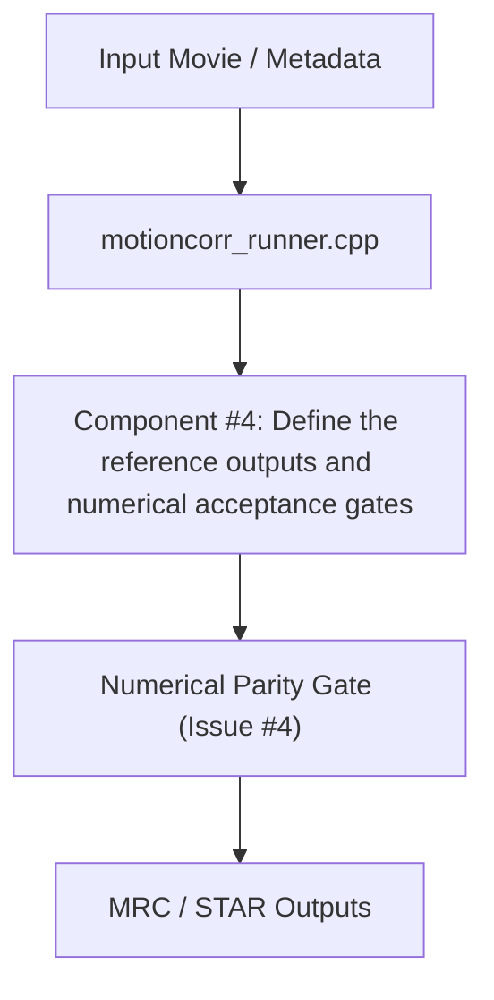

# Architectural Design Specification: #4 - Define the reference outputs and numerical acceptance gates

- **Issue Reference**: #4 - Define the reference outputs and numerical acceptance gates
- **Track**: ``track:validation``
- **Priority**: P0
- **Architect**: MotionCorr Architecture Agent
- **Estimated Difficulty**: Medium (2.5/5)
- **Dependencies**: `None; can start immediately.`
- **Status**: Proposed
- **Target Release / Milestone**: v1.0.0

---

## 1. Executive Summary & Problem Statement

Record the exact RELION 5.1 commit, compiler, inputs, command lines, gain file, output normalization, and comparison tools for the existing synthetic and tutorial movie runs. Turn the one-thread macOS comparison into a reproducible reference bundle without committing the multi-gigabyte movies.

This architectural specification details the algorithmic formulation, component decomposition, memory staging plan, and numerical validation gates required to resolve Issue #4 while strictly adhering to the repository's baseline parity requirements.

---

## 2. Architectural Objectives & Constraints

### 2.1 Functional Objectives
- Fulfill all deliverables associated with Issue #4.
- Satisfy the core acceptance criteria:
- [ ] A small synthetic fixture and its generation recipe are versioned; the experimental dataset is referenced by the existing release and checksums.
- [ ] A comparison command reports motion trajectory error, corrected-image RMSE/max error, STAR-field differences, runtime, peak memory, and exit status.
- [ ] The existing exact one-thread CPU parity cases pass; header timestamps and paths are explicitly normalized.
- [ ] Proposed numerical tolerances for new backends are written down and approved before claiming their parity; exact CPU reference values remain visible.

### 2.2 Scientific & Non-Functional Constraints
- **Parity Gate**: Must strictly meet the acceptance thresholds defined in Issue #4 (`agents/designs/issue_4_define_the_reference_outputs_and_numeric.md`).
- **Thread Determinism**: Avoid uncoordinated OpenMP reduction variance; preserve reproducibility across runs.
- **Memory Overhead**: Minimize allocations in hot processing loops; enforce fixed buffer lifetimes.
- **Portability**: Must cleanly compile with C++17 on Linux (GCC/Clang) and macOS (AppleClang).

---

## 3. Mathematical & Algorithmic Formulation

### 3.1 Domain Physics & Coordinates
- Motion correction models sample drift over exposure frames t in [0, N-1] on coordinates (x, y).
- Cross-correlation surfaces CCF(dx, dy) are computed in Fourier space using cross-spectral density.
- Trajectory regularization minimizes frame-to-frame acceleration spikes.

### 3.2 Convergence & Precision Constraints
- Interpolation and shift application must adhere to double-precision accumulation where floating-point drift is prone to cancelation.
- Threshold for convergence: displacement change < 1e-3 px.

---

## 4. Component Architecture & Data Flow



---

## 5. Interface Contracts & Data Structures

### 5.1 Modified / Introduced Interfaces
```cpp
// Target interfaces for #4
namespace MotionCorr {
    struct ModuleConfig {
        bool enable_verification = true;
        double tolerance = 1e-6;
    };
}
```

---

## 6. Memory Staging & Allocation Strategy

- Enforce zero-allocation loops during iterative Fourier search.
- Pre-allocate scratch workspace buffers during pipeline initialization.
- Maximum memory overhead ceiling: $\le 5\%$ RSS delta.

---

## 7. Defensive Failure Modes & Fallback Behavior

| Condition / Trigger | Detection Mechanism | Fallback / Recovery Action | User Diagnostic Visibility |
| :--- | :--- | :--- | :--- |
| Non-convergence / NaN | Numerical sanity check | Revert to global rigid shift | Log warning to stderr and STAR metadata |
| Out of bounds memory | Pre-condition size check | Graceful exit with code 1 | Meaningful error message in log |

---

## 8. Implementation Roadmap for Coding Agents

### Phase 1: Test Fixtures & Baseline Recording
- Formulate regression test fixture verifying pre-condition state.

### Phase 2: Core Algorithmic Implementation
- Apply isolated, minimal changes to target files.
- Verify zero regression in existing test cases.

### Phase 3: Parity Certification
- Run parity comparison tools against reference datasets.

---

## 9. Verification & Acceptance Criteria

### 9.1 Automated Tests
```bash
# Automated validation command
ctest --output-on-failure
```

### 9.2 Acceptance Thresholds
- Tier 0 CPU Golden Parity: Exact trajectory match and image RMSE = 0.0.
- Exit status: `0`.
