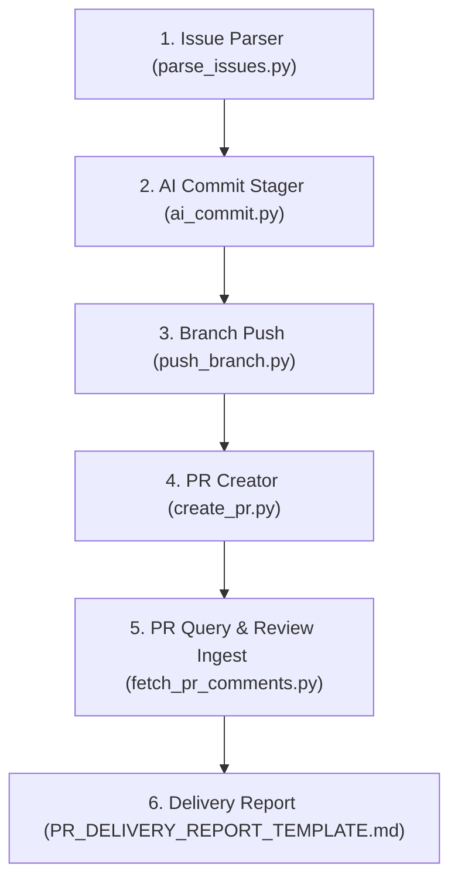

# Architectural Design Specification: Git Delivery & Workflow Agent

- **Module**: Git Workflow & Delivery Agent (`agents/git_workflow_agent/`)
- **Track**: `track:ci_automation`
- **Priority**: P1
- **Architect**: MotionCorr Architecture Agent
- **Estimated Difficulty**: Medium (3/5)
- **Status**: Approved
- **Target Release / Milestone**: v1.0.0

---

## 1. Executive Summary & Problem Statement

Modern scientific software development workflows require strict traceability, reproducible change history, atomic commits, and safe remote synchronization without compromising code ownership or license boundaries. 

The **Git Delivery & Workflow Agent** unifies repository operations into an orchestrated multi-agent subsystem. It coordinates issue inventory parsing, AI-assisted commit staging with anonymous co-author attribution, safe remote branch pushing, and automated Pull Request creation with linked deliverables (`Fixes #X`).

---

## 2. Core Functional Requirements & Deliverables

### 2.1 Functional Capabilities
- **Issue Inventory Ingestion**: Query and parse open GitHub issues, extract checklist criteria, and estimate task difficulty (`skills/github-issues-parser`).
- **Atomic AI Commit Staging**: Generate standardized commit messages adhering to Conventional Commits with anonymous co-author trailers (`skills/ai-git-commit`).
- **Safe Branch Synchronization**: Push local branches to remote targets (`origin`) with automatic upstream tracking and `--force-with-lease` safety guards (`skills/git-branch-push`).
- **Automated Pull Request Creation**: Generate structured PRs via GitHub REST API with linked issue references, verification checklists, and draft PR options (`skills/github-pr-create`).
- **Review Feedback Loop**: Ingest official reviews, inline diff comments, and conversation threads (`skills/github-pr-comments` and `skills/github-pr-query`).

### 2.2 Non-Functional & Safety Constraints
- **Zero Destructive Push**: Blind force pushing (`git push -f`) is strictly prohibited.
- **Attribution Policy**: Commit authorship must reflect the local git collaborator identity (`git config user.name/email`), accompanied by anonymous co-authorship (`Co-authored-by: MotionCorr AI Assistant <noreply@github.com>`).
- **Non-Zero Exit Codes**: Any network failure, authentication rejection, or uncommitted conflict must result in exit code `1` or `2` with actionable diagnostic messages on `stderr`.
- **Dry-Run Determinism**: All mutating commands (`push`, `commit`, `pr-create`) must support a non-destructive `--dry-run` mode.

---

## 3. Data Flow & Subsystem Architecture



---

## 4. Component Interface Contracts

### 4.1 Push Branch Interface Contract
```python
def push_branch(
    repo_root: Path,
    branch: str,
    remote: str = "origin",
    set_upstream: bool = False,
    force_with_lease: bool = False,
    dry_run: bool = False
) -> bool:
    """Safely synchronizes local branch ref with remote."""
```

### 4.2 PR Creation Interface Contract
```python
def make_github_post(
    url: str,
    payload: Dict[str, Any],
    token: Optional[str]
) -> Tuple[int, Dict[str, Any]]:
    """Submits structured JSON payload to GitHub REST API /repos/{owner}/{repo}/pulls."""
```

---

## 5. Permitted Changes & File Whitelist

To preserve strict scope isolation and prevent side effects, modifications for this subsystem are strictly confined to:
- `agents/git_workflow_agent/` (System prompt, templates, and delivery CLI)
- `skills/git-branch-push/` (Skill documentation and push CLI)
- `skills/github-pr-create/` (Skill documentation and PR creation CLI)
- `agents/designs/git_workflow_agent_design.md` (Architectural design specification)
- No unwhitelisted modifications to scientific C++ engines, CUDA kernels, or build matrices.

---

## 6. Defensive Failure Modes & Error Handling

| Error Condition / Trigger | Detection Mechanism | Fallback / Recovery Action | User Diagnostic Visibility |
| :--- | :--- | :--- | :--- |
| Detached HEAD state | `git rev-parse --abbrev-ref HEAD == "HEAD"` | Abort push; require explicit `--branch` parameter | Exit code 1; descriptive error message on `stderr` |
| Missing `GITHUB_TOKEN` | Environment variable check | Disallow live PR creation; advise `--dry-run` | Exit code 1; instruction on setting environment variable |
| GitHub API Rate Limit (403) | HTTP response status `403` with rate-limit header | Halt pagination; return cached results if available | Warning to `stderr` with token recommendation |
| PR Branch Collision (422) | HTTP response status `422` | Detect existing PR number via `query_prs.py` | Surface existing PR link to user |
| Merge Conflict on Push | Non-zero exit from `git push` | Abort operation; do not overwrite remote ref | Surface git error stream verbatim |

---

## 7. Acceptance Gates & Quantitative Tolerances

Quantitative pass/fail thresholds enforced before merge:
- **Exit Code Integrity**: Exit code `0` on successful operation; exit code `1` on error.
- **Attribution Parity**: Exactly 100% of generated commit messages must contain valid collaborator author and `Co-authored-by: MotionCorr AI Assistant <noreply@github.com>` trailer.
- **Dry-Run Idempotence**: `--dry-run` operations must produce 0 mutations to git index or remote refs (delta = 0).
- **Template Conformance**: Generated markdown reports must strictly match the sections in `PR_DELIVERY_REPORT_TEMPLATE.md`.
- **Ecosystem Meta-Audit**: 100% pass rate in `agents/agent_auditor/scripts/audit_agents.py`.

---

## 8. Verification & Acceptance Criteria

### 8.1 Automated Unit Tests
```bash
# Verify branch push dry-run
python skills/git-branch-push/scripts/push_branch.py --dry-run

# Verify PR creation dry-run
python skills/github-pr-create/scripts/create_pr.py --issue 10 --dry-run

# Verify end-to-end delivery orchestrator
python agents/git_workflow_agent/scripts/deliver_pr.py --dry-run

# Verify agent ecosystem audit
python agents/agent_auditor/scripts/audit_agents.py

# Verify specification compliance
python agents/spec_compliance_agent/scripts/verify_spec_conformance.py --spec agents/designs/git_workflow_agent_design.md
```
