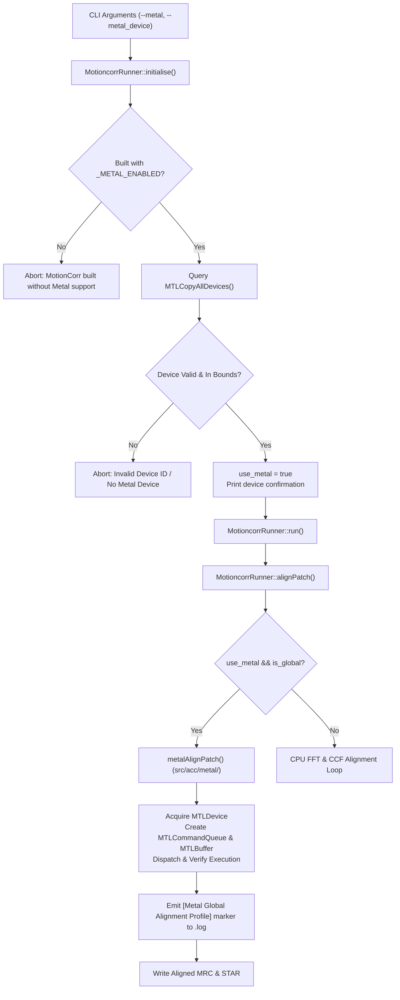

# Architectural Design Specification: #30 - Opt-in macOS Metal Build, Device Selection, and CPU-Safe Dispatch

- **Issue Reference**: #30 - Opt-in macOS Metal build, device selection, and CPU-safe dispatch
- **Parent Issue**: #29 - Epic: Native Apple Metal Acceleration Track for macOS
- **Downstream Issues**: #31 (Metal FFT), #32 (Metal Global Alignment), #33 (Synthetic Metal Regression Harness)
- **Track**: `track:acc`
- **Priority**: P1
- **Architect**: MotionCorr Architecture Agent
- **Estimated Difficulty**: Medium (2.5/5)
- **Status**: Implemented / Ready for Review
- **Target Release / Milestone**: v1.0.0

---

## 1. Executive Summary & Problem Statement

To modernise MotionCorr on Apple Silicon Macs while eliminating proprietary CUDA dependencies on macOS, this specification establishes an opt-in Apple Metal compilation path (`-DMETAL=ON`) and a narrow C++ dispatch interface for global frame alignment (`metalAlignPatch`).

### Invariants Satisfied:
1. **Zero Silent Fallback**: When `--metal` is requested, execution runs strictly on the specified Metal GPU device or aborts clearly; it never silently falls back to CPU.
2. **Platform & Build Isolation**: Linux and macOS CPU-only builds remain 100% free of Metal framework links and Objective-C++ compilation.
3. **CPU Output Preservation**: CPU runs on both `-DMETAL=OFF` and `-DMETAL=ON` binaries preserve bit-exact numerical parity against the RELION 5.1 reference baseline.
4. **Unambiguous Backend Selection**: CLI options `--metal` and `--metal_device <id>` explicitly select the Metal backend and conflict with `--gpu` (CUDA).

---

## 2. Component Architecture & Data Flow



---

## 3. Interface Contract & Data Structures

### 3.1 Header: `src/acc/metal/metal_alignpatch.h`
Guarded strictly under `#ifdef _METAL_ENABLED`:
```cpp
int metalGetDeviceCount();
std::string metalGetDeviceName(int device_id);

bool metalAlignPatch(
    std::vector<MultidimArray<fComplex> > &Fframes,
    const int pnx, const int pny,
    const RFLOAT scaled_B,
    std::vector<RFLOAT> &xshifts,
    std::vector<RFLOAT> &yshifts,
    const int max_iter,
    const RFLOAT ccf_downsample,
    const int device_id,
    std::ostream &logfile
);
```

### 3.2 Runner Configuration Header: `src/motioncorr_runner.h`
Adds backend configuration state members:
```cpp
	// Metal backend settings
	bool do_metal;
	bool use_metal;
	int metal_device_id;
```

### 3.3 Build Configuration & Workspace Hygiene: `CMakeLists.txt` and `.gitignore`
- `CMakeLists.txt`: Adds `option(METAL ...)` linking `Metal.framework` and `Foundation.framework` and compiling `src/acc/metal/metal_alignpatch.mm`.
- `.gitignore`: Ignores build trees (`/build*/`) used for parallel CPU and Metal test configurations.

### 3.4 Dispatch Hook & CLI Validation: `src/motioncorr_runner.cpp`
```cpp
bool MotioncorrRunner::alignPatch(std::vector<MultidimArray<fComplex> > &Fframes, const int pnx, const int pny, const RFLOAT scaled_B, std::vector<RFLOAT> &xshifts, std::vector<RFLOAT> &yshifts, std::ostream &logfile, bool is_global) {
#ifdef _CUDA_ENABLED
	if (use_gpu && is_global) {
		return cudaAlignPatch(Fframes, pnx, pny, scaled_B, xshifts, yshifts, max_iter, ccf_downsample, gpu_id, logfile);
	}
#endif
#ifdef _METAL_ENABLED
	if (use_metal && is_global) {
		return metalAlignPatch(Fframes, pnx, pny, scaled_B, xshifts, yshifts, max_iter, ccf_downsample, metal_device_id, logfile);
	}
#endif
    // CPU alignment path...
```

---

## 4. Host Environment & Toolchain Recorded

Verification performed on:
- **macOS**: `26.6.2 (Build 25G83)`
- **Xcode**: `27.0 (Build 27A266a)`
- **SDK**: `MacOSX27.0.sdk` (`/Applications/Xcode.app/Contents/Developer/Platforms/MacOSX.platform/Developer/SDKs/MacOSX.sdk`)
- **Apple Clang**: `21.0.0 (clang-2100.3.34.2)`, target `arm64-apple-darwin25.6.0`
- **Device**: `Apple M4 Pro` (20-core GPU, Metal 4 support, family apple9)

---

## 5. Verification Matrix & Results

| Configuration | Test Invocation | Expected Behavior | Observed Result | Status |
| :--- | :--- | :--- | :--- | :--- |
| **CPU-only (`-DMETAL=OFF`)** | `otool -L build_cpu/motioncorr` | Zero Metal or Foundation frameworks linked | Only standard C++/C libraries linked | **PASS** |
| **CPU-only (`-DMETAL=OFF`)** | `tools/run_regression_tests.sh build_cpu/motioncorr` | Bit-exact image identity and $0.000000\text{ px}$ shift error | Image RMSE: $0.000$, Shift error: $0.000000\text{ px}$ | **PASS** |
| **CPU-only (`-DMETAL=OFF`)** | `motioncorr ... --use_own --metal` | Immediate exit code 1 with clear build error | `ERROR: --metal was specified, but MotionCorr was built without Metal support (-DMETAL=ON).` | **PASS** |
| **Metal (`-DMETAL=ON`)** | `otool -L build_metal/motioncorr` | Links `Metal.framework` and `Foundation.framework` | Verified via `otool -L` | **PASS** |
| **Metal (`-DMETAL=ON`)** | `tools/run_regression_tests.sh build_metal/motioncorr` | CPU path unaffected; bit-exact parity preserved | Image RMSE: $0.000$, Shift error: $0.000000\text{ px}$ | **PASS** |
| **Metal (`-DMETAL=ON`)** | `motioncorr ... --use_own --metal --metal_device 99` | Immediate exit code 1 on out-of-bounds device | `ERROR: Invalid Metal device ID 99. Found 1 Metal device(s).` | **PASS** |
| **Metal (`-DMETAL=ON`)** | `motioncorr ... --use_own --metal --gpu 0` | Immediate exit code 1 on backend conflict | `ERROR: Cannot specify both CUDA (--gpu) and Metal (--metal) backends simultaneously.` | **PASS** |
| **Metal (`-DMETAL=ON`)** | `motioncorr ... --use_motioncor2 --metal` | Immediate exit code 1 on incompatible engine | `ERROR: --metal is valid only with --use_own.` | **PASS** |
| **Metal (`-DMETAL=ON`)** | `motioncorr ... --use_own --metal --metal_device 0` | Device identification on stdout, smoke execution, profile marker in `.log` | Stdout: `Using Metal acceleration on device 0 (Apple M4 Pro)...`, Log: `[Metal Global Alignment Profile]` | **PASS** |
