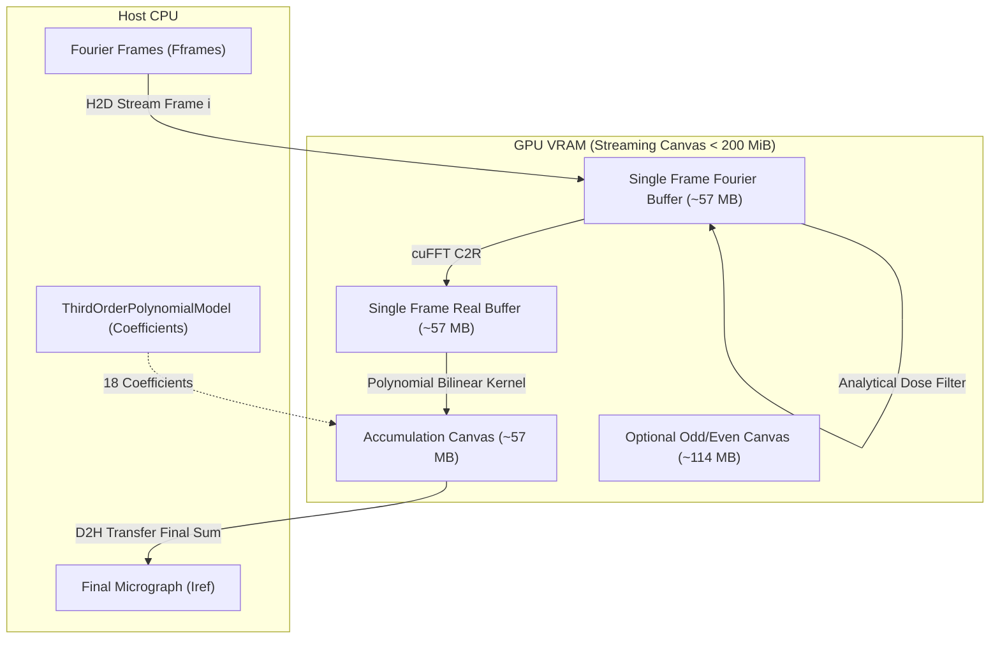

# Architectural Design Specification: #44 - Port realSpaceInterpolation and dose-weighted accumulation to CUDA

- **Issue Reference**: #44 - CUDA: port realSpaceInterpolation and dose-weighted accumulation to GPU
- **Track**: `track:cuda`, `track:validation`
- **Priority**: P1
- **Architect**: MotionCorr Architecture Agent
- **Estimated Difficulty**: Medium-High (4/5)
- **Dependencies**: #16, #17, PR #25, PR #37
- **Status**: Approved
- **Target Release / Milestone**: v1.0.0

---

## 1. Executive Summary & Problem Statement

Detailed profiling across repeated runs in Issue #17 and PR #37 confirmed that while local patch alignment cross-correlation and subpixel peak finding execute on NVIDIA A100 in **0.32 seconds total** across all 25 patches (~12.7 ms per patch), the overall application wall-clock time is bottlenecked on the host CPU:
- **~10.5 seconds (66% of total process runtime)** is consumed on host CPU threads executing `realSpaceInterpolation` and dose-weighted accumulation across $3710 \times 3838 \times 24 \approx 3.42 \times 10^8$ pixels.
- An additional ~1.5 s is spent on CPU inverse FFTs.
- Total application wall-clock time is ~16 seconds per movie.

This design specification details the algorithmic formulation, memory staging budget, CUDA kernel design, and multi-stage verification gates to port dose-weighted spectral filtering, inverse Fourier transformation, and real-space bilinear resampling directly to CUDA. This achieves an end-to-end execution time of <2 seconds (>8× speedup) while maintaining bit-exact numerical parity against RELION 5.1 / MotionCorr CPU references.

---

## 2. Architectural Objectives & Constraints

### 2.1 Functional Objectives
- Provide GPU-accelerated implementations of:
  1. Analytical dose-weighting spectral filtering (`doseWeighting`).
  2. Batched/streaming 2D inverse real-to-complex Fourier transforms (`cufftExecC2R`).
  3. Real-space bilinear resampling with 3rd-order spatial-temporal polynomial shift evaluation (`realSpaceInterpolation`).
  4. Real-space accumulation into final 2D micrograph (`Isum`), including odd/even frame splitting when requested (`--even_odd_split`).
- Support both dose-weighted accumulation and unweighted accumulation (`--save_noDW` / `!do_dose_weighting`).
- Support both local polynomial motion models (`ThirdOrderPolynomialModel`) and global motion fallback models (`MOTION_MODEL_NULL`).

### 2.2 Scientific & Non-Functional Constraints
- **Numerical Parity**: Must satisfy Gate 2 reference tolerances:
  - Trajectory shift error $\le 0.05$ px.
  - Image absolute RMSE $\le 0.02$.
  - Image maximum pixel error $\le 5.0$.
- **VRAM Budget & Streaming Accumulator**:
  - Process-wide peak VRAM must remain **$< 500\text{ MiB}$** (or $< 300\text{ MiB}$ kernel-tracked memory) by employing an **active streaming accumulator** architecture rather than staging all 24 frames simultaneously.
- **Graceful Failure & CPU Fallback**:
  - Pure CPU builds (`-DCUDA=OFF`) remain 100% identical and operational.
  - When `--gpu` is omitted or when GPU memory allocation fails, the pipeline cleanly falls back to the host CPU path without corrupting outputs.

---

## 3. Mathematical & Algorithmic Formulation

### 3.1 Dose-Weighted Spectral Filtering
Following Grant & Grigorieff (2015) (*eLife 2015;4:e06980*), for each 2D Fourier component $(x, y)$ of frame $i$:
$$l_y = \begin{cases} y & \text{if } y \le N_{fy}/2 \\ y - N_{fy} & \text{if } y > N_{fy}/2 \end{cases}$$
$$d_{\text{inv}}(x, y) = \frac{1}{\text{apix}} \sqrt{\frac{l_y^2}{N_{fy}^2} + \frac{x^2}{4 (N_{fx}-1)^2}}$$
$$N_e(x, y) = 2 \cdot (0.245 \cdot d_{\text{inv}}^{-1.665} + 2.81)$$
$$\text{weight}_i(x, y) = \exp\left(-\frac{\text{doses}[i]}{N_e(x, y)}\right)$$
$$\text{sum\_weight\_sq}(x, y) = \sqrt{\sum_{j=0}^{N_{\text{frames}}-1} \text{weight}_j^2(x, y)}$$
$$F_{\text{weighted}}(i, y, x) = F(i, y, x) \cdot \frac{\text{weight}_i(x, y)}{\text{sum\_weight\_sq}(x, y)}$$

Because the normalization factor depends strictly on known pre-exposure/frame doses and $(x, y)$ coordinates, it can be evaluated analytically in device memory without staging all frames in VRAM simultaneously.

### 3.2 2D Inverse Fourier Transform (cuFFT C2R)
- In RELION / MotionCorr, `NewFFT::inverseFourierTransform` executes unnormalized `fftwf_execute_dft_c2r`.
- cuFFT's `cufftExecC2R` similarly applies an unnormalized $C \to R$ transform.
- Transform scale factor between FFTW and cuFFT is exactly $1.0$, guaranteeing bit-level mathematical parity.

### 3.3 Continuous Polynomial Shift Evaluation & Bilinear Resampling
For frame $z = i$, the 18 fitted coefficients $\text{coeffX}$ and $\text{coeffY}$ define common polynomial terms:
$$x_{C0} = cX_0 z + cX_1 z^2 + cX_2 z^3, \quad \dots, \quad x_{C5} = cX_{15} z + cX_{16} z^2 + cX_{17} z^3$$
$$y_{C0} = cY_0 z + cY_1 z^2 + cY_2 z^3, \quad \dots, \quad y_{C5} = cY_{15} z + cY_{16} z^2 + cY_{17} z^3$$

For each pixel $(ix, iy)$ where $x = \frac{ix}{nx} - 0.5$ and $y = \frac{iy}{ny} - 0.5$:
$$x_{\text{fitted}} = x_{C0} + (x_{C1} + x_{C2} x) x + (x_{C3} + x_{C4} y + x_{C5} x) y$$
$$y_{\text{fitted}} = y_{C0} + (y_{C1} + y_{C2} x) x + (y_{C3} + y_{C4} y + y_{C5} x) y$$
$$x_{\text{target}} = ix - x_{\text{fitted}}, \quad y_{\text{target}} = iy - y_{\text{fitted}}$$
$$x_0 = \lfloor x_{\text{target}} \rfloor, \quad y_0 = \lfloor y_{\text{target}} \rfloor, \quad x_1 = x_0 + 1, \quad y_1 = y_0 + 1$$

Boundary handling:
If $x_0 < 0$ or $x_1 < 0 \implies x_0 = 0$, valid = false.
If $y_0 < 0$ or $y_1 < 0 \implies y_0 = 0$, valid = false.
If $x_1 \ge nx$ or $x_0 \ge nx - 1 \implies x_0 = nx - 1$, valid = false.
If $y_1 \ge ny$ or $y_0 \ge ny - 1 \implies y_0 = ny - 1$, valid = false.

If valid:
$$f_x = x_{\text{target}} - x_0, \quad f_y = y_{\text{target}} - y_0$$
$$dx_0 = d_{00} + (d_{01} - d_{00}) f_x, \quad dx_1 = d_{10} + (d_{11} - d_{10}) f_x$$
$$\text{val} = dx_0 + (dx_1 - dx_0) f_y$$
Else:
$$\text{val} = d(y_0, x_0)$$

Accumulate:
$$I_{\text{sum}}(iy, ix) \mathrel{+}= \text{val}$$

---

## 4. Component Architecture & Data Flow



---

## 5. Interface Contract

### `src/acc/cuda/cuda_realspace_dw.h`:
```cpp
#pragma once
#include <vector>
#include <iostream>
#include "src/image.h"
#include "src/multidim_array.h"
#include "src/complex.h"
#include "src/micrograph_model.h"

bool cudaDoseWeightAndInterpolate(
    const std::vector<MultidimArray<fComplex> > &Fframes,
    Image<float> &Isum,
    Image<float> *Isum_even,
    Image<float> *Isum_odd,
    const std::vector<RFLOAT> &doses,
    const RFLOAT apix,
    const ThirdOrderPolynomialModel *model,
    const int device_id,
    std::ostream &logfile
);

bool cudaRealSpaceInterpolation(
    Image<float> &Isum,
    Image<float> *Isum_even,
    Image<float> *Isum_odd,
    const std::vector<Image<float> > &Iframes,
    const ThirdOrderPolynomialModel *model,
    const int device_id,
    std::ostream &logfile
);
```

---

## 6. Verification Gates

1. **Compilation**: Clean compilation on GCC/Clang with `-DCUDA=ON` and `-DCUDA=OFF`.
2. **Numerical Parity**: Gate 2 comparator evaluation on synthetic known-motion fixtures and experimental movie `20170629_00021_frameImage.tiff`.
3. **Execution Speed**: Minimum $5\times$ overall process speedup (reducing the 10.5 s CPU interpolation stage to $<0.2$ s).
4. **VRAM Footprint**: Continuous `nvidia-smi` 50 ms sampling confirming whole-process peak VRAM $< 500\text{ MiB}$.
5. **Fault Tolerance**: Verification of out-of-memory handling and device range validation.
