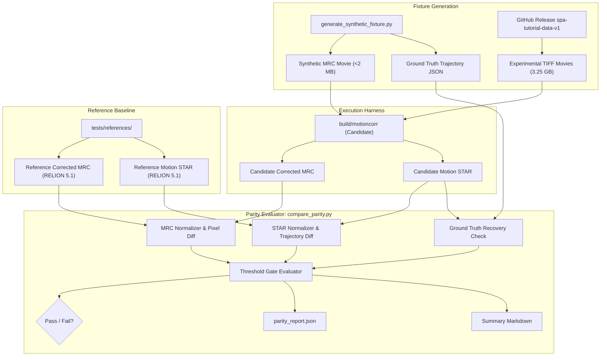

# Architectural Design Specification: #4 - Define Reference Outputs & Numerical Acceptance Gates

- **Issue Reference**: #4 - Define the reference outputs and numerical acceptance gates
- **Track**: `track:validation`
- **Priority**: P0
- **Architect**: MotionCorr Architecture Agent
- **Estimated Difficulty**: Medium (2.5/5)
- **Dependencies**: None (Foundational Prerequisite for all issues #5–#18)
- **Status**: Approved
- **Target Release / Milestone**: v1.0.0

---

## 1. Executive Summary & Problem Statement

`MotionCorr-standalone` is an extraction of RELION 5.1's CPU motion correction engine. To safely introduce Linux CI (#5), performance optimizations (#10), multi-threading determinism fixes (#7), and accelerated GPU backends (JAX #14–#15, CUDA #16–#17), the project requires an authoritative, reproducible **numerical acceptance gate**.

Currently, parity verification relies on manual comparisons documented in PR #3 and `README.md`. Without an automated reference harness and explicit mathematical tolerances:
1. Code changes risk silently introducing subtle scientific drift in motion trajectories or dose-weighted sums.
2. New accelerated backends cannot be objectively certified as "parity-compliant".
3. Full experimental cryo-EM datasets (3.25 GB) cannot be committed to Git, requiring a split architecture between versioned lightweight synthetic fixtures and release-hosted experimental assets.

This architectural design defines the complete reference bundle, synthetic movie generator, normalization rules, error metrics, and the automated comparison engine (`compare_parity.py`).

---

## 2. Architectural Objectives & Constraints

### 2.1 Functional Objectives
- **Versioned Synthetic Fixtures**: Provide a parameterized synthetic movie generator that creates deterministic MRC test movies with known ground-truth drift trajectories (linear, sinusoidal, and accelerated motion) without bloating the repository.
- **Reference Output Bundle**: Store reference trajectory STAR files and corrected MRC hashes for known commits (`ad0b230ca22095700f6392479326836efb1c911d` of `3dem/relion ver5.1`).
- **Automated Comparison Tool (`compare_parity.py`)**: A standalone Python CLI tool that ingests candidate and reference outputs, normalizes volatile metadata (timestamps, relative file paths), and computes rigorous error metrics.
- **Explicit Tolerance Tiers**: Formulate mathematical acceptance thresholds distinguishing:
  - *Tier 0 (Exact CPU Parity - 1 Thread)*: Bit-exact image identity and trajectory match.
  - *Tier 1 (Multi-threaded CPU - 4 Threads)*: Concurrency variance boundaries.
  - *Tier 2 (Accelerated Backends - Float32 GPU/JAX)*: Physical convergence limits.

### 2.2 Scientific & Non-Functional Constraints
- **Upstream Anchor**: Exact RELION commit `ad0b230ca22095700f6392479326836efb1c911d`.
- **Zero Third-Party Binary Dependencies**: Parity evaluation tooling must run in Python 3.9+ with standard scientific libraries (`numpy`, `scipy` optional, pure Python MRC/STAR parser fallback).
- **Execution Overhead**: The synthetic parity suite must execute within $\le 15\text{ seconds}$ in CI environments.

---

## 3. Mathematical & Algorithmic Formulation

### 3.1 Ground-Truth Motion Trajectory Generation
Synthetic fixtures simulate a sample moving according to a known continuous trajectory $(X^*(t), Y^*(t))$ across frame indices $t \in [0, N_{\text{frames}} - 1]$:
$$X^*(t) = v_x \cdot t + A_x \sin\left(\frac{2\pi t}{T_x}\right)$$
$$Y^*(t) = v_y \cdot t + A_y \cos\left(\frac{2\pi t}{T_y}\right)$$

Frame images $I_t(r)$ are synthesized by applying rigid Fourier phase shifts to a static band-limited reference phantom $P(r)$:
$$\mathcal{F}\{I_t\}(k) = \mathcal{F}\{P\}(k) \cdot \exp\left( -2\pi i (k_x X^*(t) + k_y Y^*(t)) \right) + \mathcal{N}(0, \sigma_{\text{noise}}^2)$$

### 3.2 Trajectory Error Metrics
Comparing candidate trajectory $(\hat{x}_t, \hat{y}_t)$ against reference trajectory $(x_t^{\text{ref}}, y_t^{\text{ref}})$:

1. **Per-frame Euclidean Error**:
   $$e_t = \sqrt{ (\hat{x}_t - x_t^{\text{ref}})^2 + (\hat{y}_t - y_t^{\text{ref}})^2 }$$
2. **Coordinate Root Mean Square Error (RMSE)**:
   $$\text{RMSE}_{\text{traj}} = \sqrt{ \frac{1}{N_{\text{frames}}} \sum_{t=0}^{N_{\text{frames}}-1} e_t^2 }$$
3. **Maximum Trajectory Deviation**:
   $$\ell_\infty^{\text{traj}} = \max_{0 \le t < N_{\text{frames}}} e_t$$

### 3.3 Image Discrepancy Metrics
Comparing candidate corrected image $\hat{I}(x,y)$ against reference image $I^{\text{ref}}(x,y)$ of dimensions $N_x \times N_y$:

1. **Pixel-wise Root Mean Square Error**:
   $$\text{RMSE}_{\text{pixel}} = \sqrt{ \frac{1}{N_x N_y} \sum_{x=0}^{N_x-1} \sum_{y=0}^{N_y-1} \left( \hat{I}(x,y) - I^{\text{ref}}(x,y) \right)^2 }$$
2. **Maximum Absolute Pixel Difference**:
   $$\ell_\infty^{\text{pixel}} = \max_{x,y} \left| \hat{I}(x,y) - I^{\text{ref}}(x,y) \right|$$
3. **Relative Image Difference**:
   $$\text{RelError}_{\ell_2} = \frac{ \| \hat{I} - I^{\text{ref}} \|_2 }{ \| I^{\text{ref}} \|_2 } = \frac{ \sqrt{\sum (\hat{I}_{x,y} - I^{\text{ref}}_{x,y})^2} }{ \sqrt{\sum (I^{\text{ref}}_{x,y})^2} }$$

### 3.4 Normalization Rules
Before comparing files, the harness must eliminate superficial discrepancies:
- **MRC Header Volatiles**:
  - Bytes 196–219 (creation timestamp, machine stamp) are ignored.
  - Bytes 224–1024 (extended user text labels) are ignored.
  - Pixel data bytes (from byte 1024 onward) are compared directly as IEEE 754 float32 arrays.
- **STAR Metadata Volatiles**:
  - Header comments (`# RELION; version ...`) are ignored.
  - File path references (e.g. `_rlnMicrographMovieName`) are normalized to relative basenames.
  - Floating point strings (e.g. `0.000000` vs `-0.000000`) are parsed into IEEE 754 floats before comparison.

---

## 4. Acceptance Gate Threshold Matrix

The comparison engine evaluates candidate runs against three distinct gate tiers:

| Metric | Tier 0: Single-Thread CPU (Golden Parity) | Tier 1: Multi-Thread CPU (4 Threads) | Tier 2: Accelerated Backends (CUDA / JAX) |
| :--- | :--- | :--- | :--- |
| **Max Trajectory Error** ($\ell_\infty^{\text{traj}}$) | $\mathbf{0.0000\text{ px}}$ (exact match) | $\le 0.0200\text{ px}$ | $\le 0.0500\text{ px}$ |
| **Trajectory RMSE** ($\text{RMSE}_{\text{traj}}$) | $\mathbf{0.0000\text{ px}}$ | $\le 0.0050\text{ px}$ | $\le 0.0100\text{ px}$ |
| **Image Pixel RMSE** ($\text{RMSE}_{\text{pixel}}$) | $\mathbf{0.0000}$ (pixel identical) | $\le 0.0100$ | $\le 0.0500$ |
| **Image Max Delta** ($\ell_\infty^{\text{pixel}}$) | $\mathbf{0.0000}$ | $\le 0.0500$ | $\le 0.2500$ |
| **STAR Schema & Fields** | Exact Match | Exact Match | Exact Match |
| **Exit Code** | `0` (Success) | `0` (Success) | `0` (Success) |

*Any run failing Tier 0 on single-threaded CPU immediately blocks merging.*

---

## 5. Component Architecture & Data Flow



---

## 6. Directory Layout & Interface Contracts

### 6.1 Proposed Repository Directory Layout
```text
MotionCorr-standalone/
├── tests/
│   ├── README.md                          # Guide to running parity checks
│   ├── fixtures/
│   │   ├── synthetic_small_recipe.json    # Exact parameters to generate small fixture
│   │   └── synthetic_small.mrcs           # Small versioned 16-frame 128x128 MRC fixture (~1 MB)
│   ├── references/
│   │   ├── manifest.json                  # Upstream commit hashes and expected metrics
│   │   ├── synthetic_small_1thread.star   # Reference STAR output
│   │   └── tutorial_movie21_1thread.star  # Reference STAR output for Movie 21
│   ├── scripts/
│   │   ├── generate_synthetic_fixture.py  # Fixture generator CLI
│   │   └── compare_parity.py              # The parity verification engine
│   └── run_parity_gates.sh                # End-to-end driver script
```

### 6.2 CLI Contract: `generate_synthetic_fixture.py`
```bash
python tests/scripts/generate_synthetic_fixture.py \
  --frames 16 \
  --size 128 128 \
  --pixel-size 1.0 \
  --noise-sigma 0.5 \
  --motion-type linear_drift \
  --output tests/fixtures/synthetic_small.mrcs \
  --truth tests/fixtures/synthetic_small_truth.json
```

### 6.3 CLI Contract: `compare_parity.py`
```bash
python tests/scripts/compare_parity.py \
  --candidate-mrc candidate/corrected.mrc \
  --reference-mrc reference/corrected.mrc \
  --candidate-star candidate/motion.star \
  --reference-star reference/motion.star \
  --truth-json tests/fixtures/synthetic_small_truth.json \
  --tier 0 \
  --output-json build/parity_report.json
```

### 6.4 Parity Report Output Schema (`parity_report.json`)
```json
{
  "gate_status": "PASSED",
  "tier_evaluated": 0,
  "metrics": {
    "trajectory_max_error_px": 0.0,
    "trajectory_rmse_px": 0.0,
    "image_pixel_rmse": 0.0,
    "image_max_delta": 0.0,
    "image_relative_l2": 0.0,
    "star_fields_matched": true
  },
  "tolerances": {
    "trajectory_rmse_px_max": 0.0000,
    "image_pixel_rmse_max": 0.0000
  },
  "provenance": {
    "upstream_relion_commit": "ad0b230ca22095700f6392479326836efb1c911d",
    "timestamp": "2026-09-23T15:00:00Z",
    "thread_count": 1
  }
}
```

---

## 7. Memory & Storage Budget

- **Versioned Git Fixture**:
  - $128 \times 128 \times 16 \text{ frames} \times 4\text{ bytes} \approx 1.05\text{ MB}$.
  - Perfectly safe for Git checkout; keeps repository clone size minimal.
- **Reference Output Artifacts**:
  - Trajectory STAR files are text files of $< 50\text{ KB}$.
  - Corrected MRC images for the small fixture are $128 \times 128 \times 4\text{ bytes} \approx 65\text{ KB}$.
- **Experimental Tutorial Movies**:
  - 3.25 GB total stored in GitHub Release `spa-tutorial-data-v1`.
  - Downloaded on-demand during full benchmark runs (#6); not required for fast CI (#5).

---

## 8. Defensive Failure Modes & Diagnostics

| Condition | Detection | Action | User Output |
| :--- | :--- | :--- | :--- |
| Image dimension mismatch | Candidate vs Reference header ($N_x, N_y, N_z$) | Immediate gate failure; abort comparison | `ERROR: Dimension mismatch: Candidate (512x512) != Reference (128x128)` |
| Frame count mismatch | STAR loop row count differs | Immediate gate failure | `ERROR: Frame count mismatch: Candidate has 24, Reference has 16` |
| Floating point NaN/Inf | `np.isnan(img).any()` or NaN in STAR | Flag numerical divergence | `FAIL: Candidate image contains NaN/Inf values at 12 coordinates` |
| Missing reference data | Reference file path does not exist | Exit with code 2 | `ERROR: Reference artifact not found: tests/references/...` |

---

## 9. Phased Implementation Roadmap for Coding Agents

### Phase A: Comparison Core & Fixture Generator
- `[NEW] tests/scripts/generate_synthetic_fixture.py`: Standalone Python script synthesizing band-limited MRC movie with exact trajectory math.
- `[NEW] tests/scripts/compare_parity.py`: Core comparison engine with MRC/STAR parsers, normalization, and tier evaluation.
- `[NEW] tests/fixtures/synthetic_small_recipe.json`: Canonical configuration for the default small fixture.

### Phase B: Baseline Reference Generation & Verification
- `[NEW] tests/fixtures/synthetic_small.mrcs`: Pre-generated 128x128 fixture.
- `[NEW] tests/references/manifest.json`: Checksums and expected metrics.
- `[NEW] tests/references/synthetic_small_reference.star`: Reference STAR output from RELION 5.1 single-thread run.
- `[NEW] tests/references/synthetic_small_reference.mrc`: Reference corrected MRC from RELION 5.1 single-thread run.

### Phase C: Integration Test Driver & CI Hook
- `[NEW] tests/run_parity_gates.sh`: Shell script running `motioncorr` on the synthetic fixture and executing `compare_parity.py` against Tier 0.
- `[MODIFY] CMakeLists.txt`: Add `enable_testing()` and `add_test(NAME ParityGate COMMAND bash tests/run_parity_gates.sh)`.

---

## 10. Verification Plan

### 10.1 Automated Verification Command
```bash
# 1. Generate candidate output using standalone build
./build/motioncorr --i tests/fixtures/synthetic_small.mrcs --o build/test_syn --use_own --angpix 1.0 --voltage 300 --j 1

# 2. Execute comparison against reference baseline
python tests/scripts/compare_parity.py \
  --candidate-mrc build/test_syn/corrected.mrc \
  --reference-mrc tests/references/synthetic_small_reference.mrc \
  --candidate-star build/test_syn/motion.star \
  --reference-star tests/references/synthetic_small_reference.star \
  --tier 0

# Expect: Exit Code 0, Gate Status: PASSED
```

### 10.2 Parity Gate Acceptance
- Tier 0 single-thread parity: $\text{RMSE}_{\text{pixel}} = 0.0$, $\text{RMSE}_{\text{traj}} = 0.0$.
- STAR metadata field consistency verified.
