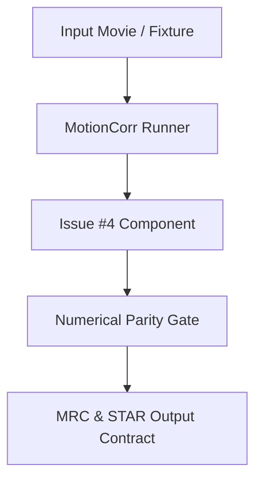

# Architectural Design Specification: #4 - Define the reference outputs and numerical acceptance gates

- **Issue Reference**: #4
- **Track**: `track:validation`
- **Priority**: P0
- **Architect**: MotionCorr Architecture Agent
- **Estimated Difficulty**: Medium (2.5/5)
- **Dependencies**: `None; can start immediately.`
- **Status**: Proposed
- **Target Release / Milestone**: v1.0.0

---

## 1. Executive Summary & Problem Statement

Record the exact RELION 5.1 commit, compiler, inputs, command lines, gain file, output normalization, and comparison tools for the existing synthetic and tutorial movie runs. Turn the one-thread macOS comparison into a reproducible reference bundle without committing the multi-gigabyte movies.

---

## 2. Architectural Objectives & Constraints

### 2.1 Functional Objectives
- Implement technical deliverables for Issue #4.
- Satisfy the core acceptance requirements:
- [ ] A small synthetic fixture and its generation recipe are versioned; the experimental dataset is referenced by the existing release and checksums.
- [ ] A comparison command reports motion trajectory error, corrected-image RMSE/max error, STAR-field differences, runtime, peak memory, and exit status.
- [ ] The existing exact one-thread CPU parity cases pass; header timestamps and paths are explicitly normalized.
- [ ] Proposed numerical tolerances for new backends are written down and approved before claiming their parity; exact CPU reference values remain visible.

### 2.2 Scientific & Non-Functional Constraints
- **Numerical Parity**: Mandatory baseline gate matching RELION 5.1 reference results (Issue #4).
- **Deterministic Execution**: Avoid non-deterministic race conditions or unordered thread reductions.
- **Memory Budget**: Peak RSS must not regress by more than 5% without documented rationale.
- **Portability**: Must build and execute cleanly on Linux (GCC/Clang) and macOS.

---

## 3. Mathematical & Algorithmic Formulation

*(To be elaborated by Architecture Agent based on domain requirements)*

1. **Core Equations / Transformations**:
   - Define coordinate frames, origin indexing, and transform matrices.
2. **Numerical Approximations & Tolerances**:
   - State floating-point precision bounds and parity convergence criteria.

---

## 4. Component Architecture & Data Flow



---

## 5. Interface Contracts & Data Structures

*(Architecture Agent: Specify relevant C++, CUDA, or Python interfaces)*

---

## 6. Memory Staging & Allocation Strategy

- Analyze buffer allocations and lifetime.
- Prevent dynamic allocations in hot alignment/CCF loops.

---

## 7. Defensive Failure Modes & Fallback Behavior

| Condition / Trigger | Detection Mechanism | Fallback / Recovery Action | User Diagnostic Visibility |
| :--- | :--- | :--- | :--- |
| Non-convergence / numerical anomaly | NaN/Inf check or condition number | Fall back to robust baseline / global shift | Log error & flag in STAR |

---

## 8. Implementation Roadmap for Coding Agents

### Step 1: Pre-requisites & Test Fixtures
- Prepare synthetic or reference fixtures.

### Step 2: Implementation of Core Logic
- Apply localized, clean changes to target modules.

### Step 3: Validation & Telemetry
- Run parity validation suite and record benchmark numbers.

---

## 9. Verification & Acceptance Criteria

### 9.1 Automated Tests
```bash
# Example verification command
python tests/compare_parity.py --issue 4
```

### 9.2 Acceptance Thresholds
- Trajectory error: $\Delta x, \Delta y \le 10^{-4}\text{ px}$
- Image RMSE $\le 10^{-6}$
- Exact STAR metadata parity
