# Architectural Design Addendum: #50 GPU residency optimization after PR #51

- **Issue Reference**: #50, PR #51 at `08236c2208b10c7caf93ecf83676ddb97c58fca3`
- **Track**: `track:cuda`, `track:optimization`
- **Priority**: P1
- **Architect**: MotionCorr Architecture Agent
- **Status**: Proposed; performance and numerical gates remain open
- **Target Release / Milestone**: v1.0.0
- **Evidence**: `outputs/issue50-review/profile-08236c2.md` in the parent workspace, one tutorial movie `00021` on A100 PCIe

---

## 1. Executive summary and measured problem

PR #51 made the main movie arrays resident on the GPU and reduced the matched process median from 7.53 to 3.80 s. It has not achieved the 3.5 GiB VRAM target: a 50 ms sample saw 6,033 MiB and allocation tracing caught a 6,636 MiB momentary allocation peak. The current result matches the saved Issue #47 CUDA output exactly, while its CPU-relative image RMSE is **0.0071307469** for movie `00021`, above the required 0.001. The optimization must preserve the current CUDA result while the separate numerical discrepancy is resolved; a faster run is not a Gate 2 pass.

The immediate memory causes are the two retained, approximately 1,304 MiB cuFFT work areas and the 1,304 MiB C2R input preservation copy. The avoidable host work is a second gain pass across every frame, performed only so CPU defect replacement can read gain-corrected neighbors. Raw TIFF decode takes 0.734 s; GPU H2D copies take 0.401 s. A further 0.635 s inside the movie and 1.113 s outside it are not assigned to specific functions by the current timers. The original 1.0–1.3 s process target is therefore unproven.

## 2. Objectives and scientific constraints

1. For the profiled 3710 × 3838 × 24 movie, record whole-process VRAM peak at or below **3.5 GiB (3,584 MiB)**, including CUDA context, plan work areas, patch and reconstruction scratch. Report both 50 ms samples and allocation-event high-water; the former alone cannot certify a passing peak.
2. Reduce median end-to-end process time below the matched 3.80 s baseline, without a material regression in any named stage. Report a distribution from repeated unprofiled runs on the same GPU, input, options, host state, and build mode; report profiler timings separately.
3. Preserve current CUDA corrected pixels, trajectory and STAR fields with an exact comparison wherever deterministic, then apply the existing RELION Gate 2 thresholds independently: coordinate RMS ≤ 0.02 px, maximum shift ≤ 0.05 px, absolute image RMSE ≤ 0.02, relative image RMSE ≤ 0.001, maximum pixel error ≤ 5.0, and identical required metadata. Never loosen tolerances. Maintain CPU fallback for CUDA allocation, plan, launch, synchronization, or reconstruction failure.
4. Preserve `CUDA=OFF` build behavior and all CLI modes, including early binning, power spectrum, no dose weighting, odd/even output, EER, explicit defect maps, and gain rotation/flip. A package may use the existing streaming or CPU path for a mode it cannot support, with a clear log and identical outputs.

## 3. Mathematical and ordering contract

For pixel `p` in frame `f`, corrected value before defect repair is the current float operation `C[f,p] = raw[f,p] * gain[p]` when gain exists, otherwise `raw[f,p]`. The unaligned sum is accumulated in the existing frame order. The host mean, standard deviation, threshold, zero-gain mask, explicit mask, and hot-pixel scan must see the same `Isum` and visit pixels in the same order as the baseline. Each bad pixel is visited in current raster order, then each frame in order; its valid neighbors are collected in the existing `dy`, then `dx` order. `rand() % n_ok` or `rnd_gaus` is called exactly where the current code calls it. Changing reduction, arithmetic precision, neighborhood order, or RNG calls changes scientific output and requires an explicit parity investigation.

The movie Fourier layout is `ny × (nx / 2 + 1)` complex values per frame, with the current R2C scale `1/(nx*ny)`. Global C2R may overwrite its input. Its input must therefore be a copy of the current aligned `d_Fframes`, which remains intact for dose weighting and CPU fallback. Patch extraction runs from the real frames produced by global C2R. Dose weighting runs from the preserved Fourier frames after local alignment and polynomial fitting. These stage dependencies forbid speculative overlap that exposes partially transformed data.

## 4. Component architecture and data flow

```mermaid
flowchart LR
  A[Decoded host frames] --> B[One H2D upload]
  B --> C[GPU gain and initial sum]
  C --> D[Host hot pixel statistics and ordered RNG repair]
  D --> E[Sparse GPU defect update]
  E --> F[Bounded batch R2C]
  F --> G[Global GPU alignment]
  G --> H[Bounded batch C2R with batch-sized Fourier copy]
  H --> I[GPU patch preparation and alignment]
  I --> J[Host polynomial fit]
  G --> K[GPU dose reconstruction]
  J --> K
  K --> L[Final image download and output]
```

Keep the existing host initial-sum download while host hot-pixel statistics are authoritative. It is approximately 54.32 MiB. Removing it requires a separate GPU statistics and mask design that preserves mean/stddev, threshold boundary decisions and mask order; do not combine that change with FFT memory work. Shift downloads and polynomial coefficient uploads are small and are part of the current algorithm boundary.

## 5. Interface and allocation contracts

### 5.1 Bounded cuFFT plans and one shared work area

In `CudaMovieSession`, create R2C and C2R plans with cuFFT automatic work allocation disabled before planning, query each plan's required work size for each candidate batch, allocate one explicitly owned work area of `max(R2C, C2R)` bytes, and associate both sequential plans with it. Plan creation, work-size query, work-area association, and execution must all be checked. The work area cannot be reused while an earlier transform is in flight; use the same stream and an explicit completion boundary before reuse or destruction. Avoid `cufftPlanMany` paths that allocate work areas before automatic allocation is disabled. Record actual work sizes and chosen batch size in the log.

Use a bounded batch `B` dividing the 24 frames when possible; process a final partial batch with its own validated plan or a safe padded strategy. Candidate sizes should start at 1 and increase only when measured whole-process peak remains below 3,584 MiB and runtime improves. Plan strides must retain the current `nx*ny` real and `ny*(nx/2+1)` complex frame layout. This changes cuFFT planning and execution shape, so compare every candidate against the `08236c2` output before selecting one. Never infer work size as a fixed multiple of frame size.

The resident real and Fourier arrays total **2,607.94 MiB**. Gain and initial sum add **108.64 MiB**. With a two-frame Fourier preservation tile of about **108.69 MiB**, the remaining budget is about **758.7 MiB** for shared movie FFT work area, patch and reconstruction scratch, alignment scratch, and CUDA context. The observed alignment increment was about 179 MiB, patch arrays about 35 MiB, and reconstruction helper about 217 MiB; their lifetimes may differ, so measure actual concurrent peak instead of adding all local estimates. A full-batch shared work area of about 1,304 MiB still fails the target. A small batch is necessary even after sharing.

Suggested private state: two movie plan handles; chosen batch size; `size_t fft_work_bytes`; one owned `void *d_fft_work`; one owned `cufftComplex *d_inverse_tile` with capacity `B * ny * nfx`; a stream or verified default-stream ordering contract. Initialize atomically or release all partly created resources on failure. `release()` must destroy plans before freeing their associated work area and be safe when called twice.

### 5.2 Preserve Fourier frames with a bounded tile

For each `B`-frame C2R tile, copy only that tile from `d_Fframes` to `d_inverse_tile`, execute C2R from the tile to the corresponding `d_Iframes` region, then reuse the tile after completion. Keep the Fourier copy exactly before C2R, because C2R may modify its complex input. The output location and normalization remain as at `08236c2`. Do not perform C2R directly on `d_Fframes`, recompute Fourier data, or modify dose weighting order as a memory shortcut. If `cudaMemcpyAsync` is introduced, pinned host memory does not affect device-to-device copies; correctness requires stream ordering and synchronized error propagation.

### 5.3 Remove the duplicate host gain pass without losing fallback

Keep raw decoded `Iframes` on the host through defect repair. On the resident path, read neighbor values as the same float product `raw * gain` when building the ordered `pbuf`; write computed replacement values to a separate sparse host record and upload them in the current frame-major shape. Do not write corrected values into raw `Iframes` during this path. For zero-gain or explicit bad pixels, preserve the exact mask and neighbor exclusion behavior. Ensure the recorded replacement of an earlier bad pixel is not read as a neighbor, matching the current `bBad` exclusion.

Make host frame state explicit (`Raw` versus `GainCorrectedAndRepaired`). If a later CUDA stage fails, materialize each host frame once with gain, then apply the saved sparse replacements at their coordinates before invoking CPU or streaming fallback. Handle failure during the GPU gain/sum call separately: determine whether device state was partially updated, discard the session, and run the original CPU preprocessing from raw frames and a reset sum. Check the return value of `updateDefectPixels`; the current caller ignores it. Treat launch success alone as insufficient where subsequent kernels depend on results; synchronize or inspect stream status at the stage boundary. Never allow a failed sparse update to continue into FFT with uncorrected pixels.

### 5.4 Transfer and time work after memory is stable

Retain the single upload of each raw frame and gain image. The initial-sum D2H and final-image D2H remain two distinct full-image transfers in the current algorithm. Do not claim a single download until an independently validated GPU hot-pixel detection replaces host statistics. Investigate whether decoded frame memory can be pinned or staged in a bounded ring without extra full-movie host copies; pinning only helps if the decoder and `cudaMemcpyAsync` can overlap safely, and it can raise host RSS. Preserve early failure and fallback access to host frames. After instrumentation identifies costs, optimize TIFF decode/read and output generation separately from GPU numerical kernels.

Add explicit stage-boundary timestamps or CUDA events for upload, plan creation, forward FFT completion, global alignment, tile copy/C2R, patches, polynomial fit, reconstruction, D2H, MRC write, STAR/PDF write and startup. Record live and peak allocated device bytes, host RSS, and selected plan sizes. Do not sum asynchronous host timers as if they form a GPU timeline. Keep profiling instrumentation off or low-cost in normal benchmark builds.

## 6. Defensive failure modes

| Trigger | Detection | Recovery and diagnostic |
|---|---|---|
| No plan/batch fits memory budget or cuFFT plan/work allocation fails | cuFFT/CUDA return plus measured free/total memory | Release partial session, log dimensions, candidate batch, requested bytes and error; run the existing CPU or streaming path from intact host frames. |
| C2R tile copy, execution or synchronization fails | CUDA/cuFFT status at tile boundary | Stop consuming resident data; release session after stream completion; use gain-corrected and repaired host frames for fallback. Do not reuse a potentially clobbered Fourier tile. |
| Sparse defect upload or kernel fails | Checked return and stream completion | Rebuild host corrected frames from raw plus saved ordered replacement values, then use CPU path. |
| GPU reconstruction fails after partial final image download | Checked stage status | Reset output image, restore required host Fourier/real frames from a valid source, and rerun CPU reconstruction. An unsuccessful download must not be treated as a valid fallback input. |
| Feature combination lacks resident implementation | Explicit capability check before session initialization | Use the existing CPU or streaming route with a descriptive log. |

All error paths must avoid a partially initialized session, double frees, stale cached pointers, and mixed GPU/CPU output. A fallback is successful only when the complete requested movie output and metadata are produced.

## 7. Independent implementation packages and ownership

Packages are ordered for integration and can be developed independently in isolated worktrees. **The integration owner alone edits shared source files** when applying the resulting patches. Each implementer supplies a narrowly scoped patch or commit; no agent should overwrite another agent's work.

| Package | Responsibility and acceptance | Exclusive implementation ownership |
|---|---|---|
| A: FFT memory | Explicit shared work area, bounded movie R2C/C2R plans and tiled Fourier preservation; log plan sizes, obey 3.5 GiB whole-process peak | `src/acc/cuda/cuda_movie_session.h`, `src/acc/cuda/cuda_movie_session.cu` FFT lifecycle and transform sections only; one agent owns both A and B integration points |
| B: host preprocessing | Lazy gain-corrected neighbor reads, sparse replacement record, checked GPU update and reliable host fallback | `src/motioncorr_runner.cpp` gain/defect/fallback sections only; any session API change goes through A's owner |
| C: transfer and timing | Measure upload, decoder, output and sync costs; optimize bounded upload staging only after an A/B integrated baseline | Dedicated profiling script/report under `tools/` and `agents/reports/`; changes to runner instrumentation are submitted to the integration owner |
| D: independent numerical check | Compare optimized output to `08236c2`, CPU/RELION and all required metadata; cover gain/no-gain, defects/no defects, dose/no dose and fallback | Read-only verification report under `agents/reports/`; no production source edits |
| E: independent performance check | Re-run matched unprofiled time/RSS and whole-process GPU allocation trace, examine all stages and error injection | Read-only verification report and raw artifact directory outside source tree; no production source edits |
| F: architecture and spec audit | Review memory arithmetic, stage ordering, fallback completeness and scope before integration | This design and read-only conformance report; no production source edits |

Do not parallelize package A into separate agents that edit `cuda_movie_session.cu`; workspace sharing, plan shape and inverse preservation share the same lifetime contract. The integration owner should apply A, measure and compare, then B, measure and compare, then choose any C optimization with evidence. Independent D and E reviewers should inspect the final combined SHA, not just their contributors' intermediate patches.

## 8. Verification and acceptance criteria

1. Record the exact source SHA, binary hash, command, GPU ID, CUDA toolkit and driver, input hashes, build flags, and host load for baseline and candidate. Use the same 24-frame tutorial `00021` command as the profile, then additional representative modes. Never compare profiled wall time to unprofiled wall time.
2. Run the candidate multiple times unprofiled and report median, spread, movie timer, every named stage, untimed movie gap and outside-movie gap. Record host peak RSS. Use an allocation-event trace to establish instantaneous VRAM peak; 50 ms `nvidia-smi` samples are supplementary. The integrated candidate must be at or below 3,584 MiB and below the matched 3.80 s median. Report performance separately if only one target passes.
3. Compare corrected MRC pixels and trajectory/STAR metadata to the pinned `08236c2` result. Investigate every change caused by batched cuFFT shape, gain read ordering, or async transfers; exact match is the aim. Apply CPU and RELION Gate 2 thresholds separately. The current relative-image-RMSE failure remains open until fresh reference evidence passes it.
4. Exercise synthetic known-motion checks, the existing CUDA negative suite, a full 24-movie dataset run, local-patch results, and explicit CPU fallback/low-memory failure cases before calling the change release-ready. A fast synthetic pass cannot substitute for full movie parity.
5. Build both `CUDA=ON` and `CUDA=OFF`. Verify all requested output variants and failure paths listed in Section 2. Review every new allocation for ownership and cleanup on every return.

**Merge gate**: independent numerical and performance reviewers must report on the final combined commit. State VRAM, end-to-end time, current-CUDA parity, and RELION Gate 2 as four separate verdicts. Update the PR's time/memory table with the exact integrated SHA and raw artifact location.
