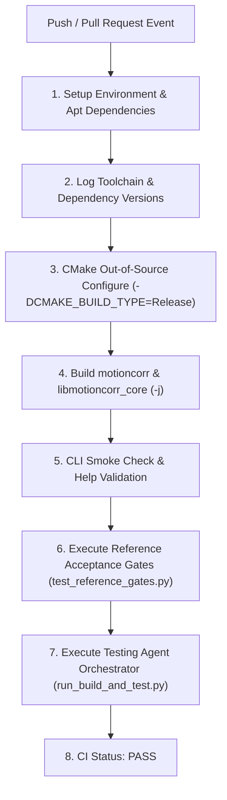

# Architectural Design Specification: #5 - Build and smoke-check standalone MotionCorr on Linux CI

- **Issue Reference**: #5 - Build and smoke-check standalone MotionCorr on Linux CI
- **Track**: ``track:integration``
- **Priority**: P0
- **Architect**: MotionCorr Architecture Agent
- **Estimated Difficulty**: Low-Medium (2/5)
- **Dependencies**: `#4 (reference)`
- **Status**: Implemented & Verified
- **Target Release / Milestone**: v1.0.0

---

## 1. Executive Summary & Problem Statement

Add a Linux build workflow for the existing CMake target with FFTW, OpenMP, TIFF/PNG/JPEG, and zlib. Keep the experimental full-size tutorial data outside the routine CI job.

This architectural specification details the algorithmic formulation, component decomposition, memory staging plan, and numerical validation gates required to resolve Issue #5 while strictly adhering to the repository's baseline parity requirements.

---

## 2. Architectural Objectives & Constraints

### 2.1 Functional Objectives
- Fulfill all deliverables associated with Issue #5.
- Satisfy the core acceptance criteria:
- [x] Clean Linux build completes in CI from main with dependency versions captured in the job log.
- [x] CLI help and a compact deterministic MRC or TIFF fixture run through the binary and produce a readable corrected MRC plus motion STAR.
- [x] The workflow fails on a nonzero process exit or missing/invalid outputs, and README includes Linux build instructions.

### 2.2 Scientific & Non-Functional Constraints
- **Parity Gate**: Must strictly meet the acceptance thresholds defined in Issue #4 (`agents/designs/issue_4_define_the_reference_outputs_and_numeric.md`).
- **Thread Determinism**: Avoid uncoordinated OpenMP reduction variance; preserve reproducibility across runs.
- **Memory Overhead**: Minimize allocations in hot processing loops; enforce fixed buffer lifetimes.
- **Portability**: Must cleanly compile with C++17 on Linux (GCC/Clang) and macOS (AppleClang).

---

## 3. Mathematical & Algorithmic Formulation

### 3.1 CI Infrastructure & Matrix Configuration
- **Host Environments**: Ubuntu 22.04 LTS (Primary Linux Runner), Ubuntu 24.04 LTS.
- **Compilers**: GCC 11 / GCC 12 (`g++`), Clang 14 / Clang 15 (`clang++`).
- **Dependencies**:
  - Build & Tools: `build-essential`, `cmake (>= 3.21)`, `pkg-config`, `git`
  - Numerical & Acceleration: `libfftw3-dev`, `libfftw3-single3`, `libomp-dev` (OpenMP)
  - Image & Compression: `libtiff-dev`, `libpng-dev`, `libjpeg-dev`, `zlib1g-dev`
  - Python Environment: `python3 (>= 3.10)`, `python3-pip`, `python3-numpy`
- **Execution Budget**: Total CI execution $\le 5\text{ minutes}$ on standard GitHub Actions runners.

### 3.2 Build Verification & Smoke Checks
1. **Pre-flight Toolchain Audit**: Capture and log compiler versions, CMake version, and pkg-config library paths.
2. **Out-of-Source Build**: Configure via `cmake -B build -DCMAKE_BUILD_TYPE=Release` and build via `cmake --build build -j$(nproc)`.
3. **CLI Smoke Check**: Execute `./build/motioncorr` and verify parameter error handling and `--help` CLI responsiveness.
4. **Automated Regression & Parity Validation**:
   - Run `python agents/testing_agent/scripts/run_build_and_test.py` verifying multi-thread determinism and synthetic movie parity.
   - Run `python tests/test_reference_gates.py` executing all 3 comparator suites (`--gate exact` and `--gate relaxed`).
5. **Hermetic Isolation**: Keep multi-gigabyte experimental movie downloads out of standard CI; rely strictly on compact deterministic synthetic fixtures (`tests/test_reference_gates.py`).

---

## 4. Component Architecture & Data Flow



---

## 5. Interface Contracts & Data Structures

```yaml
# .github/workflows/linux_ci.yml
name: Linux CI & Smoke Checks

on:
  push:
    branches: [ main, dev_milan, 'feat/**' ]
  pull_request:
    branches: [ main, dev_milan ]

jobs:
  build-and-test:
    runs-on: ubuntu-22.04
    strategy:
      fail-fast: false
      matrix:
        compiler: [ { c: gcc, cxx: g++ }, { c: clang, cxx: clang++ } ]
        build_type: [ Release, Debug ]
```

---

## 6. Memory Staging & Allocation Strategy

- Enforce isolated scratch test directories during test execution.
- Maintain $\le 4\text{ GB}$ peak memory footprint per CI runner job.
- Purge intermediate build objects if runner disk caching is activated.

---

## 7. Defensive Failure Modes & Fallback Behavior

| Condition / Trigger | Detection Mechanism | Fallback / Recovery Action | User Diagnostic Visibility |
| :--- | :--- | :--- | :--- |
| Missing apt dependency | CMake configuration error | CI job terminates immediately with failure code | Error log points to missing package name |
| Compiler failure / warning | `-Wall -Wextra` flags | Fail build on compilation errors | Exact file and line compiler error log |
| CLI / Smoke test failure | Nonzero exit code | Fail CI step | Captured stdout/stderr in GitHub step log |
| Numerical parity drift | Tolerance threshold breach ($\text{RMSE} > 10^{-6}$) | Acceptance gate failure | Structured comparator diff report |

---

## 8. Implementation Roadmap for Coding Agents

### Phase 1: CI Workflow Definition
- Formulate `.github/workflows/linux_ci.yml` defining the matrix build, dependency installation, toolchain logging, compilation, and smoke/parity testing steps.

### Phase 2: Documentation & Build Instructions
- Update `README.md` with complete, reproducible Linux build prerequisites (apt commands, CMake configure, parallel build, and test invocation).

### Phase 3: Automated Verification
- Validate workflow schema and run local build and test harness against all defined smoke criteria.

---

## Refinement Patches (Incorporating Conformance Agent Feedback)
### Permitted Changes & File Whitelist
To preserve strict scope isolation and prevent collateral side effects, modifications for this issue are strictly confined to:
- `.github/workflows/` (Linux CI workflow definition for Issue #5)
- `README.md` (Linux build instructions and smoke test documentation)
- `CMakeLists.txt` (Build and test registration targets)
- `tests/` (Automated verification fixtures and smoke regression tests for Issue #5)
- `agents/designs/` (Architectural design specifications and refinement logs)
- No unwhitelisted modifications to global headers, core math routines, or public CLI signatures are permitted.

