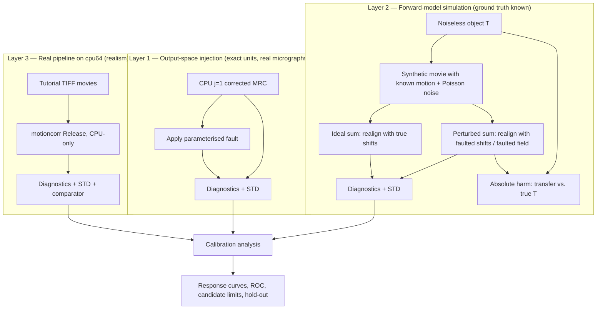

# Architectural Design Specification: Calibrate MotionCorr numerical diagnostics with controlled perturbations

- **Issue Reference**: [#60](https://github.com/KingAlejandro/MotionCorr-standalone/issues/60) — Calibrate MotionCorr numerical diagnostics with controlled perturbations
- **Track**: `track:research`, `track:validation`
- **Priority**: P1
- **Architect**: MotionCorr Architecture Agent (per [AGENTS.md](../../AGENTS.md) §1.1)
- **Status**: Proposed
- **Scope boundary**: analysis and calibration tooling only. **No change to `tools/compare_motioncorr.py`, to the `0.001` relative-RMSE limit, or to any recorded gate result.**

---

## 1. Executive Summary & Problem Statement

`docs/reference_gates.md` §5 defines Gate 2 (`--gate relaxed`) with six numerical limits. Those limits were written down as *provisional* values for future backends; none was derived from a measurement of how much motion-correction signal a violation costs. Issue [#36](https://github.com/KingAlejandro/MotionCorr-standalone/issues/36) then found 0/24 experimental movies inside the `0.001` relative-RMSE limit for the experimental CUDA path, with every other Gate 2 metric passing. Two opposite conclusions are currently equally defensible from the recorded evidence:

1. the CUDA path loses recoverable signal and the gate is correctly rejecting it; or
2. the gate is tighter than any scientific requirement, and is rejecting a backend that is scientifically equivalent.

The recorded data cannot distinguish these, because the only thing measured is *disagreement with a CPU reference*, and disagreement has no units of lost signal. Fitting a new limit to the observed 0.0029–0.0100 CUDA spread would be circular: it would be chosen by the very data it must judge.

This specification defines a **controlled-perturbation calibration**: inject numerical faults of *known physical magnitude* into motion correction, measure how every candidate diagnostic responds, and independently measure how much signal each fault actually costs. The output is a diagnostic-versus-harm mapping from which limits can be *derived* rather than fitted, together with an explicit account of blind spots, false alarms, and uncertainty.

An inconclusive result is an acceptable outcome of this work and must be reported as such.

---

## 2. Architectural Objectives & Constraints

### 2.1 Functional Objectives

- **F1** — Provide a reusable perturbation library with exactly parameterised, physically interpretable fault operators (translation, inter-frame jitter, drift bias, local deformation, envelope attenuation, dose/gain normalisation fault, hot pixels).
- **F2** — Provide a diagnostic library that computes, for any (reference, test) micrograph pair, both the *existing* Gate 2 metrics and the *candidate* metrics named in issue #60: frequency-band splits, interior/border splits, global and local displacement metrics, and at least one independent signal-quality measure.
- **F3** — Provide a driver that executes a **predeclared** perturbation matrix on real movies through the real `motioncorr` binary, CPU-only.
- **F4** — Provide an analysis stage that produces response curves, repeat-run noise floors, false-positive/false-negative counts against candidate limits, and a hold-out validation.
- **F5** — Publish a reproducible report with source, binary and input hashes, exact commands, and complete numerical outputs including negative results.

### 2.2 Scientific & Non-Functional Constraints

- **C1 — Gate immutability.** `tools/compare_motioncorr.py` is not edited by this work. No existing PASS/FAIL result is reclassified. The `0.001` limit remains in force. Any revision is a separate, explicitly reviewed proposal (issue #58 owns the semantics, this issue supplies the evidence).
- **C2 — File-ownership isolation.** All new code lands under `tools/calibration/` and all new evidence under `docs/calibration/`. Issue #59 owns `test-data/` synthetic-motion fixtures and the displacement-field *gate*; issue #58 owns gate semantics and `docs/reference_gates.md`; issue #61 owns downstream scientific non-inferiority. This work consumes their interfaces and edits none of their files.
- **C3 — Predeclaration.** The perturbation matrix, the severity grids, the movie split, the harm tiers, and the hold-out plan are committed to version control **before** any result is inspected. The commit hash of the prespecification is quoted in the report.
- **C4 — Compute policy.** CPU-only on `cpu64` (64 cores, 226 GiB). The shared `4GPUs` host is **not** used and no GPU benchmark is launched. Builds use `-DCMAKE_BUILD_TYPE=Release`; an unqualified CMake configure produces `-O0` and is treated as a configuration fault.
- **C5 — Determinism.** Every run fixes `--seed 1`. Repeat-run variation is measured, not assumed to be zero.
- **C6 — Reproducibility limits.** MotionCorr output is not byte-reproducible at whole-file level (MRC header timestamp, ghostscript dates). All hashing is over the MRC pixel payload and the normalised STAR content, never the whole file.

---

## 3. Mathematical & Algorithmic Formulation

### 3.1 The quantity a gate should be measuring

Let $T(\mathbf{r})$ be the true, motion-free specimen signal recorded by the detector and let a corrected micrograph be

$$S(\mathbf{r}) = (h * T)(\mathbf{r} - \mathbf{t}) \cdot g + n(\mathbf{r})$$

with $g$ a scale factor, $\mathbf{t}$ a rigid translation, $h$ a blur kernel produced by residual (uncorrected or mis-corrected) motion, and $n$ everything not explained by that model.

Relative RMSE collapses $g$, $\mathbf{t}$, $h$ and $n$ into one scalar. Those four terms have completely different scientific consequences:

| Term | Physical meaning | Consequence for downstream cryo-EM |
|:---|:---|:---|
| $g$ | normalisation/gain/dose scale error | none if uniform (particle extraction renormalises); harmful if frame-dependent |
| $\mathbf{t}$ | accounted-for coordinate translation | none — particle coordinates move with the micrograph |
| $h$ | residual motion blur / envelope loss | **direct loss of high-resolution signal** |
| $n$ | incoherent error (hot pixels, local field corruption, noise) | harmful, and invisible to $g,\mathbf{t},h$ |

The calibration therefore estimates all four separately.

### 3.2 Spectral Transfer Decomposition (STD)

For a reference micrograph $R$ and a test micrograph $S$, both real, of size $N_x \times N_y$, define the complex spectral transfer in radial shell $\kappa$:

$$\Gamma(\kappa) \;=\; \frac{\sum_{|\mathbf{k}| \in \kappa} \hat{S}(\mathbf{k})\,\hat{R}^{*}(\mathbf{k})}{\sum_{|\mathbf{k}| \in \kappa} |\hat{R}(\mathbf{k})|^{2}}$$

This is the least-squares transfer from reference to test, shell by shell. Because both micrographs are produced from the *same* movie, they share the same noise realisation; $\Gamma$ therefore measures how the pipeline transformed that content rather than being dominated by independent noise.

Four parameters are extracted:

1. **Scale** $g = |\Gamma(\kappa_0)|$ in the lowest non-DC shell.
2. **Translation** $\mathbf{t}$ from the linear phase ramp of $\hat{S}\hat{R}^*$, estimated to subpixel accuracy by parabolic interpolation of the peak of $\mathcal{F}^{-1}\{\hat{S}\hat{R}^{*}\}$. Reported in px and in Å.
3. **Envelope loss** $\Delta B$ in Ų, from a weighted linear fit over $k \in [k_{\min}, k_{\max}]$ of

   $$\ln \frac{|\Gamma(k)|}{g} \;=\; -\frac{\Delta B}{4}\,k^{2}, \qquad k = \frac{\kappa}{N a} \;[\text{Å}^{-1}]$$

   with $a$ the pixel size in Å. $\Delta B > 0$ means the test lost high-frequency amplitude relative to the reference.
4. **Incoherent residual** $\varepsilon_{\text{inc}}$: the fraction of reference power left unexplained after removing $g$, $\mathbf{t}$ and $\Delta B$,

   $$\varepsilon_{\text{inc}}^{2} \;=\; \frac{\sum_{\mathbf{k}} \big| \hat{S}(\mathbf{k}) - \hat{M}(\mathbf{k}) \big|^{2}}{\sum_{\mathbf{k}} |\hat{R}(\mathbf{k})|^{2}}, \qquad \hat{M}(\mathbf{k}) = g\,e^{-\Delta B k^{2}/4}\,e^{-2\pi i \mathbf{k}\cdot\mathbf{t}}\,\hat{R}(\mathbf{k})$$

$\varepsilon_{\text{inc}}$ is a *shift- and envelope-corrected relative RMSE*. It is the single most important candidate diagnostic in this design, because it is the part of relative RMSE that cannot be explained by a benign reparameterisation of the same image.

### 3.3 Harm currency and harm tiers

$\Delta B$ is the currency because it is what the MotionCor2 and RELION motion-correction literature uses, and because it converts directly into amplitude loss at a stated resolution:

$$\frac{A_{\text{test}}(d)}{A_{\text{ref}}(d)} = \exp\!\left(-\frac{\Delta B}{4 d^{2}}\right)$$

Tutorial data: $a = 0.885$ Å/px, Nyquist $= 1.77$ Å. Evaluating at $d = 3$ Å:

| Tier | Criterion | Amplitude loss at 3 Å | Required gate behaviour |
|:---|:---|:---:|:---|
| **Negligible** | $\Delta B \le 1$ Ų **and** $\varepsilon_{\text{inc}} \le$ noise floor | 0.8 % | must **not** fail a blocking gate |
| **Marginal** | $1 < \Delta B \le 5$ Ų | 0.8 – 4.1 % | warning is acceptable |
| **Unacceptable** | $\Delta B > 5$ Ų, **or** a translation not recorded in the STAR metadata, **or** a frame-dependent scale error > 1 % | > 4.1 % | must fail a blocking gate |

$\Delta B_{\text{harm}} = 5$ Ų is **declared in advance**. Sensitivity of every conclusion to that choice is reported at $\Delta B_{\text{harm}} \in \{2, 5, 10\}$ Ų.

### 3.4 Forward model for residual motion

A per-frame residual shift error $\boldsymbol{\delta}_f$ applied to an $N_f$-frame sum yields

$$S = \frac{1}{N_f}\sum_{f} T(\mathbf{r} - \boldsymbol{\delta}_f) + \text{noise} \;\;\Longrightarrow\;\; \hat{h}(\mathbf{k}) = \frac{1}{N_f}\sum_f e^{-2\pi i \mathbf{k}\cdot\boldsymbol{\delta}_f}$$

For zero-mean Gaussian $\boldsymbol{\delta}$ with per-axis RMS $\sigma$ px this tends to $\hat{h}(k) = e^{-2\pi^{2}\sigma^{2}k^{2}}$, i.e. an equivalent B-factor

$$\Delta B = 8\pi^{2}\sigma^{2}a^{2} \;[\text{Å}^2], \qquad \sigma \text{ in px}, \; a \text{ in Å/px}.$$

For $a = 0.885$: $\Delta B_{\text{harm}} = 5$ Ų corresponds to $\sigma = 0.284$ px, and $\Delta B = 1$ Ų to $\sigma = 0.127$ px. **This is a prediction made before any measurement**, and the measured curve is checked against it. Note immediately that the existing coordinate-RMS limit of 0.02 px corresponds to $\Delta B = 0.025$ Ų, i.e. the trajectory gate is roughly 200× stricter in harm terms than the declared harm boundary. That prediction is itself a calibration result to be confirmed.

Crucially, this relation applies to *random* residual error. A *constant* residual shift ($\sigma = 0$, $|\boldsymbol{\delta}| = t$) produces $\Delta B = 0$ and pure translation: no signal loss at all.

---

## 4. Component Architecture & Data Flow

### 4.1 Three experiment layers



**Why three layers, and what each can and cannot establish:**

- **Layer 2** is the only layer with an absolute harm measurement, because only there is the noiseless object known. It is small and synthetic, so it cannot establish magnitudes for real micrographs.
- **Layer 1** applies exactly known faults to real corrected micrographs, giving exact severity in physical units on realistic image statistics. Its limitation is stated explicitly: applying a blur to an already-summed micrograph blurs the noise as well as the signal, whereas real residual motion blurs only the signal. Layer 1 therefore *over*states RMSE for a given $\Delta B$; Layer 2 quantifies that bias and the correction factor is reported.
- **Layer 3** is the only layer that exercises the real code path, real gain correction, real defect handling and real dose weighting, but it can only reach the faults that are reachable through CLI options and input files.

No single layer is sufficient; the report states which layer each claim rests on.

### 4.2 Which faults are reachable where

| ID | Fault | Physical parameter | L1 | L2 | L3 | Class |
|:---|:---|:---|:---:|:---:|:---:|:---|
| `H1` | thread count `--j 1,2,4,8` | reduction order, FFTW plan | — | — | ✓ | harmless |
| `H2` | `OMP_PROC_BIND` close/spread | thread placement | — | — | ✓ | harmless |
| `H3` | repeat run, identical config | — | — | — | ✓ | harmless (noise floor) |
| `H4` | reference against itself | — | ✓ | ✓ | ✓ | harmless (null control) |
| `X1` | accounted-for constant translation | $t$ px | ✓ | ✓ | ✓ | benign-but-alarming |
| `X2` | random inter-frame jitter | $\sigma$ px RMS | ✓ | ✓ | — | harmful |
| `X3` | systematic inter-frame drift bias | total $\Delta$ px | ✓ | ✓ | — | harmful |
| `X4` | corrupted local deformation field | $a_{\text{loc}}$ px RMS, corr. length $L$ | ✓ | ✓ | — | harmful |
| `X5` | high-frequency attenuation | $\Delta B_{\text{app}}$ Ų | ✓ | ✓ | — | harmful |
| `X6` | wrong dose (`--dose_per_frame`) | scale $\rho$ | — | ✓ | ✓ | harmful |
| `X7` | hot pixels injected into movie | count $n$, amplitude | ✓ | ✓ | ✓ | harmful |
| `X8` | gain normalisation fault | $\epsilon$ uniform / one bad column | — | — | ✓ | harmful |

`X2`–`X5` are not reachable through the CLI without editing the alignment engine. Editing the engine would collide with the CUDA and optimisation branches and would make the perturbation itself a confound. They are therefore studied in L1/L2 only, and this is recorded as a **scope limit**, not hidden.

### 4.3 Module layout (all new files, no shared edits)

```
tools/calibration/
  __init__.py
  mrcio.py            # MRC 2014 read/write, STAR parsing, motion-model evaluation
  perturbations.py    # F1: fault operators, each with declared physical units
  diagnostics.py      # F2: existing Gate 2 metrics + candidate metrics + STD
  prespecification.py # C3: the frozen matrix, severity grids, splits, harm tiers
  layer1_inject.py    # L1 driver
  layer2_forward.py   # L2 driver
  layer3_pipeline.py  # L3 driver (cpu64)
  analyze.py          # F4: response curves, noise floor, ROC, hold-out
docs/calibration/
  issue60_gate_calibration.md   # F5: the report
  *.json                        # raw measurements
```

---

## 5. Interface Contracts & Data Structures

### 5.1 Displacement-field metric (consumes #59, does not define the gate)

Issue #59 owns the known-motion gate. This work needs the same quantity for calibration and therefore implements a read-only evaluator of the shipped model, reproducing `Micrograph::getShiftAt` (`src/micrograph_model.cpp:360`) exactly:

```python
# total applied displacement, in pixels, of frame f at detector position (x, y)
#   normalised coords: xn = x/width - 0.5 ; yn = y/height - 0.5
#   polynomial variable: z = f - first_frame            (f is 1-indexed)
#   D(f,x,y) = global_shift[f] + ThirdOrderPolynomialModel(z, xn, yn)
def displacement_field(star, grid_x, grid_y) -> np.ndarray:  # (n_frames, ny, nx, 2)
```

Reported statistics, in **pixels and Å**, with constant offset reported separately from frame-to-frame change:

`field_rms`, `field_p95`, `field_max`, `field_const_offset`, `field_interframe_rms`.

If and when #59 publishes a metric module, this evaluator is replaced by an import; the schema above is offered to #58/#59 as the coordination point and is not unilaterally frozen.

### 5.2 Diagnostic record schema

```json
{
  "existing": { "image_rmse": 0.0, "image_relative_rmse": 0.0, "image_max_abs_error": 0.0,
                "traj_max_shift_error": 0.0, "traj_coord_rms_error": 0.0 },
  "bands":    { "rel_rmse_low": 0.0, "rel_rmse_mid": 0.0, "rel_rmse_high": 0.0 },
  "regions":  { "rel_rmse_interior": 0.0, "rel_rmse_border": 0.0, "border_px": 100 },
  "std":      { "scale_g": 1.0, "shift_px": [0.0, 0.0], "delta_b_A2": 0.0,
                "eps_incoherent": 0.0, "fit_r2": 1.0, "fit_kmin_A": 20.0, "fit_kmax_A": 3.0 },
  "field":    { "field_rms_px": 0.0, "field_p95_px": 0.0, "field_max_px": 0.0,
                "field_const_offset_px": 0.0, "field_interframe_rms_px": 0.0 },
  "quality":  { "hf_signal_retention": 1.0 }
}
```

`quality.hf_signal_retention` is a **screen, not a measurement**: the ratio of azimuthally averaged power in the 4–8 Å band to a fitted local background, normalised to the reference. A CTF-fit-based measurement is issue #61's deliverable and is not duplicated here.

---

## 6. Prespecified experiment matrix

### 6.1 Severity grids (physical units; $a = 0.885$ Å/px)

| Fault | Grid |
|:---|:---|
| `X1` translation $t$ [px] | 0.10, 0.25, 0.50, 1.00, 2.00, 4.00 |
| `X2` jitter $\sigma$ [px RMS/axis] | 0.02, 0.05, 0.10, 0.20, 0.40, 0.80 |
| `X3` drift total $\Delta$ [px] | 0.05, 0.10, 0.25, 0.50, 1.00, 2.00 |
| `X4` local field $a_{\text{loc}}$ [px RMS] | 0.05, 0.10, 0.20, 0.50, 1.00, 2.00 (× $L \in \{W/4, W/2\}$) |
| `X5` applied $\Delta B_{\text{app}}$ [Ų] | 1, 2, 5, 10, 25, 50 |
| `X6` dose scale $\rho$ | 0.50, 0.80, 0.95, 1.05, 1.25, 2.00 |
| `X7` hot pixels $n$ | 1, 10, 100, 1000, 10000 |
| `X8` gain error $\epsilon$ | 1e-4, 1e-3, 1e-2, 1e-1, plus one bad column |

### 6.2 Split rule (frozen before any result is read)

- **Severity split**: grid index 0, 2, 4, … → *selection*; index 1, 3, 5, … → *hold-out*.
- **Movie split**: *selection* = `00021 00023 00025 00027 00029 00031`; *hold-out* = `00042 00044 00046 00047 00048 00049`. The remaining twelve movies are untouched and reserved.
- Candidate limits are chosen using selection movies × selection severities **only**. False-positive and false-negative rates are then reported on the hold-out cells, once.

### 6.3 Decision rule for a candidate limit

For diagnostic $d$ with limit $\theta$:

- $\text{FP}(\theta)$ = fraction of *negligible-tier* cells (all `H*` plus `X*` cells measured at $\Delta B \le 1$ Ų and $\varepsilon_{\text{inc}}$ at noise floor) with $d > \theta$.
- $\text{FN}(\theta)$ = fraction of *unacceptable-tier* cells with $d \le \theta$.
- A diagnostic is recommended **blocking** only if some $\theta$ achieves $\text{FP} = 0$ on the selection set with a margin of at least 3× the measured repeat-run noise floor, and $\text{FN} = 0$ on the selection set; and both hold on the hold-out set.
- Otherwise it is recommended **warning** (reported, non-blocking) or **strict CPU regression** (blocking only for same-platform single-thread CPU, where the expected value is exactly zero).
- If no diagnostic meets the blocking criterion, the recommendation is **inconclusive** and says so.

---

## 7. Testing & Validation Strategy

1. **Null control** — reference against itself must give exactly zero on every diagnostic; a non-zero result is a tooling fault, not a finding.
2. **Analytic control** — the measured $\Delta B(\sigma)$ curve for `X2` must match $8\pi^2\sigma^2a^2$ within the fit uncertainty. This validates the STD estimator against closed-form theory before it is used to judge anything.
3. **Round-trip control** — `X1` at integer $t$ must be recovered by the STD translation estimator to < 0.01 px, and must give $\Delta B \approx 0$ and $\varepsilon_{\text{inc}} \approx 0$.
4. **Unit tests** — `tools/calibration/test_calibration.py`, running in < 10 s on small arrays, covering each operator's declared units and each diagnostic's null and analytic controls.
5. **Repeat-run noise floor** — five identical `--j 1` runs and five identical `--j 4` runs per selection movie; every threshold margin is expressed in units of this floor.

---

## 8. Risks, Limitations & Mitigations

| Risk | Mitigation |
|:---|:---|
| Layer 1 blurs noise as well as signal, inflating RMSE per unit $\Delta B$ | Quantify the bias in Layer 2 where both are separable; report the factor; never quote a Layer-1 RMSE as a harm estimate without it |
| Post-hoc perturbation is not a real backend bug | Layer 3 exercises the real binary for every fault reachable through the CLI; the unreachable set is named in §4.2 |
| $\Delta B_{\text{harm}} = 5$ Ų is a judgement call | Declared in advance; all conclusions re-reported at 2 and 10 Ų |
| Six selection movies is a small sample | Uncertainty reported per movie, not per pixel; hold-out is a genuine second sample; the result may be inconclusive |
| STD fit degenerate at low SNR in the highest shells | Fit range restricted to shells with reference power above a declared floor; $R^2$ reported for every fit; fits below $R^2 = 0.9$ are excluded and counted |
| Overlap with #58/#59/#61 | File ownership fixed in C2; schema in §5.1 offered, not imposed |
| Tempting to "fix" the 0.001 gate | C1: not touched. This work outputs evidence and a proposal only |

---

## 9. Rollout

1. Commit this ADR and `prespecification.py` **first**, and quote that commit in the report (C3).
2. Implement `tools/calibration/` with unit tests; verify §7 controls 1–3 pass.
3. Run Layer 2 and Layer 1 locally (cheap, no shared host).
4. Build Release on `cpu64`, generate own CPU `j=1` references, run Layer 3 pilot.
5. Analyse; write `docs/calibration/issue60_gate_calibration.md`.
6. Open one focused PR; link it on #60; post the recommendation and its uncertainty as an issue comment. Do not merge any gate change in this PR.

---

## 10. Verdict

`SPEC_PROPOSED` — the design is self-contained, touches no other owner's files, changes no gate, and defines in advance both the faults and the rule by which any future limit would be judged.
