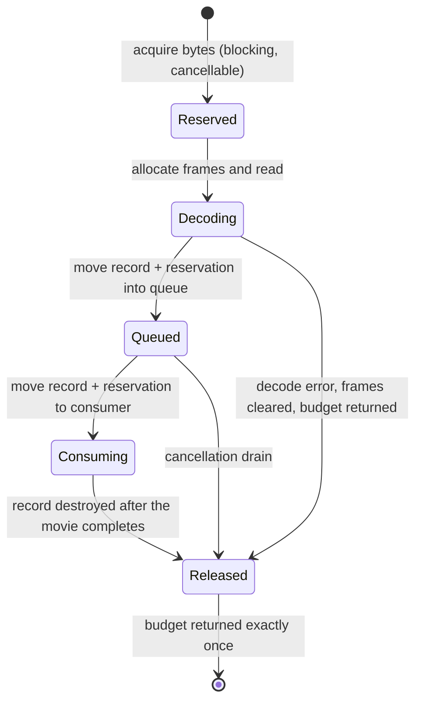

# Architectural Design Specification: Bounded next-movie prefetch

- Issue: #94
- Status: Proposed design; opt-in prototype. No speedup is claimed or established.
- Base: `4c952b3f54479653512c4d208e09c9a8c02f3726` (main after #90/#91)
- Related: #95 (frame/chunk staging, shares the admission interface below), #85 (decoder),
  #53/#55 (process scheduling), #92 (input integrity), #26 (measurement slot), #66 (integration)

## 1. Problem and non-goals

`MotioncorrRunner::run()` is a strict serial loop: movie *N* is decoded from disk, corrected,
written, and only then is movie *N+1* opened. On the resident CUDA path the correction stage
is largely device-bound while the decode stage is host/IO-bound, so the two could in principle
overlap. **Whether that overlap produces a measurable full-run gain is unknown and is exactly
what this change is built to test.** A negative result is an acceptable outcome and must stop
the complexity from being promoted.

Explicitly out of scope for this PR:

- asynchronous output writing;
- strip-parallel or frame-streaming decoder rewrites (#95);
- any arithmetic, FFT, precision, threshold or gate change;
- any change to the default execution path — prefetch is off unless asked for;
- a general allocator/threadpool framework, or a broad runner refactor.

## 2. Why a queue of size one is not a memory bound

The core admission requirement, restated from the issue's correction: *enqueueing a decoded
buffer does not free its memory*. At steady state a "one queued movie" pipeline holds **three**
decoded movies:

```text
  producer-current (being decoded)  +  queued (<= capacity)  +  consumer-active (being corrected)
```

So queue-slot count and byte ownership are two different resources and both are bounded here.
Bytes are reserved **before** allocation and decode, the reservation **transfers with ownership**
through producer -> queue -> consumer, and is released **once**, when the allocation is actually
destroyed. Releasing "on publication" would make the bound unobservable.



## 3. Ownership split

| Stage | Owner | Rationale |
|---|---|---|
| Geometry probe (`nx, ny, nn`) | producer | read-only file header access |
| Frame selection (`--first_frame_sum` / `--last_frame_sum`) | producer, via the shared selector | pure function of run-wide options and `nn` |
| Frame decode into `Iframes` | producer | the only work being moved off the critical path |
| `Micrograph` construction, optics/voltage/angpix lookup, `pre_exposure` | consumer | mutates runner state |
| Gain resolution and `gain_cache` | consumer | mutates runner state; the cache is documented as serial-loop-only |
| Grouping check, hot-pixel, FFT, alignment, all CUDA calls, writes, STAR/PDF | consumer | unchanged |

The producer touches no `MotioncorrRunner` member. It is handed an immutable movie list, the
frame-selection options by value, and a loader callback. After publication the decoded buffers
are owned solely by the consumer; the producer never reads them again.

**One loader, not two.** `movieio::probeGeometry`, `movieio::selectFrames` and
`movieio::decodeFrames` are the single implementation used by *both* the serial path and the
producer, so a divergence between prefetched and serial decoding is a compile-time
impossibility rather than a test obligation.

## 4. Supported inputs, and the serial fallback contract

The prototype prefetches **plain MRC/MRCS and TIFF** movies only, admitted by a **positive
whitelist** on the format `Image::openFile` would actually resolve (lowercased, honouring an
explicit `name.dat:mrcs` override). "Everything except EER and compressed MRC" would be wrong:
`Image` also accepts SPIDER, IMAGIC, raw and others, and a negative check pushes each of them
across an unvalidated thread boundary and onto byte accounting derived for these readers.

EER and compressed-MRC inputs keep decoder state (`EERRenderer`, `CompressedMRCReader`) that is
consumed *after* the decode stage — the EER gain reference is resolved through the live
renderer — so moving those decoders across a thread boundary is a separate change. They are
routed to the existing in-line serial load and are declared **unrun** for prefetch here, not
"supported".

Two further routes to serial loading, both by design:

1. **Oversized movie.** If the conservative byte estimate for a movie exceeds the whole prefetch
   budget, it can never be admitted. The producer publishes a `LoadInline` marker and the
   consumer loads it itself, through the same loader, under a *forced* grant that is recorded
   and counted rather than silently untracked. Refusing the movie instead
   would be a functional regression against the serial baseline, which always holds one movie
   resident regardless of size. The forced grant is the documented, counted exception to the
   bound.
2. **Unsupported format** (EER, compressed MRC), which is in-line by format, not by size.
3. **Prefetch disabled**, which is the default everywhere including CUDA mode.

`over_budget_grants` counts only grants that genuinely pushed the reserved total above the
limit. An in-line load that happens to fit is not an override; `inline_loaded` already answers
"how many movies bypassed the producer", and conflating the two would make the override field
unreadable on, say, an all-EER dataset.

## 5. Byte estimation

Reserved bytes must be an upper bound on what the decode actually adds, not the size of one
pixel array:

```text
  frame_bytes = round_up_to_page(nx * ny * sizeof(float))
  estimate    = n_frames * (frame_bytes + kPerFrameOverheadBytes)   # decoded frames + object/metadata
              + n_io_threads * frame_bytes                          # decoder scratch upper bound
```

The scratch term is a provable bound rather than a tuning constant: a TIFF strip buffer holds
at most one frame's worth of raw samples, at most 4 bytes per pixel, and at most `n_io_threads`
are live at once. All products are computed with overflow-checked arithmetic before any
allocation. The estimate deliberately ignores nothing it can charge for and over-charges where
it cannot measure; over-charging only causes earlier backpressure.

### 5.1 What the budget does and does not cover

The budget bounds **decoded host movie frames** -- the buffers the producer, the queue and the
consumer own -- and nothing else. It is the *prefetch-extra* budget, not the process budget,
and two traced facts make that distinction load-bearing rather than pedantic:

- On the resident CUDA path the consumer's host `Iframes` are **never released mid-movie**: the
  `Iframes[iframe].clear()` loop in `executeOwnMotionCorrection` is guarded by
  `if (!movie_session)`. So holding the reservation for the whole consumer stage is not merely
  conservative there, it is *exact* -- the buffers really are live until the record dies.
- The non-dose-weighted / `--save_noDW` / `--even_odd_split` reconstruction branch allocates a
  third full-movie float stack (`Irefframes[iframe]().initZeros(Iframes[iframe]())`) alongside
  the deliberately retained `Fframes`. That is a genuine process high-water contributor and it
  is **outside** this budget. Anyone sizing `--prefetch_mem_mb` from a "real + R2C" array
  calculation is under-counting the process by a full real stack. (Traced independently by the
  #95 agent, confirmed here against the same head; both are calculated array sizes, not
  measured RSS.)

The reported `process_peak_rss_bytes` exists precisely so that the budget number is never
mistaken for the process high-water.

`--prefetch_mem_mb 0` (the default when prefetch is on) sets the budget to `3 x` the first
movie's estimate — producer-current + one queued + consumer-active — and then holds it fixed
for the run. **Fixed at three, and deliberately not scaled by `--prefetch_queue`**: a count
limit is not a memory limit, so scaling would mean raising the queue silently raises the
ceiling, and a large enough queue would disable the default bound while the CLI still promises
`3 x`. A queue larger than three simply cannot fill under the automatic budget, because bytes
are the bound and slots are not. Heterogeneous datasets degrade gracefully: a larger-than-budget
outlier takes route (1) above instead of silently growing the high-water.

## 6. Cancellation, errors and the failure contract

- A decode error is a **movie-tagged outcome**, not a batch abort. The producer captures the
  exception, clears the partial frames, returns their bytes, and publishes a `Failed` record.
  The consumer rethrows it at the same point in `run()` where a serial read would have thrown,
  so #91's contract is preserved verbatim: healthy movies still process, the failed movie is
  listed, joint STAR/PDF output is withheld, and the job exits non-zero.
- `pipeline_control_check_abort_job()` now cancels and **joins** the producer before `exit()`.
  Previously there was no thread to join; leaving one running across `exit()` would race static
  destruction.
- Cancellation wakes a producer blocked on the byte budget *and* a producer blocked on a full
  queue *and* a consumer blocked on an empty queue. `MoviePrefetcher`'s destructor cancels and
  joins, so every unwinding path — including the `REPORT_ERROR` that reports failed movies —
  joins before shared state dies.
- The consumer never acquires budget on the blocking path, so it cannot deadlock against a
  producer holding the capacity it needs. Progress is structurally guaranteed, not scheduled.
- Reservations are released by a move-only RAII handle. Double release is unrepresentable, and
  the one early release -- the producer's error path -- runs only after the partial frames have
  actually been dropped.
- **Order matters as much as count, in two places.** `MoviePrefetchRecord` has an explicit
  destructor that frees `Iframes` and only then releases the reservation, and the reservation
  is additionally declared first so even a defaulted destructor would run last. It also has an
  explicit **move assignment**, because declaring the reservation first fixes destruction and
  breaks assignment: members are assigned in declaration order, so a defaulted operator would
  replace the reservation -- releasing the old one -- while the previous `Iframes` are still
  allocated. That is reachable as soon as a caller reuses one record across repeated
  `next(record)` calls, which the signature invites. The explicit operator frees first,
  releases second, and is self-move safe. Either alone is fragile: a
  defaulted destructor destroys members in reverse declaration order, so returning the bytes
  before freeing the buffers would wake a producer blocked on the budget while this movie's
  frames are still being released -- real resident memory would transiently reach
  `limit + one movie` on a host sized to `limit`, and no counter would show it, because the
  accounting is already back to zero. The consumer's in-line reservation is declared before
  every buffer it accounts for, for the same reason.
- The producer thread has a top-level `catch (...)`. A decode error is a per-movie outcome, but
  an allocation failure in the bookkeeping itself is not, and letting it leave a `std::thread`
  function is `std::terminate` with no diagnostic -- exactly the failure the OpenMP capture
  exists to prevent. It is captured and rethrown on the consumer, which reports it as a run
  failure.
- **Two things the prefetch path does not preserve, and should not be claimed to.** Abort is no
  longer immediate: `cancelAndJoin()` waits for the producer to finish decoding whatever movie
  it is inside, because cancellation is not polled within a decode, so abort can take up to one
  movie decode. And the *stderr transcript* of a damaged movie is interleaved differently:
  `RelionError`'s constructor writes at throw time, which is now on the producer thread during
  a different movie's correction, so the two halves of one movie's report can be separated. The
  exit code, the failed-movie list, the retained healthy outputs and the withheld joint output
  are identical; the transcript ordering is not.

## 7. CPU budget

The producer's decode uses the same `--max_io_threads`-capped OpenMP width the serial path
would have used, so the *work* is unchanged; what changes is that up to that many IO threads may
now be live while the consumer computes. Under the round's aggregate CPU cap this must be
counted: reader threads are part of the budget, not free. CPU-only mode stays serial by default
and this PR does not change that; the option is available there only so the equivalence tests
can run without a GPU.

## 8. Instrumentation

With prefetch on the run prints, and the tests parse: budget limit, peak reserved bytes, peak
queue occupancy, admitted/inline/failed counts, forced grants, producer time blocked on budget
and on the queue, consumer time blocked waiting for data, and the process-wide `ru_maxrss`
high-water (explicitly labelled as whole-process, and as a sampled ceiling rather than an
allocator trace). Queue bytes and RSS are reported separately, never conflated.

## 9. Interface offered to #95

`src/movie_prefetch.h` is deliberately split so that #95's staging work reuses the admission
half without inheriting the whole-movie half:

- `movieio::ByteBudget` + `movieio::ByteBudget::Reservation` — the reserve-before-allocate,
  transfer-on-move, release-once admission primitive. Nothing in it is whole-movie specific; a
  frame/chunk ring can charge against the same object so that a future combined pipeline has
  **one** budget rather than two that each believe they are the bound.
- `movieio::estimateDecodedMovieBytes` / `roundUpToPage` — shared conservative arithmetic.
- `movieio::BoundedQueue<T>` — count-bounded, cancellable handoff.

`MoviePrefetchRecord` and `MoviePrefetcher` are whole-movie specific and are **not** proposed as
#95's interface. If #95 needs sub-movie admission it should take `ByteBudget` and leave the
record type alone. The record does carry an explicit `std::vector<int> frames` rather than an
implicit "all frames of this movie", so a later chunked producer can describe a partial frame
range without changing the type; #95 asked for that property to be kept, and it is.

## 10. Acceptance for this PR

Cheap CPU checks are the gate for merging the prototype; timing is a separate, later step.

- Lifecycle unit tests: record destruction order, degenerate geometry, override counting,
  exact-fit / just-below / oversized budgets, blocked-then-woken reserve,
  transfer-on-move, release-once, cancellation at every ownership state, producer error,
  ordering, and an accounting stress check asserting that
  `active + queued + producer-current` never exceeds the limit. Every blocking test runs under a
  watchdog so a deadlock fails the test instead of hanging CI.
- End-to-end equivalence on synthetic movies: serial vs prefetch must produce identical
  corrected pixels, identical shifts and identical frame selection, under a normal budget, a
  budget exactly equal to one movie, and a budget too small for any movie (all-inline). Mixed
  geometry in one run. A deliberate positive control proves the comparison can fail.
- Damaged first movie, damaged last movie, and non-prefix resume must match serial behaviour
  exactly, including exit code and which outputs exist.

GPU acceptance is **not** claimed here and is not attempted before #26's slot: same-backend
exact pixels/headers/STAR for all 24 tutorial movies, >= 3 interleaved paired blocks with
alternating arm order, recorded stage intervals and observed overlap, occupancy and memory
high-water, then 1 GPU before 2/3/4-worker schedules under the fixed aggregate CPU budget.

## 11. License

RELION GPL-2.0-or-later notices preserved. New files carry the same notice. No dependency and
no third-party code is added; the implementation uses only C++17 standard-library threading.

## 12. Changed-file whitelist

- `CMakeLists.txt`
- `src/movie_prefetch.h`
- `src/movie_prefetch.cpp`
- `src/motioncorr_runner.h`
- `src/motioncorr_runner.cpp`
- `tests/test_prefetch_lifecycle.cpp`
- `tests/test_prefetch_equivalence.py`
- `scripts/prefetch_gpu_screen.sh`
- `tools/compare_prefetch_arms.py`
- `agents/designs/issue_94_bounded_prefetch.md`
- `WORKER_STATUS.md`
- `docs/issue94_prefetch/` (evidence only)
