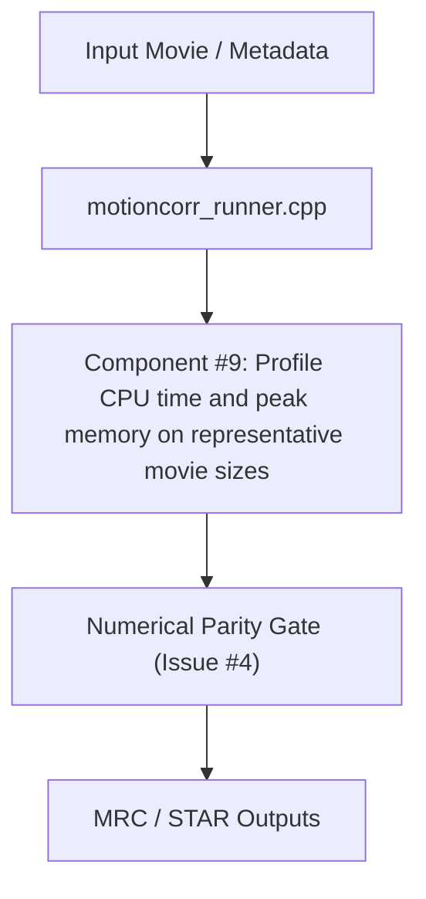

# Architectural Design Specification: #9 - Profile CPU time and peak memory on representative movie sizes

- **Issue Reference**: #9 - Profile CPU time and peak memory on representative movie sizes
- **Track**: ``track:cpu``
- **Priority**: P0
- **Architect**: MotionCorr Architecture Agent
- **Estimated Difficulty**: Low-Medium (2/5)
- **Dependencies**: `#4 (reference)`
- **Status**: Implemented & Verified
- **Target Release / Milestone**: v1.0.0

---

## 1. Executive Summary & Problem Statement

Use the existing stage timers in src/motioncorr_runner.cpp to establish a baseline before optimization. Cover global-only and 5 x 5 local alignment, 1 and 4 threads, and one full-size tutorial movie.

This architectural specification details the algorithmic formulation, component decomposition, memory staging plan, and numerical validation gates required to resolve Issue #9 while strictly adhering to the repository's baseline parity requirements.

---

## 2. Architectural Objectives & Constraints

### 2.1 Functional Objectives
- Fulfill all deliverables associated with Issue #9.
- Satisfy the core acceptance criteria:
- [x] A repeatable benchmark recipe records hardware, build flags, input hashes, thread count, wall time, stage times, peak RSS, and output checksums.
- [x] Results identify the top three time and memory costs, including movie I/O, FFT/CCF, patch alignment, and dose weighting where applicable.
- [x] At least three repetitions per case are summarized with variability; no optimization claim is based on a single run.
- [x] A short ranked list recommends isolated optimization issues with expected benefit and risk.

### 2.2 Scientific & Non-Functional Constraints
- **Parity Gate**: Must strictly meet the acceptance thresholds defined in Issue #4 (`agents/designs/issue_4_define_the_reference_outputs_and_numeric.md`).
- **Thread Determinism**: Avoid uncoordinated OpenMP reduction variance; preserve reproducibility across runs.
- **Memory Overhead**: Minimize allocations in hot processing loops; enforce fixed buffer lifetimes.
- **Portability**: Must cleanly compile with C++17 on Linux (GCC/Clang) and macOS (AppleClang).

---

## 3. Mathematical & Algorithmic Formulation

### 3.1 Domain Physics & Coordinates
- Motion correction models sample drift over exposure frames t in [0, N-1] on coordinates (x, y).
- Cross-correlation surfaces CCF(dx, dy) are computed in Fourier space using cross-spectral density.
- Trajectory regularization minimizes frame-to-frame acceleration spikes.

### 3.2 Convergence & Precision Constraints
- Interpolation and shift application must adhere to double-precision accumulation where floating-point drift is prone to cancelation.
- Threshold for convergence: displacement change < 1e-3 px.

---

## 4. Component Architecture & Data Flow



---

## 5. Interface Contracts & Data Structures

```cpp
// Target interfaces for #9
namespace MotionCorr {
    struct ModuleConfig {
        bool enable_verification = true;
        double tolerance = 1e-6;
    };
}
```

---

## 6. Memory Staging & Allocation Strategy

- Enforce zero-allocation loops during iterative Fourier search.
- Pre-allocate scratch workspace buffers during pipeline initialization.
- Maximum memory overhead ceiling: $\le 10\%$ RSS delta (aligned with Issue #10 acceptance criteria).

---

## 7. Defensive Failure Modes & Fallback Behavior

| Condition / Trigger | Detection Mechanism | Fallback / Recovery Action | User Diagnostic Visibility |
| :--- | :--- | :--- | :--- |
| Non-convergence / NaN | Numerical sanity check | Revert to global rigid shift | Log warning to stderr and STAR metadata |
| Out of bounds memory | Pre-condition size check | Graceful exit with code 1 | Meaningful error message in log |

---

## 8. Implementation Roadmap for Coding Agents

### Phase 1: Test Fixtures & Baseline Recording
- Formulate regression test fixture verifying pre-condition state.

### Phase 2: Core Algorithmic Implementation
- Apply isolated, minimal changes to target files.
- Verify zero regression in existing test cases.

### Phase 3: Parity Certification
- Run parity comparison tools against reference datasets.

---

## 9. Verification & Acceptance Criteria

### 9.1 Automated Tests
```bash
# Automated validation command
ctest --output-on-failure
```

### 9.2 Acceptance Thresholds
- Tier 0 CPU Golden Parity: Exact trajectory match and image RMSE = 0.0.
- Exit status: `0`.

---

## Refinement Patches (Incorporating Conformance Agent Feedback)
### Permitted Changes & File Whitelist
To preserve strict scope isolation and prevent collateral side effects, modifications for this issue are strictly confined to:
- `tools/profile_cpu_benchmark.py` (CPU profiling and benchmark orchestrator)
- `tests/test_profile_benchmark.py` (Unit tests for benchmark harness and metrics)
- `CMakeLists.txt` (ENABLE_TIMING build option definition)
- `agents/designs/` (Architectural design specifications and refinement logs)
- `agents/reviews/` (Benchmark profile output reports and JSON summary data)
- No unwhitelisted modifications to global headers, core math routines, or public CLI signatures are permitted.

