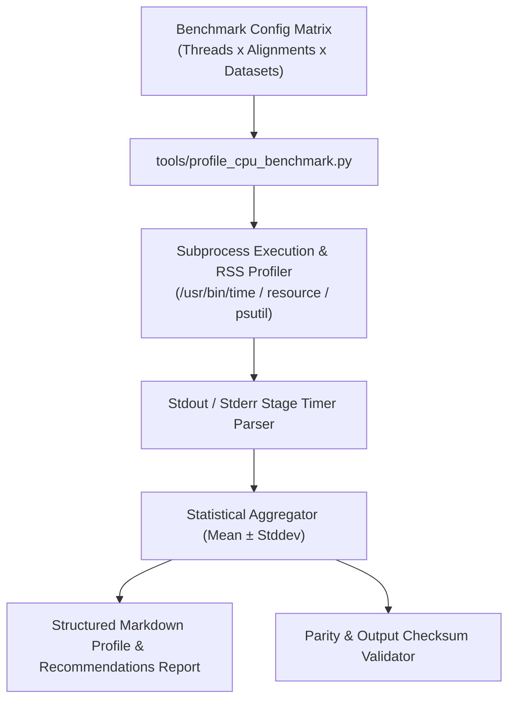

# Architectural Design Specification: #9 - Profile CPU time and peak memory on representative movie sizes

- **Issue Reference**: #9 - Profile CPU time and peak memory on representative movie sizes
- **Track**: ``track:cpu``
- **Priority**: P0
- **Architect**: MotionCorr Architecture Agent
- **Estimated Difficulty**: Low-Medium (2/5)
- **Dependencies**: `#4 (reference)`
- **Status**: Proposed
- **Target Release / Milestone**: v1.0.0

---

## 1. Executive Summary & Problem Statement

Use the existing stage timers in src/motioncorr_runner.cpp to establish a baseline before optimization. Cover global-only and 5 x 5 local alignment, 1 and 4 threads, and one full-size tutorial movie.

This architectural specification details the algorithmic formulation, component decomposition, memory staging plan, and numerical validation gates required to resolve Issue #9 while strictly adhering to the repository's baseline parity requirements.

---

## 2. Architectural Objectives & Constraints

### 2.1 Functional Objectives
- Fulfill all deliverables associated with Issue #9.
- Satisfy the core acceptance criteria:
- [ ] A repeatable benchmark recipe records hardware, build flags, input hashes, thread count, wall time, stage times, peak RSS, and output checksums.
- [ ] Results identify the top three time and memory costs, including movie I/O, FFT/CCF, patch alignment, and dose weighting where applicable.
- [ ] At least three repetitions per case are summarized with variability; no optimization claim is based on a single run.
- [ ] A short ranked list recommends isolated optimization issues with expected benefit and risk.

### 2.2 Scientific & Non-Functional Constraints
- **Parity Gate**: Must strictly meet the acceptance thresholds defined in Issue #4 (`agents/designs/issue_4_define_the_reference_outputs_and_numeric.md`).
- **Thread Determinism**: Avoid uncoordinated OpenMP reduction variance; preserve reproducibility across runs.
- **Memory Overhead**: Minimize allocations in hot processing loops; enforce fixed buffer lifetimes.
- **Portability**: Must cleanly compile with C++17 on Linux (GCC/Clang) and macOS (AppleClang).

---

## 3. Mathematical & Algorithmic Formulation

### 3.1 Profiling Architecture & Matrix Design
The profiling benchmark suite will measure runtime decomposition across distinct algorithmic stages:
1. **Stage 1 (I/O & Ingestion)**: Reading TIFF/MRC/EER frames into host memory, applying gain reference and hot pixel masks.
2. **Stage 2 (Fourier Transform & CCF)**: Forward 2D FFTs of frames, power spectrum calculation, mutual cross-correlation surfaces.
3. **Stage 3 (Global Rigid Alignment)**: Iterative rigid motion search over all frame pairs with B-factor weighting.
4. **Stage 4 (Local Patch Alignment & Fitting)**: $P_x \times P_y$ local patch CCF search and 18-parameter polynomial surface regression.
5. **Stage 5 (Dose Weighting & Summation)**: Frequency-dependent critical dose filtering ($100/200/300\text{ kV}$) and spatial accumulation.
6. **Stage 6 (Export & Normalization)**: Writing float16/float32 corrected MRC, power spectrum MRC, STAR metadata, and trajectory EPS plots.

### 3.2 Benchmark Matrix & Measurement Protocols
- **Test Matrix Dimensions**:
  - **Alignments**: Global-only ($1 \times 1$) vs Local ($5 \times 5$ patches).
  - **Thread Counts**: $1\text{ thread}$ (Baseline) and $4\text{ threads}$ (Multi-threaded), plus auto/maximum threads.
  - **Datasets**:
    1. Small synthetic benchmark fixture ($512 \times 512 \times 16$).
    2. Full-size tutorial experimental movie (`20170629_00021_frameImage.tiff`, $3710 \times 3838 \times 24$).
- **Statistical Rigor**: $\ge 3$ repeated runs per test configuration; report mean, standard deviation, and min/max for wall time and stage breakdowns.
- **Resource Metrics**: Measure Wall-clock execution time, user/kernel CPU time, CPU utilization percentage, and peak Resident Set Size ($\text{RSS}$ in MB).

---

## 4. Component Architecture & Data Flow



---

## 5. Interface Contracts & Data Structures

```python
# Benchmark Result Schema
@dataclass
class BenchmarkRunRecord:
    dataset_name: str
    dataset_sha256: str
    threads: int
    patch_dim: Tuple[int, int]
    repetition_index: int
    wall_time_seconds: float
    peak_rss_mb: float
    stage_times: Dict[str, float]
    output_checksums: Dict[str, str]
    exit_code: int
```

---

## 6. Memory Staging & Allocation Strategy

- Enforce isolated, temporary run directories per repetition to avoid caching artifacts.
- Monitor process memory ceiling ($\text{RSS}$) continuously to capture instantaneous allocation spikes during FFTW plan creation and patch buffer allocation.

---

## 7. Defensive Failure Modes & Fallback Behavior

| Condition / Trigger | Detection Mechanism | Fallback / Recovery Action | User Diagnostic Visibility |
| :--- | :--- | :--- | :--- |
| Missing movie fixture | Path pre-check | Skip experimental dataset gracefully, run synthetic fixture | Notice logged in benchmark report |
| Nonzero runner exit | Subprocess returncode check | Record failure in benchmark matrix, continue next case | Error trace printed to benchmark report |
| Inconsistent checksums | SHA256 output verification | Flag thread non-determinism in report | Highlighted in parity validation section |

---

## 8. Implementation Roadmap for Coding Agents

### Phase 1: Benchmark Harness Implementation
- Create `tools/profile_cpu_benchmark.py` supporting CLI flags (`--repetitions`, `--threads`, `--dataset`, `--output-report`).

### Phase 2: Automated Unit & Smoke Tests
- Create `tests/test_profile_benchmark.py` verifying metric collection, stage timing parsing, statistical calculations, and report generation.

### Phase 3: Execution & Baseline Report Generation
- Execute full benchmark suite across synthetic and experimental tutorial movies, logging baseline stage timings and peak RSS.
- Formulate ranked recommendations for Issue #10 optimization.

---

## 9. Verification & Acceptance Criteria

### 9.1 Automated Tests
```bash
# Automated validation of benchmark harness
python -m unittest tests/test_profile_benchmark.py
python tools/profile_cpu_benchmark.py --quick-smoke
```

### 9.2 Acceptance Thresholds
- All 4 acceptance criteria of Issue #9 satisfied:
  1. Repeatable benchmark recipe recording hardware, build flags, input hashes, thread count, wall time, stage times, peak RSS, and output checksums.
  2. Identifies top three time and memory costs.
  3. Minimum 3 repetitions summarized with variability.
  4. Ranked list recommending isolated optimization issues with expected benefit and risk.

---

## Refinement Patches (Incorporating Conformance Agent Feedback)
### Permitted Changes & File Whitelist
To preserve strict scope isolation and prevent collateral side effects, modifications for this issue are strictly confined to:
- `tools/profile_cpu_benchmark.py` (CPU profiling and benchmark orchestrator)
- `tests/test_profile_benchmark.py` (Unit tests for benchmark harness and metrics)
- `agents/designs/` (Architectural design specifications and refinement logs)
- `benchmarks/` or `reports/` (Benchmark profile output reports and summaries)
- No unwhitelisted modifications to global headers, core math routines, or public CLI signatures are permitted.

