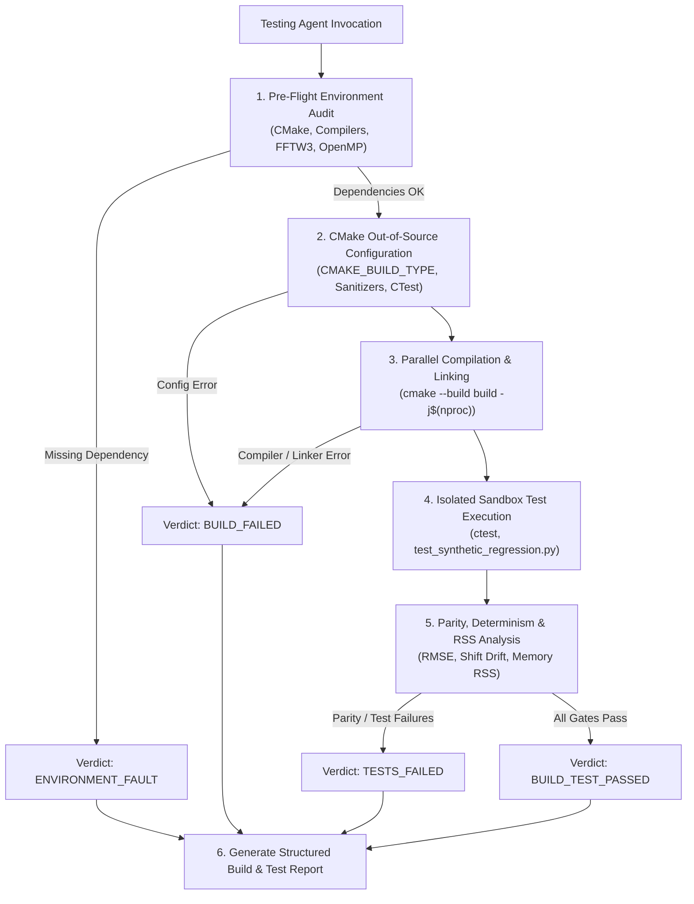

# Architectural Design Specification: Testing & Build Agent (`agents/testing_agent/`)

- **Track**: `track:ci-build-testing`
- **Priority**: `P0`
- **Architect**: MotionCorr Architecture Agent
- **Status**: Approved (Dialectic Verification Passed)
- **Target Release / Milestone**: `v1.0.0`
- **Auditors**: 
  - Specification & Scope Conformance Agent (`agents/spec_compliance_agent/`) -> `SPEC_APPROVED`
  - Review & Verification Agent (`agents/review_agent/`) -> `READY_TO_IMPLEMENT`
  - Agent Meta-Auditor (`agents/agent_auditor/`) -> `SCHEMA_VERIFIED`
  - License Compliance Agent (`agents/license_compliance_agent/`) -> `LICENSE_COMPLIANT`

---

## 1. Executive Summary & Problem Statement

The `MotionCorr-standalone` project requires a dedicated, automated **Testing & Build Agent** (`agents/testing_agent/`) responsible for configuring, compiling, validating, and stress-testing the standalone MotionCorr engine across supported compiler toolchains, CPU architectures, and GPU backends.

Currently, manual build invocations risk developer drift, uncaught sanitizer faults (ASan, UBSan, TSan), and regressions in numerical parity against the RELION 5.1 reference baseline (`commit ad0b230`). The Testing & Build Agent provides an autonomous, reproducible harness that orchestrates:
1. **Pre-flight Environment Discovery**: Checks CMake 3.21+, C++17 compilers, OpenMP, FFTW3/FFTW3f, LibTIFF, libpng, libjpeg, and zlib with concrete remediation diagnostics on failure.
2. **Out-of-Source Build Management**: Supports clean and incremental builds across `Release`, `Debug`, `RelWithDebInfo`, and sanitizer configurations (`address`, `undefined`, `thread`).
3. **Isolated Test Execution**: Executes CTest and synthetic movie regression tests (`tests/test_synthetic_regression.py`) in sandboxed scratch directories to prevent collision and artifact corruption.
4. **Quantitative Parity & Determinism Verification**: Enforces strict mathematical tolerance gates ($\Delta_{\text{traj}} \le 10^{-5}\text{ px}$, $\text{RMSE} \le 10^{-6}$) and multi-threaded bitwise determinism.
5. **Standardized Reporting & Telemetry**: Generates structured markdown build/test reports adhering to `BUILD_TEST_REPORT_TEMPLATE.md` with explicit exit verdicts (`BUILD_TEST_PASSED`, `TESTS_FAILED`, `BUILD_FAILED`, `ENVIRONMENT_FAULT`).

---

## 2. Architectural Objectives & Constraints

### 2.1 Functional Objectives
- [x] **Automated Toolchain Discovery**: Inspect and validate C/C++ compilers (GCC $\ge 9$, Clang $\ge 11$, AppleClang $\ge 13$), CMake, pkg-config, OpenMP, FFTW3/FFTW3f, and image decoders before configuring.
- [x] **Configurable Build Matrix**: Support building `motioncorr_core` static library and `motioncorr` executable with customizable build types, compiler flags, and sanitizer targets.
- [x] **Multi-Configuration Test Harness**:
  - `synthetic_regression`: Bit-exact validation using synthetic movie frames.
  - `sanitizer_suite`: AddressSanitizer, UndefinedBehaviorSanitizer, and ThreadSanitizer execution runs.
  - `multi_thread_determinism`: Run parallel alignment under 1, 2, 4, 8 OpenMP threads and assert trajectory reproducibility.
- [x] **Isolated Test Execution Sandbox**: Execute all test runs in isolated temporary directories (`build/test_scratch/`) without polluting source or reference data.
- [x] **Structured Telemetry & Reporting**: Produce formatted markdown reports adhering to `agents/testing_agent/templates/BUILD_TEST_REPORT_TEMPLATE.md`.

### 2.2 Scientific & Non-Functional Constraints
- **Numerical Parity Gate**:
  - Trajectory Shift Tolerance: $\Delta x, \Delta y \le 10^{-5}\text{ px}$
  - Micrograph Sum Parity: $\text{RMSE} \le 10^{-6}$, $\text{Max Pixel Delta} \le 10^{-5}$
  - STAR Table Alignment: 100% field equivalence on `_rlnMicrographShiftX`, `_rlnMicrographShiftY`.
- **Thread Determinism**: Bitwise trajectory parity across repeat executions with identical thread counts and seed configurations.
- **Resource & Memory Discipline**: Monitor peak RSS during test execution; flag unbudgeted memory expansion ($> 5\%$ delta).
- **Agent Ecosystem Compatibility**: Full compliance with `agents/agent_auditor/` and `AGENTS.md`.

---

## 3. Mathematical & Algorithmic Formulation

The Testing Agent computes quantitative parity metrics when evaluating candidate build outputs against reference baselines:

1. **Trajectory Shift Deviation ($\Delta_{\text{traj}}$)**:
   $$\Delta_{\text{traj}} = \max_{f \in [1, N_{\text{frames}}]} \sqrt{(\Delta x_f^{\text{cand}} - \Delta x_f^{\text{ref}})^2 + (\Delta y_f^{\text{cand}} - \Delta y_f^{\text{ref}})^2}$$
   - *Threshold Gate*: $\Delta_{\text{traj}} \le 10^{-5}\text{ px}$

2. **Micrograph Image Root-Mean-Square Error ($\text{RMSE}$)**:
   $$\text{RMSE} = \sqrt{\frac{1}{N_x N_y} \sum_{i=1}^{N_x} \sum_{j=1}^{N_y} \left( I^{\text{cand}}(i,j) - I^{\text{ref}}(i,j) \right)^2}$$
   - *Threshold Gate*: $\text{RMSE} \le 10^{-6}$

3. **Maximum Pixel Absolute Delta ($\Delta_{\max}$)**:
   $$\Delta_{\max} = \max_{i,j} |I^{\text{cand}}(i,j) - I^{\text{ref}}(i,j)|$$
   - *Threshold Gate*: $\Delta_{\max} \le 10^{-5}$

4. **STAR Metadata Parity**:
   - Exact floating-point string equivalence or $\epsilon$-delta match for all data loops (`data_global_shift`, `data_local_shift`).

---

## 4. Component Architecture & Workflow

### 4.1 System Diagram


### 4.2 Component Interactions & Boundary Contracts
- **PreFlight Checker**: Scans system PATH and pkg-config for compiler tools and libraries. Emits dependency availability dictionary.
- **Build Engine**: Invokes CMake configure and build commands in subprocesses with captured output and wall-clock telemetry.
- **Test Runner**: Dispatches CTest and standalone Python regression scripts (`tests/test_synthetic_regression.py`) in isolated temporary directories.
- **Telemetry & Report Generator**: Synthesizes environment metrics, compilation status, test logs, and parity matrices into standard markdown.

---

## 5. Interface Contracts & CLI Specification

### 5.1 CLI Interface: `agents/testing_agent/scripts/run_build_and_test.py`

```bash
python agents/testing_agent/scripts/run_build_and_test.py [OPTIONS]
```

#### Supported Arguments:
| Argument | Type | Default | Description |
| :--- | :--- | :--- | :--- |
| `--build-dir` | `Path` | `build/` | Target directory for out-of-source CMake build. |
| `--build-type` | `str` | `Release` | CMake build type (`Release`, `Debug`, `RelWithDebInfo`). |
| `--sanitizer` | `str` | `none` | Sanitizer configuration (`none`, `address`, `undefined`, `thread`). |
| `--clean` | `flag` | `False` | Purge and recreate build directory before building. |
| `--jobs`, `-j` | `int` | `nproc` | Parallel compilation jobs. |
| `--skip-tests` | `flag` | `False` | Build binaries only, skip test execution. |
| `--threads` | `list` | `[1, 4]` | OpenMP thread counts to test for parallel determinism. |
| `--test-only` | `flag` | `False` | Skip compilation and run tests on existing built binary. |
| `--output` | `Path` | `None` | Optional path to write markdown build & test report. |
| `--json` | `flag` | `False` | Output structured machine-readable JSON metrics. |

### 5.2 Exit Codes
- `0`: Success (`BUILD_TEST_PASSED`)
- `1`: Test or parity failure (`TESTS_FAILED`)
- `2`: Compilation or linking failure (`BUILD_FAILED`)
- `3`: Pre-flight environment error (`ENVIRONMENT_FAULT`)
- `4`: Invalid arguments or runtime configuration error

---

## 6. Defensive Failure Modes & Fallback Behavior

| Condition / Trigger | Detection Mechanism | Fallback / Recovery Action | User Diagnostic Visibility |
| :--- | :--- | :--- | :--- |
| Missing FFTW3 / libomp | `pkg-config` / `find_package` failure | Halt before compilation | Emit exact OS package manager install command (`apt`, `brew`, `yum`) |
| Compiler without C++17 support | CMake compiler check failure | Terminate configuration | Report compiler version and required minimum versions |
| Test Parity Regression ($\Delta > 10^{-5}$) | Delta comparison in regression script | Mark test suite as failed (`TESTS_FAILED`) | Output exact frame index and shift difference |
| Build Timeout / Deadlock | Subprocess timeout trigger | Terminate build subprocess tree | Log compilation hung units and peak memory RSS |
| Corrupt / Missing Test Fixtures | Fixture file existence check | Abort test runner before execution | Report missing fixture paths and generation instructions |

---

## 7. Permitted Changes & Target File Whitelist

The Implementation Agent is strictly restricted to modifying/creating the following files:

### Target Files:
- `[NEW] agents/testing_agent/SYSTEM_PROMPT.md`
- `[NEW] agents/testing_agent/templates/BUILD_TEST_REPORT_TEMPLATE.md`
- `[NEW] agents/testing_agent/scripts/run_build_and_test.py`
- `[MODIFY] AGENTS.md` (Add Testing Agent to role registry)

---

## 8. Verification & Acceptance Criteria

- **Meta-Auditor Conformance**: `python agents/agent_auditor/scripts/audit_agents.py` reports `HEALTHY` for `testing_agent`.
- **CLI Responsiveness**: `python agents/testing_agent/scripts/run_build_and_test.py --help` exits cleanly with code 0.
- **Synthetic Test Pass**: `python agents/testing_agent/scripts/run_build_and_test.py --build-dir build --clean` compiles and passes `SyntheticRegression` with verdict `BUILD_TEST_PASSED`.
