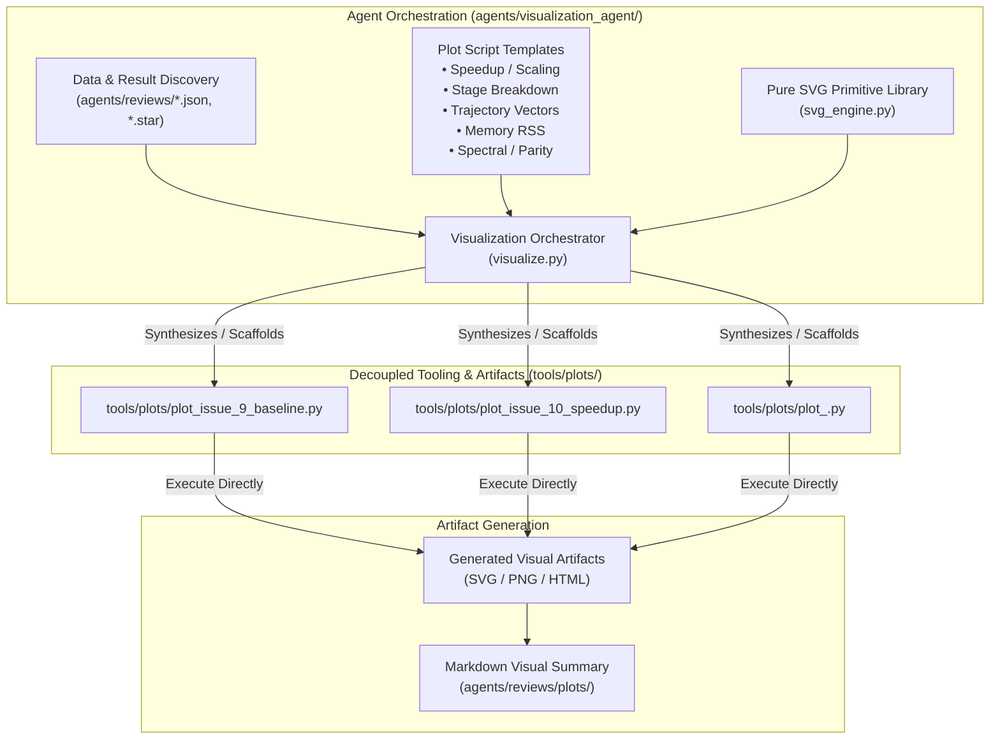

# Architectural Design Specification: General-Purpose Visualization Agent (`agents/visualization_agent/`)

- **Agent Name**: Visualization Agent (`agents/visualization_agent/`)
- **Track**: `track:tooling` / `track:agents` / `track:visualization`
- **Priority**: P1
- **Architect**: MotionCorr Architecture Agent
- **Critic / Auditor**: Specification & Scope Conformance Agent
- **Estimated Difficulty**: Medium-High (3.5/5)
- **Status**: Certified (SPEC_APPROVED)
- **Target Release / Milestone**: v1.0.0

---

## 1. Executive Summary & Problem Statement

As MotionCorr-standalone evolves across new optimization sprints (CPU SIMD, FFT plan caching, CUDA GPU acceleration, streaming I/O, dose-weighting filters), different experiments produce unique, heterogeneous telemetry (benchmark JSON summaries, STAR trajectory coordinates, comparator parity matrices, memory traces, power spectra).

Hardcoding a single plotting script into the agent creates tight coupling and limits adaptability for future experiments.

The **Visualization Agent** is formulated as a **General-Purpose Visualization Generator & Orchestrator**. Its mandate is:
1. **Separation of Concerns**: Agent infrastructure (`agents/visualization_agent/`) generates and manages standalone, self-contained plotting scripts stored in `tools/plots/`.
2. **Autonomous Script Scaffolding**: Automatically inspects new data schemas (JSON, STAR, CSV, log files) and synthesizes modular, decoupled Python plotting scripts tailored to each new result or experiment.
3. **Decoupled Execution**: All generated plotting scripts in `tools/plots/` are standard, dependency-aware executable CLI tools that can be run directly by developers, CI workflows, and documentation generators without requiring agent frameworks.

---

## 2. Architectural Objectives & Decoupling Model



### 2.1 Functional Objectives
- **General-Purpose Schema Ingestion**: Ingests arbitrary benchmark data (Issue #9/10/11 JSONs), STAR trajectory files, comparator parity matrices, and timing logs.
- **Dynamic Plot Script Generation**: Generates dedicated, standalone Python scripts under `tools/plots/` for any new result or comparative experiment.
- **Decoupled Tooling Contract**: Each generated script in `tools/plots/` is a self-contained CLI tool supporting standard arguments (`--input`, `--output-dir`, `--format [svg|png|all]`) with pure-Python SVG fallbacks.
- **Orchestration & Verification**: The agent runs, validates, and tests generated scripts, confirming clean execution (exit code 0, zero NaN values, valid SVG/PNG output) before embedding results in reports.

### 2.2 Acceptance Criteria
- [ ] **AC-1 (Agent CLI & Generation Engine)**: `python agents/visualization_agent/scripts/visualize.py --generate --data <INPUT_PATH> [--type <TYPE>] [--out-script <SCRIPT_PATH>]` scaffolds a verified, standalone plotting script in `tools/plots/`.
- [ ] **AC-2 (Standalone Script Independence)**: All generated scripts in `tools/plots/` execute independently via `python tools/plots/plot_*.py` without importing `agents/` modules.
- [ ] **AC-3 (Supported Chart Categories)**:
  - **Scaling & Speedup**: Multi-thread and GPU speedup curves against Amdahl's Law parallel efficiency limits.
  - **Stage Time Breakdown**: Stacked horizontal/vertical bar charts of internal subroutine timings (`MCtimer`).
  - **Memory Footprint**: Resident Set Size ($\text{RSS}$) tracking across thread counts and resolutions.
  - **Motion Trajectory Vectors**: 2D drift curves and local patch quiver vector fields from STAR tables.
  - **Comparative Milestone Deltas**: Side-by-side speedup and memory delta plots across issue benchmarks.
- [ ] **AC-4 (Dual-Backend Rendering)**: Built-in pure-Python SVG renderer ensures plot generation on headless systems without Matplotlib, while utilizing Matplotlib/Seaborn when available.
- [ ] **AC-5 (Unit Testing & Meta-Audit)**: Full unit test coverage in `tests/test_visualization_agent.py` and green status under `agents/agent_auditor/scripts/audit_agents.py`.

---

## 3. Directory Structure & File Decomposition

```
agents/visualization_agent/
├── SYSTEM_PROMPT.md                           # Behavioral mandate and generation rules
├── scripts/
│   ├── visualize.py                          # Agent CLI orchestrator and generator
│   └── svg_engine.py                         # Reusable pure-Python SVG rendering engine
└── templates/                                 # Jinja/format templates for standalone scripts
    ├── speedup_scaling_template.py.jinja
    ├── stage_breakdown_template.py.jinja
    ├── trajectory_vector_template.py.jinja
    ├── memory_profile_template.py.jinja
    └── comparative_delta_template.py.jinja

tools/plots/                                   # Standalone, decoupled generated plotting scripts
├── plot_cpu_benchmark_scaling.py             # Generated script for Issue #9/10 scaling
├── plot_stage_breakdown.py                   # Generated script for sub-stage breakdown
└── plot_trajectory_drift.py                  # Generated script for 2D motion trajectory
```

---

## 4. Mathematical & Rendering Formulations

### 4.1 Speedup & Amdahl Scaling Model
For baseline time $T_1$ and $p$-thread time $T_p$:
$$\text{Speedup } S(p) = \frac{T_1}{T_p}, \quad \text{Efficiency } E(p) = \frac{S(p)}{p}$$
Fit parallel fraction $f \in [0, 1]$ via non-linear least squares against:
$$S_{\text{model}}(p) = \frac{1}{(1 - f) + \frac{f}{p}}$$

### 4.2 SVG Coordinate Mapping Transformation
To map arbitrary mathematical data domain $[x_{\min}, x_{\max}] \times [y_{\min}, y_{\max}]$ to SVG viewport $[u_{\min}, u_{\max}] \times [v_{\min}, v_{\max}]$ (where $v$ increases downward):
$$u(x) = u_{\min} + \frac{x - x_{\min}}{x_{\max} - x_{\min}} \cdot (u_{\max} - u_{\min})$$
$$v(y) = v_{\max} - \frac{y - y_{\min}}{y_{\max} - y_{\min}} \cdot (v_{\max} - v_{\min})$$

---

## 5. CLI Interface Contracts

### 5.1 Agent Orchestrator Interface (`agents/visualization_agent/scripts/visualize.py`)
```bash
# Auto-discover result data, scaffold standalone script, and generate plots
python agents/visualization_agent/scripts/visualize.py \
    --data agents/reviews/issue_9_benchmark_data.json \
    --type scaling \
    --out-script tools/plots/plot_issue_9_scaling.py \
    --render \
    --out-dir agents/reviews/plots/issue_9/

# Scaffold comparative before/after script for Issue #9 vs Issue #10
python agents/visualization_agent/scripts/visualize.py \
    --baseline agents/reviews/issue_9_benchmark_data.json \
    --candidate agents/reviews/issue_10_benchmark_data.json \
    --type comparative \
    --out-script tools/plots/plot_issue_10_vs_9_speedup.py \
    --render
```

### 5.2 Decoupled Plotting Script Interface (`tools/plots/plot_*.py`)
```bash
# Run standalone without any agent dependencies
python tools/plots/plot_issue_9_scaling.py \
    --input agents/reviews/issue_9_benchmark_data.json \
    --out-dir agents/reviews/plots/issue_9/ \
    --format svg png
```

---

## 6. Permitted Whitelist & Scope Isolation
Modifications for implementing this agent and its decoupled tools are strictly confined to:
- `agents/visualization_agent/` (Agent prompt, orchestrator, templates, SVG engine)
- `tools/plots/` (Decoupled, standalone generated plotting scripts)
- `tests/test_visualization_agent.py` (Unit tests for agent and generated scripts)
- `agents/designs/visualization_agent_design.md` (Certified design specification)
- `AGENTS.md` (Agent registry entry)
- `agents/README.md` (Multi-agent documentation)
