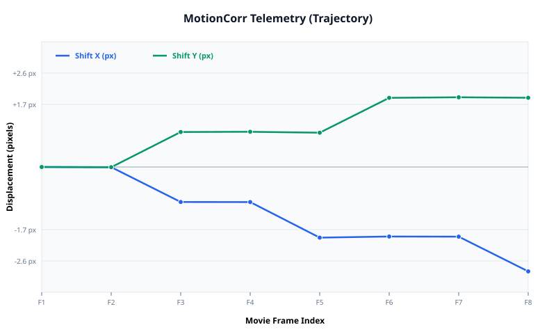

# Visualization Report: MotionCorr Telemetry (Trajectory)

- **Generated By**: MotionCorr Visualization Agent (`agents/visualization_agent/`)
- **Timestamp**: `2026-09-24 12:07:46`
- **Source Dataset**: `test-data/fixtures/reference_output/synthetic_128x128_8frames.star`

---

## Generated Visual Plots

### synthetic_128x128_8frames_trajectory.svg

