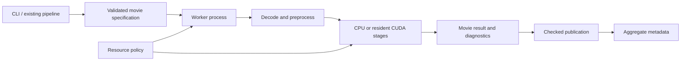

# Architecture investigation: product boundaries before more backends

Issue [#142](https://github.com/KingAlejandro/MotionCorr-standalone/issues/142).
Reviewed baseline: `57e98666a6225a8fdb6dafbdbc356478c21cea3a`, 2 October 2026.
Experiment design and limits: [EXPERIMENTS.md](EXPERIMENTS.md).
Measured results: [RESULTS.md](RESULTS.md).
Workload coverage and unresolved interactions: [WORKLOADS.md](WORKLOADS.md).

Publication update: while these experiments ran, main advanced to `6c87441`
through [PR #145](https://github.com/KingAlejandro/MotionCorr-standalone/pull/145),
which addresses the reproduced single-particle aggregate STAR publication
failure. The measurements below remain pinned to their recorded earlier
sources; they do not validate a combined tree with #145. Configuration-bound
resume remains a separate concern.

## Recommendation

Continue the resident CUDA direction. Make the unit of ownership a worker
process and the unit of scientific work a movie. Keep scheduling, resource
policy and publication outside the numerical stages. The immediate product
should be a reliable RELION-compatible batch command, with a small external
coordinator for multiple GPUs. A backend plugin framework, a rewritten
algorithm, and a resident acquisition service are not prerequisites.

The main risk is committing more features to the runner's implicit state
machine. The reference algorithm, particular tutorial geometry, old 3.5 GiB
target and current CLI behavior are four different constraints. Treating all
four as permanent invariants produces incidental complexity and can prevent
useful alternatives from being tested.

This is a decision proposal supported by code inspection, external workflow
documentation and bounded experiments. No user interviews or production
facility acceptance have occurred. No recommendation here authorizes merging
an existing PR or replacing the scientific acceptance criteria.

## Who will use it, and what must work?

| Workflow | User's successful outcome | Architectural consequence | Current evidence/gap |
|---|---|---|---|
| Pipeline/HPC batch (initial priority) | Supply movie STAR and resources; get complete outputs; safely resume after interruption | Stable CLI/metadata, resource limits, configuration-bound completion, explicit partial failure, one aggregate publisher | Earlier #142 probes reproduced stale resume after changing binning and false success on aggregate rename failure. #145 subsequently addresses the single-particle publication failure; configuration-bound resume remains a priority. |
| Facility acquisition | Keep up with arrivals and deliver useful motion/QC feedback quickly | Bounded intake, complete-file detection, latency metrics, per-movie records and worker replacement | No arrival-service/latency acceptance established. Integrate with existing pipeline control first; do not make the correction engine watch directories or manage a database. |
| Individual researcher | Install once, run a single GPU, understand unsupported input and failures | Honest capability/help output, explicit backend choice, useful errors, straightforward packaging and examples | CPU defaults are clear; CUDA remains experimental. Native GPU-list syntax suggests more capability than main executes. A successful compile is not a support guarantee. |
| Developer/maintainer | Locate a stage, reproduce a bug quickly, review a small numerical or lifetime change | Stage entry points, tiny native probes, independent CPU tests, one resource owner, narrow source targets and durable experiment records | Useful session/failure/workspace abstractions already exist. The 4,336-line runner and broad source glob make unrelated concepts hard to separate; CUDA runtime CI and nvCOMP build coverage remain gaps. |

The same numerical engine can serve all three user workflows. Their orchestration
requirements differ. For tomography, low-dose motion and EER grouping are also
scientific requirements, not simply additional file-format checkboxes. RELION's
[tomography motion-correction guide](https://relion.readthedocs.io/en/latest/STA_tutorial/MotionCorrection.html)
illustrates different patching, fractionation and output needs.

## What other projects suggest

| Primary source | Observed choice | Lesson for this project |
|---|---|---|
| [WarpTools](https://warpem.github.io/warp/user_guide/warptools/quick_start_warptools_tilt_series/) | Explicit settings, per-movie metadata/QC, and multiple worker processes per GPU on large cards | Process isolation can coexist with reuse and throughput. Select worker count using memory and CPU budgets; do not copy a fixed count from another algorithm. |
| [CryoSPARC Patch Motion Correction](https://guide.cryosparc.com/processing-data/all-job-types-in-cryosparc/motion-correction/job-patch-motion-correction) | Normal processing overlaps loading the next movie; low-memory mode disables that overlap. Failed movies are an explicit output group. | A memory/throughput tradeoff belongs in an execution policy, and users need identifiable failures. Neither overlap nor prefetch is automatically beneficial on our workloads. |
| [RELION Schemes](https://relion.readthedocs.io/en/latest/Onthefly.html) | External pipeline control handles repeated processing and changes to job options | Keep acquisition orchestration outside the engine; bind resume to the calculation's identity rather than just files existing. |
| [MotionCor3](https://github.com/czimaginginstitute/MotionCor3) | Linux/NVIDIA-focused implementation with alignment, correction, I/O and buffer-pool components | A focused native application is a viable product shape. Its structure is a comparison, not proof that copying its memory or threading model suits this code. |
| [NVIDIA cuFFT](https://docs.nvidia.com/cuda/cufft/index.html) | Batched transforms can use different optimizations; reproducibility is conditioned on plan parameters, GPU model and library version | Batch size can affect both memory and arithmetic. Benchmark it as a policy candidate and compare outputs explicitly; never promise bitwise equivalence from API similarity. |

These are architectural comparisons, not cross-software performance or accuracy
rankings. No competitor binary was benchmarked and no external implementation
was copied into this experiment.

## The smallest useful separation

Use concrete objects and functions before interfaces with virtual methods:

- **Movie specification:** resolved input, optics, geometry, selected frames,
  gain/defect identity, physical units, seed and output options. Resolve and
  validate once. Processing a second movie must not mutate the first movie's
  settings or the aggregate's interpretation of its results.
- **Worker state:** device identity and sticky health; bounded reusable gain
  and plan resources with one owner. Movie sessions borrow resources under an
  explicit lifetime. Reuse the work in #136/#140 after its own review.
- **Movie state:** raw/corrected/real/Fourier representations and their validity.
  Keep a small number of legal stage boundaries. A status must describe actual
  produced state, not imply it from pointer non-nullness.
- **Result/publication:** motion model, images, diagnostics and validated
  metadata. Write a completion record only after required products are
  published. Keep execution configuration distinct from scientific parameters
  when defining compatibility, but record both for reproducibility.

This is a sequence of extractions around real ownership boundaries. Do not
replace the runner in a single PR or invent a task graph/framework merely to
make the diagram literal.

## Decisions and alternatives

| Decision | Chosen direction | Alternatives and why they remain limited |
|---|---|---|
| Multi-GPU unit | Whole-movie process workers; start with the existing #117 coordinator | Threaded runners currently share mutable/global state. Splitting one movie across GPUs adds communication and complicates failure recovery before a user need is demonstrated. |
| Worker lifetime | Several movies per process; bounded reuse; replace a worker after fatal device failure | One process per movie is simple but repeats setup. Infinite-lived workers require explicit health, eviction and input-transition tests. The granularity probe measures setup amortization, not those lifetime guarantees. |
| CUDA scheduling | Keep a conservative default; benchmark policy by shape and memory allowance | A universal batch-one rule overfits an old resource target; universal larger batches can change arithmetic and exceed smaller cards. No automatic tuning in the processing loop yet. |
| Memory | Account for movie payload, scratch, retained pools and decoder/writer overlap separately | Full residency grows with frame count; FFT batching cannot make two full-movie representations bounded. Long/high-resolution workloads may require a staged design, but repeated disk passes can dominate. Measure the workload first. |
| Failure fallback | Prefer explicit safe checkpoints; use whole-movie restart as a comparison design | Per-kernel fallback preserves maximum progress but multiplies representation states. Whole-movie restart is simpler but doubles work on failures and requires immutable inputs, reproducible seeds and no premature publication. No blanket deletion of existing fallback. |
| Acceleration framework | C++/CUDA with a maintained CPU reference | JAX/Metal prototypes can answer portability questions separately. A generic backend layer now would multiply build, scientific and failure-state combinations without a demonstrated product requirement. |
| Graphs / async overlap | No graph work in this experiment; only measured, bounded overlap | PR #139 found a graph no-go for its large-movie workload. Prior FFT-sync confirmation was inconclusive. Neither result says all graphs or all asynchrony are useless. |
| Test strategy | Fast stage probes, then selected application cases, then broad acceptance | A tiny FFT benchmark cannot establish algorithm quality, EER behavior, mixed optics, compressed-input safety, multi-GPU scaling or downstream reconstruction quality. |

The residency limit is concrete: just the real and Fourier frame arrays require
2.547 GiB at 3710×3838×24, 10.002 GiB at 4096×4096×80, and 40.005 GiB at
8192×8192×80. Those are computed payload sizes, before gain, sums, plans,
scratch or CUDA context. Changing batch size alone cannot make the last case
fit a 40 GiB card. This is why memory admission and a future staged path are
different decisions from optimizing cuFFT scratch.

## Developer and maintainer experience

Keep numerical changes and lifetime changes separately reviewable. A reviewer
should see one hypothesis, one small implementation and a result that can
reject it. Keep timing repetitions out of normal correctness CTest; build the
experiment target explicitly. The new probe uses production entry points as
its reference and leaves production kernels and orchestration unchanged.

Before another backend, improve four interfaces in separate changes:

1. Configuration-bound resume with negative workflow tests, retaining the
   checked aggregate publication introduced by #145 and verifying it on the
   eventual combined tree. These protect users independently of CUDA speed.
2. Movie-local specification/result extraction, first demonstrated on mixed
   optics and heterogeneous sizes. Preserve CLI and numerical behavior.
3. Worker-owned health/resources, building on #136/#140 rather than another pool.
4. Stable machine-readable capabilities/run diagnostics and clear examples for
   one GPU, scheduler-managed batches and CPU fallback. Existing pipelines
   should not parse human progress logs to discover what actually ran.

Later, replace the broad source glob with explicit targets only after measuring
the link/include closure; pruning imported code by appearance risks removing
needed metadata/I/O behavior or upstream provenance. Keep fast CPU-only tests
available to contributors without GPUs, add native CUDA checks in a controlled
GPU environment, and make nvCOMP an explicit tested configuration.

## What would change the recommendation?

Gather three real workflow examples: a facility acquisition run, a scheduled
SPA dataset and a low-dose/EER tomography dataset. Record movie arrival rate,
shape/frame distribution, input format, available CPU/RAM/VRAM, required
products, acceptable latency and restart expectations. Obtain independent
scientific truth/outcome evidence alongside reproducibility and CPU agreement.

Then use a fixed total resource budget to compare 1/2 workers per GPU and small
bounded batches. Report completed movies per minute, p50/p95 latency, peak host
and device memory, failed/skipped movie identities and recovery behavior. Add
intra-movie streaming only if representative movies fail the agreed memory
envelope; add dynamic scheduling only if heterogeneous workloads demonstrate
stragglers. These are discriminating experiments, not prerequisites for a
framework rewrite.
