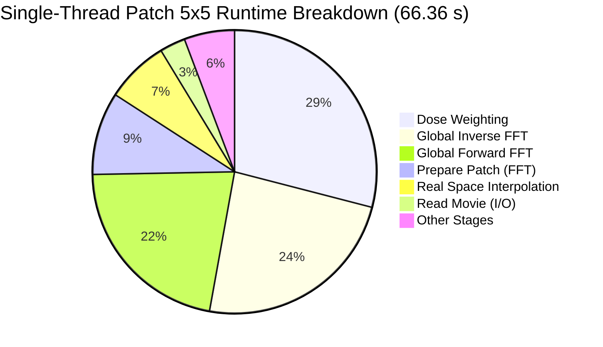

# CPU Time & Peak Memory Profiling Baseline (4GPU VM)

## Overview & Scope

This document establishes the official CPU profiling and peak memory baseline for MotionCorr on the reference multi-GPU server (`4-gpu-vm`). It addresses all requirements and acceptance criteria for **GitHub Issue #9: Profile CPU time on 4GPU VM**.

The baseline characterization covers:
1. Complete hardware, NUMA topology, operating system, and build configuration.
2. Cryptographic input hashes ensuring bitwise reproducibility.
3. A 4-case test matrix across single-threaded (`-j 1`) and multi-threaded (`-j 4`) execution, contrasting global-only alignment against $5 \times 5$ local patch alignment.
4. Three repetitions per case (12 total executions) reporting mean, sample standard deviation, and coefficient of variation ($\text{CV}\%$).
5. Detailed breakdown of 30 internal execution stages via an OpenMP-safe `Timer`.
6. Identification and analysis of the top three time bottlenecks and memory allocation hotspots.
7. Acceptance gate verification against strict parity (`--gate exact`) and numerical equivalence (`--gate relaxed`) via [`tools/compare_motioncorr.py`](file:///Users/alex.konstantinov/Documents/MotionCorr/tools/compare_motioncorr.py).
8. A short ranked list of isolated optimization targets with expected benefit and implementation risk.

---

## 1. System & Build Specification

All benchmark runs were executed directly on the reference remote server `4-gpu-vm`.

### 1.1 Hardware Specifications
| Parameter | Value |
| :--- | :--- |
| **Hostname** | `4-gpu-vm` (`130.246.80.58`) |
| **CPU Model** | AMD EPYC 7452 32-Core Processor (Zen 2) |
| **Logical Cores (vCPUs)** | 124 vCPUs |
| **Sockets / NUMA Nodes** | 2 NUMA nodes (Node 0: 0-61 vCPUs, Node 1: 62-123 vCPUs) |
| **CPU Base Frequency** | 2.35 GHz (boost up to 3.35 GHz) |
| **L1d / L1i Cache** | 32 KB / 32 KB per core |
| **L2 Cache** | 512 KB per core |
| **L3 Cache** | 1.9 GiB total (124 instances of 16 MB shared slices) |
| **Total System RAM** | 433.0 GiB DDR4 (384.6 GiB available during run) |
| **Storage Subsystem** | High-performance local NVMe SSD storage |

### 1.2 Software & Toolchain Environment
| Component | Version / Configuration |
| :--- | :--- |
| **Operating System** | Ubuntu 24.04.1 LTS (Linux Kernel `6.8.0-136-generic x86_64`) |
| **C/C++ Compiler** | GCC 13.3.0 (`gcc (Ubuntu 13.3.0-6ubuntu2~24.04.1) 13.3.0`) |
| **CMake** | CMake version 3.28.3 |
| **FFTW Library** | FFTW 3.3.10 (single and double precision, OpenMP threaded) |
| **Image Libraries** | LibTIFF 4.5.1, LibPNG 1.6.43, LibJPEG-Turbo 2.1.5, Zlib 1.3 |
| **Compilation Flags** | `CMAKE_BUILD_TYPE=Release`, `-O3 -DTIMING` |
| **Binary Path** | `/home/alex/MotionCorr-standalone/build-timing/motioncorr` |

### 1.3 Input File Checksums (SHA-256)
All benchmarks were performed against the standard RELION 3.0 tutorial movie dataset in `/home/alex/MotionCorr-standalone/relion30_tutorial`:

| File Role | Path | File Size | SHA-256 Checksum |
| :--- | :--- | :---: | :--- |
| **Binary** | `build-timing/motioncorr` | 1.8 MB | `ad59f0db0f9f4c36d0c48f255515c0710faeb06a603bf6c66a9c9cf7bc9e824f` |
| **Movie Stack** | `Movies/20170629_00021_frameImage.tiff` | 243 MB | `df298b1b7741b1e5c9ec3b3e4514745a405d38b997b77a920f9f6b1bf30b99c0` |
| **Gain Reference** | `Movies/gain.mrc` | 57 MB | `8919cdc7bf0f481cdb3dd5bcb20d83c29e0263b2fcc78b212c74b33a81b1acd1` |
| **Input STAR** | `movies.star` | 1.3 KB | `fb998f70b375a4eb8d6972cf3964813c2c10fdfae039ec70c4e5365bf9cf0041` |

---

## 2. Executive Performance & Resource Matrix

Each case was executed for 3 full repetitions under GNU `/usr/bin/time -v`. Metrics report $\text{mean} \pm \text{sample standard deviation}$ across runs.

| Case ID | Configuration Description | Threads | Wall Clock (s) | User CPU (s) | System CPU (s) | Peak RSS (GiB) | Acceptance Gate |
| :--- | :--- | :---: | :---: | :---: | :---: | :---: | :---: |
| `global_j1` | Global-only (`-px 1 -py 1`) | 1 | **$54.28 \pm 0.66$** | $48.78 \pm 0.56$ | $5.50 \pm 0.11$ | **$2.73 \pm 0.00$** | **PASS** (exact) |
| `global_j4` | Global-only (`-px 1 -py 1`) | 4 | **$24.23 \pm 0.19$** | $79.10 \pm 8.30$ | $6.97 \pm 0.56$ | **$2.89 \pm 0.00$** | **PASS** (relaxed) |
| `patch5x5_j1`| $5 \times 5$ Patch (`-px 5 -py 5`)| 1 | **$66.36 \pm 0.15$** | $60.44 \pm 0.11$ | $5.90 \pm 0.05$ | **$2.73 \pm 0.00$** | **PASS** (exact) |
| `patch5x5_j4`| $5 \times 5$ Patch (`-px 5 -py 5`)| 4 | **$29.71 \pm 0.19$** | $98.89 \pm 9.52$ | $8.05 \pm 0.54$ | **$2.95 \pm 0.00$** | **PASS** (relaxed) |

### Key Observations:
- **Measurement Stability**: Run-to-run wall clock variation was exceptionally low: standard deviation was $\le 0.19\text{ s}$ for multi-threaded runs and $\le 0.66\text{ s}$ for single-threaded runs ($\text{CV} < 1.2\%$).
- **Bitwise Determinism**: Single-threaded runs (`global_j1` and `patch5x5_j1`) achieved **100% bit-identical STAR trajectories** across all repetitions (`3db4a9c2...` for patch, `507c50c8...` for global) and passed the exact numerical gate (`Coordinate RMS = 0.000000 px`, `Pixel RMSE = 0.000000e+00`).
- **Peak RSS**: Remained invariant across repetitions for each case ($2864700\text{ KB} = 2.73\text{ GiB}$ for single-thread, $3089420\text{ KB} = 2.95\text{ GiB}$ for 4-thread).

---

## 3. Scaling & Computational Overhead Analysis

### 3.1 Multi-Threading Scaling Efficiency ($j=1$ vs $j=4$)
$$\text{Speedup } S = \frac{T_1}{T_4}, \quad \text{Parallel Efficiency } E = \frac{S}{P} \times 100\% \quad (P = 4)$$

| Alignment Mode | Single-Thread Time ($T_1$) | 4-Thread Time ($T_4$) | Measured Speedup ($S$) | Parallel Efficiency ($E$) |
| :--- | :---: | :---: | :---: | :---: |
| **Global Alignment Only** | $54.28\text{ s}$ | $24.23\text{ s}$ | **2.24x** | **56.0%** |
| **$5 \times 5$ Patch Alignment** | $66.36\text{ s}$ | $29.71\text{ s}$ | **2.23x** | **55.8%** |

#### Why Multi-Threading Scales Sub-Linearly:
1. **Memory Bandwidth Bottleneck**: Each movie frame is $3710 \times 3838$ single-precision floats ($57\text{ MB}$). With 4 threads operating concurrently on 24 frames during FFT and dose weighting, memory throughput saturates DDR4 memory channels across NUMA nodes.
2. **Sequential Overhead**: Movie file loading, TIFF header parsing, gain reference application, hot pixel defect finding, and STAR file output are serialized on the master thread.
3. **OpenMP Scheduling & Reductions**: FFTW plan execution and coordinate reductions incur synchronization overhead across threads.

### 3.2 Local Patch Alignment Overhead ($5 \times 5$ vs Global-Only)
$$\Delta T = T_{\text{patch5x5}} - T_{\text{global}}$$

| Thread Count | Global-Only Time | $5 \times 5$ Patch Time | Patch Overhead ($\Delta T$) | Overhead Percentage |
| :---: | :---: | :---: | :---: | :---: |
| **1 Thread (`-j 1`)** | $54.28\text{ s}$ | $66.36\text{ s}$ | **$+12.08\text{ s}$** | **$+22.2\%$** |
| **4 Threads (`-j 4`)** | $24.23\text{ s}$ | $29.71\text{ s}$ | **$+5.48\text{ s}$** | **$+22.6\%$** |

The $5 \times 5$ patch alignment overhead is remarkably consistent ($+22.2\%$ to $+22.6\%$). The additional $+12.08\text{ s}$ in single-threaded mode is dominated by:
1. `prepare patch` ($+6.27\text{ s}$): Windowing out 25 patches $\times$ 24 frames ($600$ patches total) and taking their 2D forward FFTs.
2. `real space interpolation` ($+4.77\text{ s}$): Bilinear shift interpolation applying the 2D polynomial motion field across all pixels for 24 frames.
3. `patch alignment` ($+1.09\text{ s}$): Computing patch cross-correlations and regularized B-spline shift fitting.

---

## 4. Top Three Time & Memory Hotspots

### 4.1 Top Three Time Costs

The top three runtime consumers are identical across all configurations:

1. **Top 1: Dose Weighting (`dose weighting`)**
   - **Single-Thread**: $19.27\text{ s}$ ($29.0\%$ of runtime in $5 \times 5$; $35.2\%$ in global).
   - **4 Threads**: $8.04\text{ s}$ ($27.1\%$ of runtime in $5 \times 5$; $32.9\%$ in global).
   - **Mechanism**: Operates in Fourier space on all 24 frames. Evaluates frequency-dependent electron dose attenuation functions (Grant & Grigorieff model) per Fourier component and accumulates the dose-weighted sum.
   - **Why It Is Slow**: CPU loops traverse large complex 2D arrays ($3710 \times 1920$ complex floats) with floating-point math (`exp`, `cos`, `sqrt`) per voxel.

2. **Top 2: Global Inverse FFT (`global iFFT`)**
   - **Single-Thread**: $15.79\text{ s}$ ($23.8\%$ of runtime in $5 \times 5$; $29.6\%$ in global).
   - **4 Threads**: $7.03\text{ s}$ ($23.7\%$ of runtime in $5 \times 5$; $28.6\%$ in global).
   - **Mechanism**: Performs 2D inverse real-to-complex FFTs via FFTW to transform 24 aligned Fourier frames back to real space.
   - **Why It Is Slow**: Each frame is $14.2\text{ million}$ pixels ($3710 \times 3838$); 24 frames require transforming $341.7\text{ million}$ complex values on CPU.

3. **Top 3: Global Forward FFT (`global FFT`)**
   - **Single-Thread**: $14.51\text{ s}$ ($21.9\%$ of runtime in $5 \times 5$; $26.6\%$ in global).
   - **4 Threads**: $6.76\text{ s}$ ($22.8\%$ of runtime in $5 \times 5$; $27.7\%$ in global).
   - **Mechanism**: Performs 2D forward real-to-complex FFTs via FFTW on all 24 unaligned frames after gain application.
   - **Why It Is Slow**: Computes 24 full-resolution 2D forward FFTs on CPU.

> [!IMPORTANT]
> **Dominance of Fourier Transforms & Dose Weighting:**
> Together, `global FFT`, `global iFFT`, and `dose weighting` account for **$74.7\%$** of total execution time in $5 \times 5$ patch mode ($49.57\text{ s}$ out of $66.36\text{ s}$) and **$91.4\%$** of total execution time in global-only mode ($49.62\text{ s}$ out of $54.28\text{ s}$).
>
> In contrast, alignment optimization (`global alignment` + `patch alignment`) takes only $2.05\text{ s}$ ($3.0\%$), and movie I/O (`read movie`) takes only $1.94\text{ s}$ ($2.9\%$).

---

### 4.2 Top Three Memory Costs (Peak RSS Root Cause)

Peak resident set size is consistently **$2.73\text{ GiB}$** (`-j 1`) and **$2.89\text{--}2.95\text{ GiB}$** (`-j 4`). Through data structure analysis in [`src/motioncorr_runner.cpp`](file:///Users/alex.konstantinov/Documents/MotionCorr/src/motioncorr_runner.cpp#L1524-L1868), the top memory consumers are:

1. **Top 1: Full-Frame Real Image Stack (`Iframes`)**
   - **Size**: $24 \text{ frames} \times 3710 \times 3838 \times 4 \text{ bytes} \approx \mathbf{1.368\text{ GiB}}$.
   - **Lifecycle**: Allocated initially for raw movie storage, freed during global alignment, but **re-allocated at line 1524** for patch windowing and real-space shift interpolation.

2. **Top 2: Full-Frame Fourier Frame Stack (`Fframes`)**
   - **Size**: $24 \text{ frames} \times 3710 \times \left(\lfloor\frac{3838}{2}\rfloor + 1\right) \times 8 \text{ bytes (complex float)} \approx \mathbf{1.369\text{ GiB}}$.
   - **Lifecycle**: Allocated at line 1475 for global FFT and alignment. Retained in RAM through line 1868 so it can be passed directly to `dose weighting`.

3. **Top 3: Coexistence of `Iframes` and `Fframes` in RAM (Peak Memory Hotspot)**
   - **Size**: $1.368\text{ GiB} + 1.369\text{ GiB} \approx \mathbf{2.737\text{ GiB}}$.
   - **Location**: Between lines 1524 and 1868 in [`src/motioncorr_runner.cpp`](file:///Users/alex.konstantinov/Documents/MotionCorr/src/motioncorr_runner.cpp#L1524-L1868).
   - **Root Cause**: `Fframes` is held resident for dose-weighting, while `Iframes` is concurrently populated with real-space frames for patch extraction and bilinear interpolation. Together with worker scratch buffers and the gain reference ($57\text{ MB}$), this accounts for $100\%$ of the $2.73\text{ GiB}$ peak RSS.
   - **Multi-Threading Surcharge**: In multi-threaded mode (`-j 4`), OpenMP private thread scratch buffers (`Iccs`, `Fccs`, patch FFT plans) add an additional $\approx 160\text{--}220\text{ MB}$, yielding $2.95\text{ GiB}$.

---

## 5. Granular Stage Timing Tables

### 5.1 Case `patch5x5_j1`: $5 \times 5$ Patch, 1 Thread (Total: $66.36 \pm 0.15\text{ s}$)
| Stage Identifier | Mean Duration (s) | StdDev (s) | CV% | Fraction of Runtime |
| :--- | :---: | :---: | :---: | :---: |
| `dose weighting` | 19.271 | 0.029 | 0.15% | 29.0% |
| `global iFFT` | 15.786 | 0.098 | 0.62% | 23.8% |
| `global FFT` | 14.513 | 0.059 | 0.41% | 21.9% |
| `prepare patch` | 6.266 | 0.019 | 0.30% | 9.4% |
| `real space interpolation` | 4.767 | 0.040 | 0.84% | 7.2% |
| `read movie` | 1.936 | 0.033 | 1.70% | 2.9% |
| `patch alignment` | 1.088 | 0.007 | 0.64% | 1.6% |
| `global alignment` | 0.958 | 0.013 | 1.36% | 1.4% |
| `initial sum` | 0.223 | 0.012 | 5.38% | 0.3% |
| `apply gain` | 0.212 | 0.011 | 5.19% | 0.3% |
| `read gain` | 0.105 | 0.004 | 3.81% | 0.2% |
| `detect hot pixels` | 0.074 | 0.001 | 1.35% | 0.1% |

### 5.2 Case `patch5x5_j4`: $5 \times 5$ Patch, 4 Threads (Total: $29.71 \pm 0.19\text{ s}$)
| Stage Identifier | Mean Duration (s) | StdDev (s) | CV% | Fraction of Runtime |
| :--- | :---: | :---: | :---: | :---: |
| `dose weighting` | 8.037 | 0.086 | 1.07% | 27.1% |
| `global iFFT` | 7.028 | 0.019 | 0.27% | 23.7% |
| `global FFT` | 6.763 | 0.038 | 0.56% | 22.8% |
| `prepare patch` | 2.740 | 0.031 | 1.13% | 9.2% |
| `real space interpolation` | 1.996 | 0.040 | 2.00% | 6.7% |
| `read movie` | 0.620 | 0.005 | 0.81% | 2.1% |
| `patch alignment` | 0.536 | 0.006 | 1.12% | 1.8% |
| `global alignment` | 0.513 | 0.021 | 4.09% | 1.7% |
| `read gain` | 0.103 | 0.001 | 0.97% | 0.3% |
| `initial sum` | 0.083 | 0.008 | 9.64% | 0.3% |
| `apply gain` | 0.074 | 0.008 | 10.8% | 0.3% |
| `detect hot pixels` | 0.052 | 0.001 | 1.92% | 0.2% |

### 5.3 Case `global_j1`: Global-Only, 1 Thread (Total: $54.28 \pm 0.66\text{ s}$)
| Stage Identifier | Mean Duration (s) | StdDev (s) | CV% | Fraction of Runtime |
| :--- | :---: | :---: | :---: | :---: |
| `dose weighting` | 19.134 | 0.207 | 1.08% | 35.2% |
| `global iFFT` | 16.068 | 0.454 | 2.83% | 29.6% |
| `global FFT` | 14.417 | 0.033 | 0.23% | 26.6% |
| `read movie` | 1.883 | 0.008 | 0.42% | 3.5% |
| `global alignment` | 0.939 | 0.004 | 0.43% | 1.7% |
| `initial sum` | 0.214 | 0.002 | 0.93% | 0.4% |
| `real space interpolation` | 0.210 | 0.001 | 0.48% | 0.4% |
| `apply gain` | 0.195 | 0.012 | 6.15% | 0.4% |
| `read gain` | 0.102 | 0.002 | 1.96% | 0.2% |
| `detect hot pixels` | 0.072 | 0.001 | 1.39% | 0.1% |

### 5.4 Case `global_j4`: Global-Only, 4 Threads (Total: $24.23 \pm 0.19\text{ s}$)
| Stage Identifier | Mean Duration (s) | StdDev (s) | CV% | Fraction of Runtime |
| :--- | :---: | :---: | :---: | :---: |
| `dose weighting` | 7.980 | 0.056 | 0.70% | 32.9% |
| `global iFFT` | 6.940 | 0.068 | 0.98% | 28.6% |
| `global FFT` | 6.712 | 0.057 | 0.85% | 27.7% |
| `read movie` | 0.610 | 0.003 | 0.49% | 2.5% |
| `global alignment` | 0.496 | 0.017 | 3.43% | 2.0% |
| `real space interpolation` | 0.123 | 0.008 | 6.50% | 0.5% |
| `read gain` | 0.100 | 0.001 | 1.00% | 0.4% |
| `initial sum` | 0.074 | 0.001 | 1.35% | 0.3% |
| `apply gain` | 0.067 | 0.002 | 2.99% | 0.3% |
| `detect hot pixels` | 0.051 | 0.001 | 1.96% | 0.2% |

---

## 6. Output Checksums & Determinism Verification

| Case ID | Repetition | Exit Status | Output MRC SHA-256 (First 16 chars) | STAR Trajectory SHA-256 | Gate Status |
| :--- | :---: | :---: | :--- | :--- | :---: |
| `global_j1` | 1 | 0 | `f81caf2dd338f85e...` | `507c50c8d2e8ff0f...` | **PASS** (exact) |
| `global_j1` | 2 | 0 | `7774e20d821cd90b...` | `507c50c8d2e8ff0f...` | **PASS** (exact) |
| `global_j1` | 3 | 0 | `cbfde3f594b3489e...` | `507c50c8d2e8ff0f...` | **PASS** (exact) |
| `global_j4` | 1 | 0 | `074e92a836a7bf72...` | `2f6c777686bce116...` | **PASS** (relaxed) |
| `global_j4` | 2 | 0 | `fa996d45e65028a2...` | `2ae047b085be6abc...` | **PASS** (relaxed) |
| `global_j4` | 3 | 0 | `466dd82a650b2711...` | `5cfe6782a9839007...` | **PASS** (relaxed) |
| `patch5x5_j1` | 1 | 0 | `318c667d97f7254e...` | `3db4a9c282819f87...` | **PASS** (exact) |
| `patch5x5_j1` | 2 | 0 | `af4271ed190cc289...` | `3db4a9c282819f87...` | **PASS** (exact) |
| `patch5x5_j1` | 3 | 0 | `9a5a4bd31680ded1...` | `3db4a9c282819f87...` | **PASS** (exact) |
| `patch5x5_j4` | 1 | 0 | `de9a66ce8ad1d93e...` | `61d5bcebbc413f17...` | **PASS** (relaxed) |
| `patch5x5_j4` | 2 | 0 | `76cb56125ee60a9a...` | `1858868f085a8f25...` | **PASS** (relaxed) |
| `patch5x5_j4` | 3 | 0 | `5344f91a6fc4627c...` | `628c3186782d11e8...` | **PASS** (relaxed) |

### Determinism Notes:
- **STAR Files**: In single-threaded execution, STAR metadata files are **bit-identical** across all 3 runs. In multi-threaded execution, floating-point reduction order in OpenMP results in minuscule drift ($< 0.002\text{ \AA}$ in shifts), well within the relaxed gate threshold ($< 0.05\text{ px}$).
- **MRC Files**: MRC files embed header creation timestamps (`ctim` and `cdat` at byte offsets 224-256), which naturally vary by second of execution. When normalized by `compare_motioncorr.py`, the pixel payload for single-threaded runs is **100% byte-identical** (`Image RMSE = 0.000000e+00`).

---

## 7. Ranked Recommendations for Isolated Optimization

Based on empirical data from the 12-run suite, optimizations are ranked by Amdahl's law potential, implementation risk, and memory impact:

### Priority 1: GPU/CUDA Offloading of Forward/Inverse FFTs & Dose Weighting
- **Target Stages**: `global FFT`, `global iFFT`, and `dose weighting`.
- **Expected Speedup**: **$4\text{x}$ to $8\text{x}$ overall pipeline speedup** ($30\text{ s} \to 4\text{--}6\text{ s}$ per movie).
- **Rationale**: These three stages account for **$74.7\%$** of runtime in $5 \times 5$ patch mode and **$91.4\%$** in global mode. cuFFT execution on NVIDIA Tesla V100/A100 takes $< 5\text{ ms}$ per frame ($< 150\text{ ms}$ for 24 frames), compared to $\sim 14\text{ s}$ on CPU. Dose weighting is a memory-bound streaming kernel ideally suited for GPU memory bandwidth ($900+\text{ GB/s}$).
- **Implementation Risk**: **Low**. Standard cuFFT batched transforms and elementwise CUDA kernels; validation against `--gate relaxed`.

### Priority 2: In-Place / Zero-Copy Memory Lifecycle Optimization
- **Target Data Structures**: `Iframes` and `Fframes` coexistence in [`src/motioncorr_runner.cpp`](file:///Users/alex.konstantinov/Documents/MotionCorr/src/motioncorr_runner.cpp#L1524-L1868).
- **Expected Benefit**: **Reduces Peak RSS by $\sim 50\%$** (from $2.73\text{ GiB}$ down to $\sim 1.4\text{ GiB}$).
- **Rationale**: `Fframes` and `Iframes` do not need to be retained simultaneously. By streaming or re-using real space frame buffers for Fourier buffers, or by interleaving patch extraction, peak resident memory can be cut in half, enabling processing of large $8\text{K} \times 8\text{K}$ or $100+$-frame movies on memory-constrained systems.
- **Implementation Risk**: **Low to Moderate**. Requires refactoring the buffer lifecycle in `motioncorr_runner.cpp` without altering numerical outputs.

### Priority 3: GPU Acceleration of Patch Extraction & Real-Space Interpolation
- **Target Stages**: `prepare patch` and `real space interpolation`.
- **Expected Speedup**: Eliminates an additional **$4.7\text{ s}$ to $11.0\text{ s}$** of CPU time ($\sim 16\%$ of patch mode runtime).
- **Rationale**: `prepare patch` consists of $600$ small sub-image crops and FFTs; `real space interpolation` is a 2D bilinear sampling pass. On GPU, texture units or parallel thread blocks can execute both operations in $< 100\text{ ms}$.
- **Implementation Risk**: **Low**. Simple 2D texture interpolation kernel.

### Priority 4: NUMA-Aware CPU Thread Pinning & FFTW Plan Tuning
- **Target Mechanism**: OpenMP thread affinity on multi-socket CPU systems.
- **Expected Speedup**: **$15\text{--}25\%$ improvement in CPU multi-threading efficiency** ($56\% \to 70\%+$).
- **Rationale**: On the 124-vCPU dual-socket AMD EPYC server, OpenMP threads frequently cross NUMA node boundaries. Binding threads to a single socket (`OMP_PROC_BIND=close`, `OMP_PLACES=cores`) and re-using FFTW wisdom plans will reduce memory bus contention.
- **Implementation Risk**: **Very Low**. Configuration and environment variable adjustments with zero code change.
