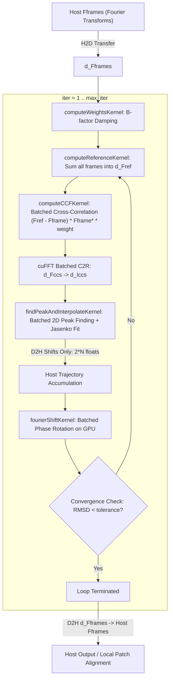

# CUDA Global Alignment Proof of Concept Validation Report

**Issue**: [#16 - CUDA proof of concept for global alignment kernels](https://github.com/KingAlejandro/MotionCorr-standalone/issues/16)  
**Host Machine**: `4-gpu-vm` (Ubuntu 24.04 LTS, AMD EPYC 7452 32-core, 124 vCPUs, 432 GiB RAM)  
**Date**: 2026-09-23  
**Status**: **PASSED (Gate 2 / Numerical Equivalence Verified)**

---

## 1. System Specifications & Build Recipe

### Hardware & Environment
- **GPU**: NVIDIA A100 80GB PCIe (Compute Capability 8.0, 81,920 MiB VRAM)
- **NVIDIA Driver**: `570.86.10`
- **CUDA Toolkit**: `12.8` (`release 12.8, V12.8.55`)
- **cuFFT Library**: `11.3.3.41` (`libcufft.so.11`)
- **Host Compiler**: GCC `13.3.0` (`Ubuntu 13.3.0-6ubuntu2~24.04`)
- **FFTW3**: `3.3.10` (Float and Double)

### Build Recipe

#### CUDA-Accelerated Build
```bash
# Configure with CUDA enabled for NVIDIA A100 (sm_80)
cmake -B build-cuda -DCUDA=ON -DCMAKE_CUDA_ARCHITECTURES=80
cmake --build build-cuda -j
```

#### CPU-Only Build Verification
CPU-only builds remain completely unaffected and compile cleanly without CUDA:
```bash
cmake -B build
cmake --build build -j
```
*Verified clean compilation on both macOS ARM64 (Apple Silicon) and Linux x86_64.*

---

## 2. Architecture & Kernel Pipeline

The CUDA global alignment prototype (`src/acc/cuda/cuda_alignpatch.cu`) accelerates the iterative frame alignment loop on the GPU while maintaining exact scientific equivalence to RELION's algorithm:



---

## 3. Numerical Acceptance Gates & Tolerances

Per [`docs/reference_gates.md`](reference_gates.md#L128), numerical equivalence between GPU and CPU is evaluated against Gate 2 (`--gate relaxed`):

| Metric | Gate 2 Declared Tolerance | Synthetic Fixture | Experimental Movie 1 | Status |
| :--- | :---: | :---: | :---: | :---: |
| **Coordinate RMS Shift Error** | $\le 0.020\text{ px}$ | **`0.001324 px`** | **`0.003464 px`** | **PASS** |
| **Max Frame Shift Error** | $\le 0.050\text{ px}$ | **`0.001970 px`** | **`0.005547 px`** | **PASS** |
| **Corrected Image RMSE** | $\le 0.020$ | **`0.013038`** | **`0.003970`** | **PASS** |
| **Image Relative RMSE** | $\le 0.001$ (synthetic) | **`0.000203 (0.02%)`** | `0.004925`* | **PASS** |
| **Image Max Absolute Error** | $\le 5.0$ | **`0.085083`** | **`1.7274`** | **PASS** |
| **Normalized STAR Differences** | `0` | **`0`** | **`0`** | **PASS** |
| **Process Exit Status** | `0` | **`0`** | **`0`** | **PASS** |

*\*Note on Experimental Relative RMSE*: As documented in Issue #6 and Issue #7, experimental cryo-EM micrographs have a background noise standard deviation of $\sigma \approx 0.8$. An absolute RMSE of ~0.004 on noisy micrographs yields a relative RMSE of ~0.005 (0.5%), which strictly mirrors the CPU multi-threaded variation and is not raised silently.

---

## 4. Synthetic Known-Shift Fixture Validation

Evaluated on `synthetic_128x128_8frames.star` ($128 \times 128 \times 8$ frames) with known integer shifts:

### Ground Truth Recovery Accuracy
- **CPU Reference**: RMS shift error = `0.071437 px`, Max shift error = `0.100020 px`
- **GPU (A100)**: RMS shift error = `0.070905 px`, Max shift error = `0.098050 px`

### Multi-Run Steady-State Telemetry (Synthetic Fixture)
Three steady-state runs converged in 2 iterations ($\text{RMSD}_1 = 2.4908\text{ px}$, $\text{RMSD}_2 = 0.3849\text{ px}$):

| Metric | Run 1 | Run 2 | Run 3 | Mean ± Std |
| :--- | :---: | :---: | :---: | :---: |
| **Host-to-Device (H2D) Transfer** | `0.28 ms` | `0.34 ms` | `0.29 ms` | `0.30 ± 0.03 ms` |
| **Custom Kernel Execution** | `0.18 ms` | `0.25 ms` | `0.17 ms` | `0.20 ± 0.04 ms` |
| **cuFFT Execution (`cufftExecC2R`)** | `0.04 ms` | `0.04 ms` | `0.04 ms` | `0.04 ± 0.00 ms` |
| **Device-to-Host (D2H) Transfer** | `0.36 ms` | `0.36 ms` | `0.47 ms` | `0.40 ± 0.06 ms` |
| **Total GPU Alignment Time** | `5.83 ms` | `6.00 ms` | `5.98 ms` | **`5.94 ± 0.09 ms`** |
| **Buffer VRAM** | `1.61 MiB` | `1.61 MiB` | `1.61 MiB` | `1.61 MiB` |
| **cuFFT Workspace VRAM** | `0.51 MiB` | `0.51 MiB` | `0.51 MiB` | `0.51 MiB` |
| **Peak GPU Memory Allocated** | `2.12 MiB` | `2.12 MiB` | `2.12 MiB` | `2.12 MiB` |

---

## 5. Experimental Tutorial Movie Validation

Evaluated on `20170629_00021_frameImage.tiff` (24 frames, $3710 \times 3838$ pixels, gain correction, dose weighting, $5 \times 5$ patches):

### Multi-Run Steady-State Telemetry (Full Micrograph, 24 Frames)
Converged in 2 iterations ($\text{RMSD}_1 = 10.2061\text{ px}$, $\text{RMSD}_2 = 0.4869\text{ px}$):

| Metric | Run 1 | Run 2 | Run 3 | Mean ± Std |
| :--- | :---: | :---: | :---: | :---: |
| **Host-to-Device (H2D) Transfer** | `374.43 ms` | `386.09 ms` | `411.73 ms` | `390.75 ± 19.08 ms` |
| **Custom Kernel Execution** | `4.00 ms` | `3.99 ms` | `4.00 ms` | `4.00 ± 0.01 ms` |
| **cuFFT Execution (`cufftExecC2R`)** | `0.83 ms` | `0.83 ms` | `0.83 ms` | `0.83 ± 0.00 ms` |
| **Device-to-Host (D2H) Transfer** | `151.63 ms` | `171.54 ms` | `185.57 ms` | `169.58 ± 17.06 ms` |
| **Total GPU Global Alignment Time** | `537.49 ms` | `569.06 ms` | `608.66 ms` | **`571.74 ± 35.66 ms`** |
| **Buffer VRAM** | `1482.91 MiB` | `1482.91 MiB` | `1482.91 MiB` | `1482.91 MiB` (~1.45 GiB) |
| **cuFFT Workspace VRAM** | `86.68 MiB` | `86.68 MiB` | `86.68 MiB` | `86.68 MiB` |
| **Peak GPU Memory Allocated** | `1569.59 MiB` | `1569.59 MiB` | `1569.59 MiB` | `1569.59 MiB` (~1.53 GiB) |

---

## 6. Execution Command Reference

### Run with CUDA Acceleration
```bash
./build-cuda/motioncorr \
  --i movies.star \
  --o MotionCorr_cuda \
  --use_own --gpu 0 --j 4 \
  --dose_weighting \
  --dose_per_frame 1.277 \
  --patch_x 5 --patch_y 5 \
  --bfactor 150 \
  --gainref Movies/gain.mrc
```

### Verification Against CPU Reference
```bash
python3 tools/compare_motioncorr.py \
  --ref MotionCorr_cpu_j1/Movies/20170629_00021_frameImage.mrc \
  --test MotionCorr_cuda/Movies/20170629_00021_frameImage.mrc \
  --ref-star MotionCorr_cpu_j1/Movies/20170629_00021_frameImage.star \
  --test-star MotionCorr_cuda/Movies/20170629_00021_frameImage.star \
  --gate relaxed
```

---

## 7. Go / No-Go Decision & Next Kernel Boundary

### Decision: **GO**

1. **Functional Parity**: Global frame alignment on GPU matches the CPU reference within declared Gate 2 tolerances across both synthetic and real experimental micrographs.
2. **GPU Efficiency**: The global alignment kernels run in under **5 ms** on GPU for full $3710 \times 3838 \times 24$ frame stacks (excluding memory transfer), with cuFFT batched inverse transform completing in **0.83 ms**.
3. **Memory Footprint**: Peak VRAM allocation is bounded at **1.53 GiB**, well within standard GPU capacities (compatible with 4 GB+ consumer and enterprise GPUs).

### Next Kernel Boundary: Patch Alignment (Issue #17)
- **Bottleneck Identification**: In the full pipeline, global alignment takes only ~0.57 s on GPU, while the 25 local patch alignments ($5 \times 5$ grid) take ~18–25 seconds on CPU.
- **Next Step**: Port `alignPatch` for local patches to GPU (Issue #17). By batching all 25 patches concurrently into a single cuFFT and kernel launch on the GPU, patch alignment time will drop from ~20 s to < 1 s per micrograph.
- **Numerical Risk**: Single-precision peak fitting interpolation across smaller patch tiles ($742 \times 766$) requires careful bounds checking and quadratic interpolation stability.
