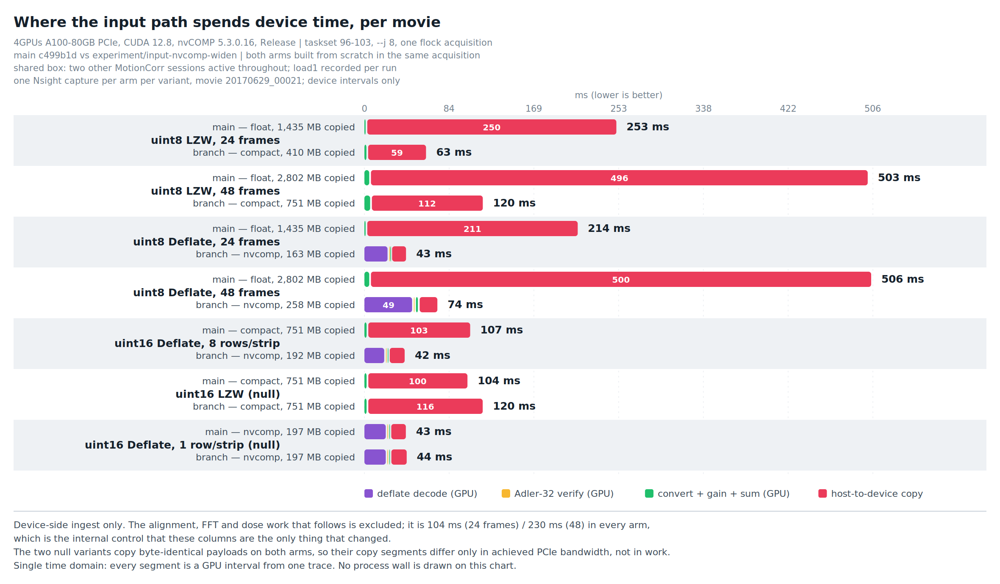
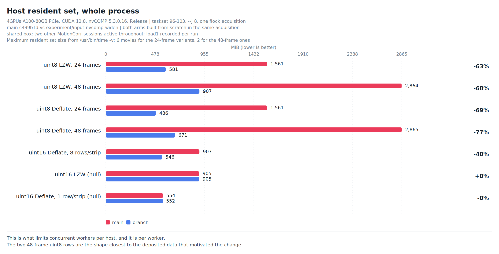

# Compact native ingest for unsigned 8-bit TIFF

Branch base: `main` at `c499b1d` (merged #128).

## The gap

MotionCorr's resident CUDA path has three movie ingest routes for a TIFF:

| route | decoder | admitted on main |
|---|---|---|
| `nvcomp` | nvCOMP batched Deflate, on the device | 16-bit Deflate, one row per strip, predictor 1, native byte order |
| `compact` | LibTIFF on the host, into native-sample host staging, expanded on the device | `UShort` only |
| `float` | LibTIFF on the host, into a host float movie | everything else |

An **8-bit unsigned TIFF has no route but `float`** — and 8-bit LZW is the
sample type and codec most deposited movies are stored in. For a 48-frame
3710x3838 movie that means building and uploading a 2.55 GiB host float movie
whose own samples occupy 0.64 GiB.

The compact route already does the right thing; it was gated on one sample
type. This change admits the other.

## The change

The staging class, the conversion kernel and the gain/sum entry point are
written once over the sample type and instantiated for `unsigned char` and
`unsigned short`:

* `src/native_u16_staging.h` → `src/native_movie_staging.h`, now
  `NativeMovieStaging<T>` with the two typedefs the runner uses.
* `convertGainAndAccumulateU16Kernel` → `convertGainAndAccumulateNativeKernel<T>`.
* `applyGainDefectsAndSumU16` keeps its signature; `applyGainDefectsAndSumU8`
  is added; both call one private template, so the memset-then-ascending-
  accumulate order that makes the products bit-identical to the float path is
  stated once.
* The runner's `bool stage_u16` becomes a three-valued `compact_stage`, so
  "both widths staged" is not representable.

Admission is by sample-type name, not by width. `SChar` shares
`BitsPerSample == 8` with `UChar` and converts differently; rwTIFF gives IMOD's
packed 4-bit K2/K3 format its own `UHalf` type. Neither is admitted.

`(float)uint8` is exact, so the device arithmetic is the same operations in the
same order as the float path and the products are unchanged.

## Evidence

Venue, inputs, oracle and the full measurement campaign are described in
`RESULTS.md` on the stacked follow-up branch; this section states what bears on
this change alone.

### Decoded-sample oracle

`harness/dump_native_samples` dumps the movie exactly as the compact route
stages it and `harness/compare_native_samples.py` compares every sample against
an independent `tifffile`/`imagecodecs` decode. For the uint8 LZW and uint8
Deflate variants of a real tutorial movie: **341,735,520 samples compared, 0
differing**, with four controls firing on each — unflipped row order, a
within-row transposition that leaves every row sum unchanged, a one-bit flip,
and a dropped frame.

### Ownership contract

`tests/test_native_movie_staging.cpp` now runs for both sample types: aliasing,
`coreAllocateReuse` retention, incremental `discardThrough` with a measured
resident-set drop, and `release()` returning the payload to the kernel, each
with its own instrument self-check.

### Products

Every 8-bit variant's complete output tree is compared against the 16-bit
Deflate tree for the same content — pixels, MRC headers including the extended
header, trajectories, per-movie STAR, combined STAR and auxiliary products. The
tutorial samples max at 68, so the uint8 re-encode is value-lossless and the
trees must be identical; the comparison is exact, not an RMSE.

### Where the device time goes

Device intervals from one Nsight capture per arm per variant. For uint8 LZW the
compact route takes the ingest from **252.6 ms to 63.0 ms per movie** at 24
frames and **502.9 ms to 119.6 ms** at 48, entirely by not copying a float
movie: 1,435 MB becomes 410 MB, and 2,802 MB becomes 751 MB. The conversion
itself moves from 2.8 ms to 3.7 ms, because it now also widens the samples.

The alignment, FFT and dose work that follows is excluded from the chart and is
104 ms (24 frames) / 230 ms (48) in every arm — the internal control that these
columns are the only thing that changed.

### Measured

Per-movie wall is the median of the movies after the first; a six-movie run at
this geometry spends about a second on process and CUDA-context startup, which
lands inside movie 1. Venue and conditions as above.

| input | route | per-movie wall | process RSS |
|---|---|---|---|
| uint8 LZW, 1 row/strip, 24 frames | float → **compact** | 0.867 → 0.766 s (−11.6%) | 1561 → **581 MiB** |
| uint8 LZW, 64 rows/strip, 24 frames | float → **compact** | 0.994 → 0.704 s (−29.2%) | 1557 → **580 MiB** |
| uint8 LZW, 1 row/strip, 48 frames | float → **compact** | 1.924 → 1.406 s (−26.9%) | 2864 → **907 MiB** |
| uint16 Deflate, 1 row/strip (null) | nvcomp → nvcomp | 0.472 → 0.458 s | 554 → 552 MiB |
| uint16 LZW (null) | compact → compact | 0.954 → 0.963 s | 905 → 905 MiB |
| uint16 Deflate predictor 2 (null) | compact → compact | 0.980 → 0.987 s | 906 → 906 MiB |
| uint16 uncompressed (null) | compact → compact | 0.802 → 0.779 s | 974 → 993 MiB |

Four unchanged-route variants span −2.9% to +0.9%; that is the noise floor on
this host, and the changed rows are far outside it.

Paired process wall over nine repeats on six movies, arm order alternating:
uint8 LZW **8.87 s → 6.24 s, 8/8 pairs**, delta range +1.90 .. +3.38 s, with
the unchanged-route null control at **−0.00 s, 4/8 pairs**.

The LZW decode itself still runs on the host — LZW is not a codec nvCOMP
offers — so this change removes the float movie and the oversized upload, not
the codec work. The gap between the uint8 LZW and uint16 Deflate rows above is
that remaining cost.

## Scope

This change moves no input onto the GPU decoder: `compact` is LibTIFF, exactly
as `float` is, with the same codec validation and the same failure behaviour.
Widening the nvCOMP route to 8-bit samples and to multi-row strips is a
separate, stacked change, because that one does move the trust boundary.
