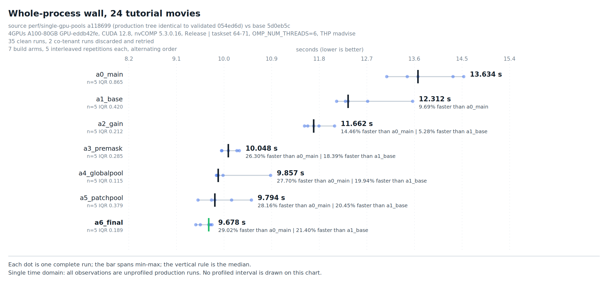
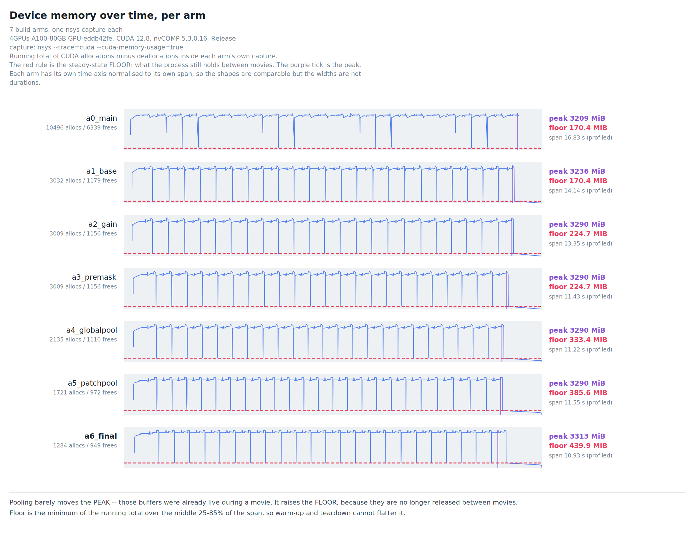
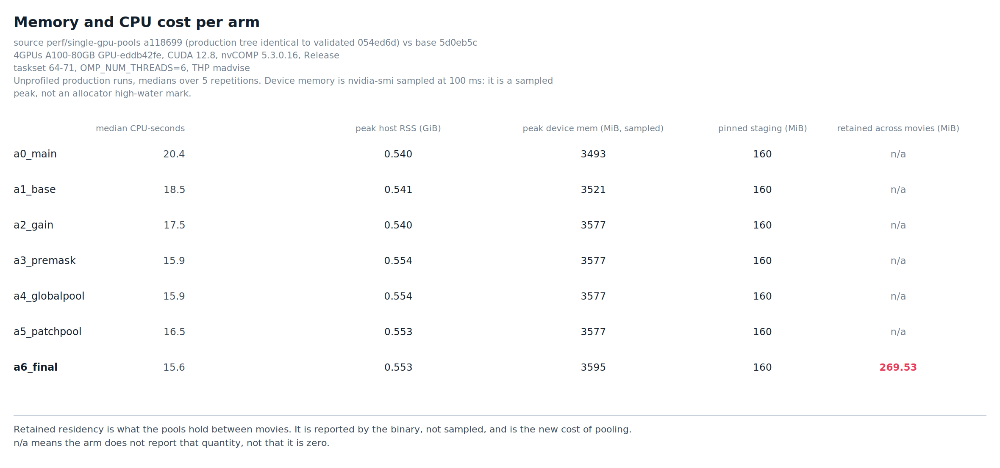
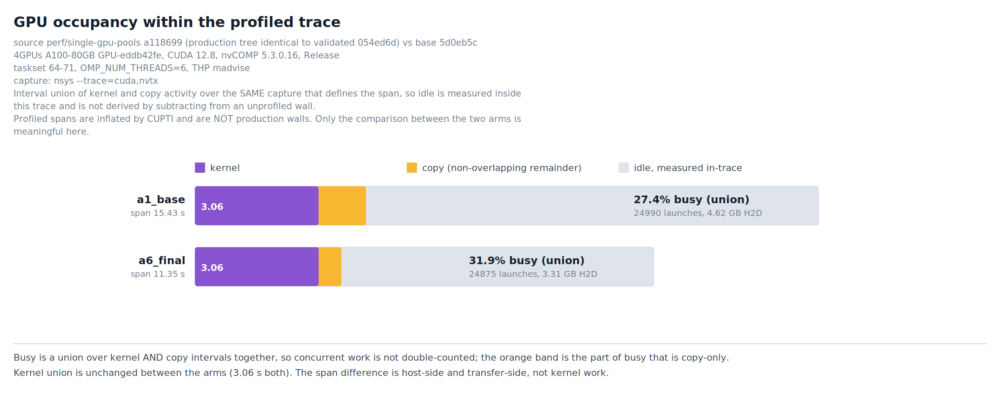
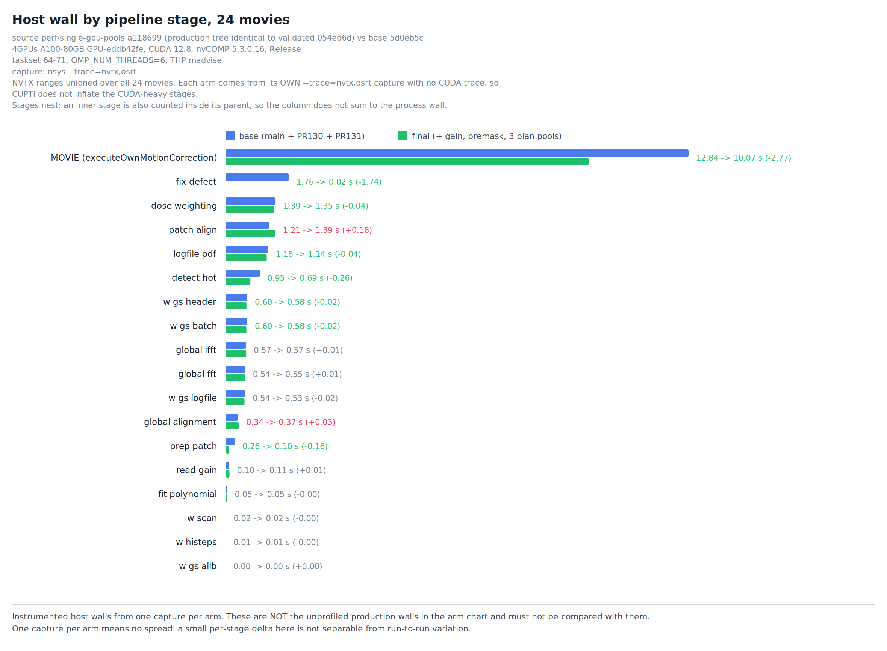
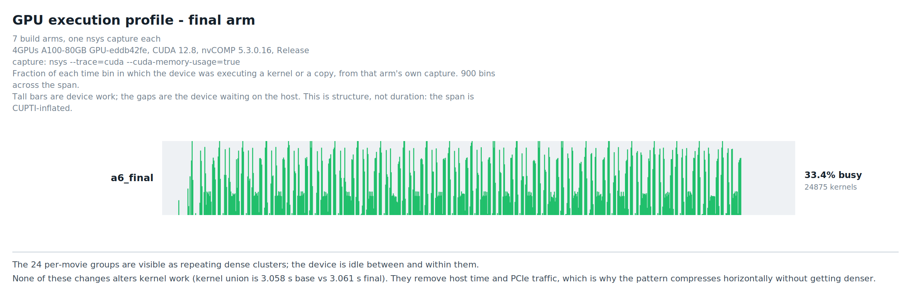
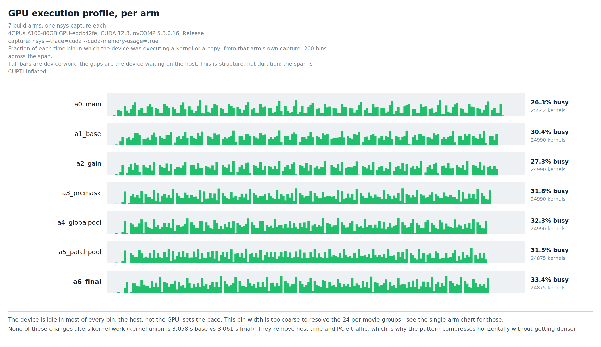
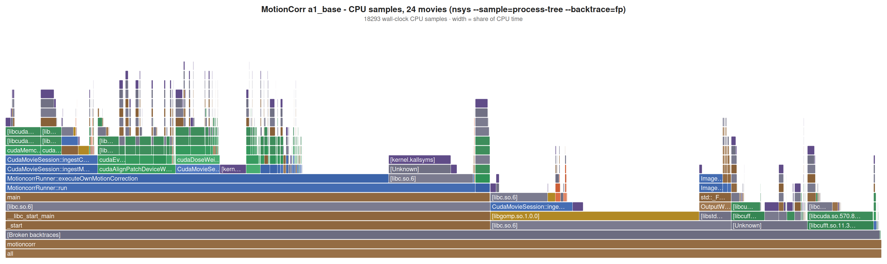
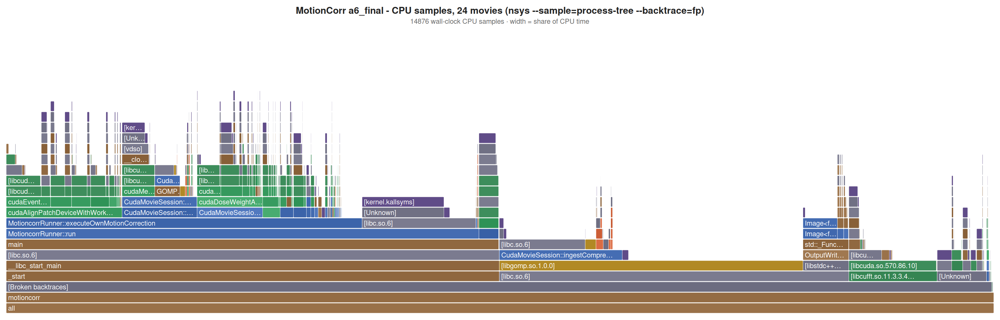

# Single-GPU pooling: measured result, 2 October 2026

Measurement for `perf/single-gpu-pools`. Everything here was executed on native GPU
hardware on the dates and source pins given below. Nothing is calculated from another
campaign and nothing is relabelled from an earlier one.

## Venue and provenance

| | |
|---|---|
| Host | `4GPUs` (`4-gpu-vm`), 124 CPUs, THP `madvise` |
| Device | A100 80GB PCIe, `GPU-eddb42fe-4f9a-adde-76d3-b924e14add54`, pinned by UUID |
| Toolchain | CUDA 12.8, nvCOMP 5.3.0.16, cmake 3.28.3, python 3.12.3 |
| Build | `-DCMAKE_BUILD_TYPE=Release -DCUDA=ON -DUSE_NVCOMP=ON`, one build per arm |
| Payload | `taskset -c 64-71`, `OMP_NUM_THREADS=6`, `--j 6 --max_io_threads 6` |
| Input | 24 tutorial movies, `movies.star` sha256 `fb998f70b375a4eb8d6972cf3964813c2c10fdfae039ec70c4e5365bf9cf0041` |
| Options | `--use_own --dose_weighting --dose_per_frame 1.277 --patch_x 5 --patch_y 5 --bfactor 150 --gainref Movies/gain.mrc --seed 1 --gpu 0 --ingest nvcomp` |
| Wall scope | whole process, wrapper-inclusive, including every requested report and the writer drain |

This is **not** the venue of the PR130 (SCARF A100-40GB) or PR128 campaigns. Nothing
here may be pooled with them.

Full machine-readable provenance, including the per-arm binary hashes and every input
hash, is in [`data/provenance.json`](data/provenance.json).

## What each arm is

Seven independent clean builds, one per commit, so every mechanism is measured on its
own rather than inferred by subtracting combined figures.

| arm | commit | what it adds, and why it could be faster |
|---|---|---|
| `a0_main` | `c499b1d3` | **Current main.** The reference the project ships today. |
| `a1_base` | `5d0eb5c` | **+ PR130 + PR131 — this branch's parent.** PR130 gives each movie one patch-alignment workspace instead of allocating scratch, plans, events and weights per patch group. PR131 computes the dose-weighting denominator once per reconstruction instead of once per frame. Neither is this PR's work; `a1_base` is the line everything below is measured against. |
| `a2_gain` | `bc695da` | **Worker-lifetime device gain.** The gain reference is identical for every movie in a job, but was `cudaMalloc`'d, uploaded and freed 24 times. Now it is uploaded once and keyed on owner + gain identity. Saves 23 host-to-device copies of 54.32 MiB. |
| `a3_premask` | `2dfcc14` | **Static defect premask + sparse traversal.** Two separate things. The *premask* — external defect file plus gain-zero pixels — is immutable for a run but was rebuilt per movie; it is now built once. The *traversal* stops scanning every pixel of every frame to find bad ones and instead walks a precomputed bad-pixel list. Automatically detected hot pixels are still recomputed per movie. |
| `a4_globalpool` | `fa3f18a` | **Pooled global cuFFT plans, work area and inverse tile.** The whole-frame R2C/C2R plans and their scratch were created and destroyed per movie. Now kept on a worker-lifetime key of geometry + device. |
| `a5_patchpool` | `5bdd119` | **Pooled batched patch R2C plan.** Same idea for the patch-alignment transform, keyed on patch geometry and group count. |
| `a6_final` | `a118699` | **Pooled dose-weighted C2R plan**, plus the retained-byte accounting that makes the cost below visible at all. |

Arms 4–6 are the three cuFFT plan pools. They are the mechanisms that cost memory, and
the ones that buy the least time — see the attribution and memory sections.

## Wall clock

5 repetitions per arm, interleaved round-robin with the order reversed on alternate
repetitions so monotonic drift cannot favour one arm. 35 clean runs retained.

| arm | median | min | max | IQR | CPU-s | vs `a1_base` |
|---|---|---|---|---|---|---|
| `a0_main` | 13.634 | 13.044 | 14.499 | 0.865 | 20.44 | — |
| `a1_base` | 12.312 | 12.095 | 13.534 | 0.420 | 18.52 | reference |
| `a2_gain` | 11.662 | 11.489 | 12.057 | 0.212 | 17.54 | +5.28% |
| `a3_premask` | 10.048 | 9.920 | 10.257 | 0.285 | 15.93 | +18.39% |
| `a4_globalpool` | 9.857 | 9.824 | 10.848 | 0.115 | 15.91 | +19.94% |
| `a5_patchpool` | 9.794 | 9.475 | 10.485 | 0.379 | 16.49 | +20.45% |
| `a6_final` | 9.678 | 9.434 | 9.740 | 0.189 | 15.59 | **+21.40%** |

**This branch's result is `a1_base` → `a6_final`: 12.312 → 9.678 s, a 21.40% reduction.**
Paired within each repetition: +2.635, +3.826, +2.743, +2.662, +2.942 s, median paired
saving **2.743 s, 5/5 faster**.

`a0_main` → `a6_final` is 29.02%, but that figure includes PR130 and PR131 and must not
be attributed to this branch.

### Where the time actually comes from

| mechanism | median saving | share of the 2.634 s |
|---|---|---|
| device-gain retention | +0.650 s | 24.7% |
| **premask + sparse defect traversal** | **+1.614 s** | **61.3%** |
| global plan pool | +0.191 s | 7.3% |
| patch plan pool | +0.063 s | 2.4% |
| dose-weighted plan pool | +0.117 s | 4.4% |
| *three plan pools together* | *+0.370 s* | *14.0%* |

Two things follow, and they matter more than the headline.

**The premask commit carries most of the win and costs no retained VRAM.** It is also
the commit with the exactness risk (RNG draw order, traversal order), which is why its
equivalence was established separately and not inferred from the wall clock.

**The three cuFFT plan pools buy 0.370 s and cost the entire 269.53 MiB of retained
residency.** The individual pool steps (+0.191, +0.063, +0.117 s) are smaller than the
run-to-run IQR of the arms they sit between and are **not individually resolvable** at
n=5. Their *sum* is resolvable: `a3_premask` ranges 9.920–10.257 s and `a6_final` ranges
9.434–9.740 s with no overlap. Treat the three pools as one 0.370 s mechanism, not as
three separately justified ones.

## Memory: where every byte goes

The chart is the running total of CUDA allocations minus deallocations inside each
arm's own capture. The sawtooth is the 24 movies. What changes down the column is not
the height of the teeth but the depth of the gaps between them.

### Peak barely moves; the floor is what rises

| arm | peak VRAM | floor between movies | alloc events | free events |
|---|---|---|---|---|
| `a0_main` | 3208.6 MiB | 170.4 MiB | 10,496 | 6,339 |
| `a1_base` | 3235.8 MiB | 170.4 MiB | 3,032 | 1,179 |
| `a2_gain` | 3290.1 MiB | 224.7 MiB | 3,009 | 1,156 |
| `a3_premask` | 3290.1 MiB | 224.7 MiB | 3,009 | 1,156 |
| `a4_globalpool` | 3290.1 MiB | 333.4 MiB | 2,135 | 1,110 |
| `a5_patchpool` | 3290.1 MiB | 385.6 MiB | 1,721 | 972 |
| `a6_final` | **3313.1 MiB** | **439.9 MiB** | **1,284** | **949** |

**Peak rises 77.3 MiB. The floor rises 269.5 MiB.** That gap is the whole point: the
pooled buffers were *already* being allocated during each movie, so holding them does
not make the high-water mark much higher — it stops the trough returning to baseline.
A VRAM budget sized on peak sees +77 MiB; a budget that has to accommodate a second
concurrent worker on the same card sees +269.5 MiB per worker.

The 269.5 MiB measured here matches the 269.53 MiB the binary reports on its own
`Peak VRAM:` line, from a completely independent path — the profiler's allocation
events versus the runner's own accounting.

### Which buffer, which step, which region of memory

Every floor step matches a single named allocation to within 0.02 MiB:

| step | measured Δfloor | buffer | predicted size | where it lives |
|---|---|---|---|---|
| `a0`→`a1` | +0.0 MiB | PR131 normalization plane (peak only, +27.2 MiB) | 28,493,312 B = 27.17 MiB | **device global** |
| `a1`→`a2` | **+54.3 MiB** | device gain reference, `nx·ny·4` | 56,955,920 B = 54.32 MiB | **device global** |
| `a2`→`a3` | **+0.0 MiB** | defect premask, `nx·ny·1` | 14,238,980 B = 13.58 MiB | **host, pageable** |
| `a3`→`a4` | **+108.7 MiB** | global cuFFT work area + inverse tile | 56,986,624 + 56,986,624 B = 108.69 MiB | **device global** |
| `a4`→`a5` | **+52.2 MiB** | patch R2C plan workspace | 54,710,784 B = 52.18 MiB | **device global** |
| `a5`→`a6` | **+54.3 MiB** | DW C2R plan workspace | 56,986,624 B = 54.35 MiB | **device global** |

Three regions are involved, and only one of them grows:

* **Device global memory** — all five retained buffers. 269.53 MiB held between movies:
  gain 54.32, FFT work area 54.35, inverse tile 54.35, patch plan 52.18, DW plan 54.35.
  Allocated with `cudaMalloc` (the gain, the work area, the tile) or by cuFFT as plan
  workspace (the two plan entries). This is the number that constrains how many workers
  fit on a card.
* **Host pageable memory** — the defect premask only, a `MultidimArray<bool>` of
  `ny × nx` on the runner, 13.58 MiB. It costs **zero** device bytes, which is why
  `a2`→`a3` is flat on the chart while being the single largest time saving. It shows up
  instead as host RSS: 0.541 → 0.553 GiB, +12 MiB against 13.58 MiB predicted.
* **Host page-locked (pinned) memory** — the nvCOMP staging pool. **Unchanged by this
  PR**; no commit here allocates, grows or retains pinned memory.

### The other memory effect: allocation churn

Allocation events fall from 3,032 to 1,284 and frees from 1,179 to 949 — and from
10,496/6,339 at `a0_main`, most of that drop being PR130's workspace reuse. Cumulative
allocated bytes across a 24-movie run are ~81.8 GB in the final arm, nearly all of it
transient. Fewer `cudaMalloc`/`cudaFree` round trips is a second-order reason these
arms are faster, independent of the bytes retained.

### CPU and host memory

| quantity | `a1_base` | `a6_final` | delta |
|---|---|---|---|
| median CPU-seconds | 18.52 | 15.59 | −2.93 |
| peak host RSS | 0.541 GiB | 0.553 GiB | +12 MiB |
| peak device memory (nvidia-smi, 100 ms sampling) | 3521 MiB | 3595 MiB | +74 MiB |
| peak device memory (nsys allocation events) | 3235.8 MiB | 3313.1 MiB | +77.3 MiB |
| pinned staging reservation | unchanged | unchanged | 0 |
| **device memory retained between movies** | 170.4 MiB | 439.9 MiB | **+269.5 MiB** |

The two independent peak measurements agree on the delta (+74 vs +77.3 MiB) and differ
on the absolute by ~285 MiB, which is the CUDA context and driver overhead that
`nvidia-smi` counts and allocation events do not. Neither is an allocator high-water
mark: the nvidia-smi figure is a 100 ms sample, the nsys figure is a running total over
tracked allocations.

## GPU occupancy

From `nsys --trace=cuda,nvtx`, one capture per arm. Busy is an interval union over
kernel **and** copy together, measured inside the same capture that defines the span —
not derived by subtracting profiled device time from an unprofiled wall.

| | `a1_base` | `a6_final` |
|---|---|---|
| traced span | 15.428 s | 11.349 s |
| kernel union | 3.058 s | 3.061 s |
| copy union | 1.174 s | 0.564 s |
| busy union | 4.232 s (27.4%) | 3.625 s (31.9%) |
| kernel launches | 24,990 | 24,875 |
| H2D | 4.62 GB | 3.31 GB |

**Kernel time is unchanged** — 3.058 vs 3.061 s. None of these mechanisms makes the GPU
compute faster; they remove host work and host-to-device traffic. The GPU remains idle
roughly two thirds of the span, so this release does not address the dominant
inefficiency recorded in the earlier execution profile.

The H2D drop independently confirms the gain mechanism: 4.62 − 3.31 = 1.31 GB, against
56,955,920 B × 23 avoided re-uploads = 1.310 GB.

Profiled spans are inflated by CUPTI and are not production walls. Only the comparison
between the two arms is meaningful.

## Host stages

From `nsys --trace=nvtx,osrt`, one capture per arm, no CUDA trace so CUPTI does not
inflate the CUDA-heavy stages. NVTX ranges unioned over all 24 movies.

| stage | base | final | delta |
|---|---|---|---|
| `MOVIE (executeOwnMotionCorrection)` | 12.839 | 10.070 | −2.769 |
| `fix defect` | 1.758 | **0.019** | **−1.739** |
| `detect hot` | 0.950 | 0.689 | −0.261 |
| `prep patch` | 0.260 | 0.103 | −0.156 |
| `dose weighting` | 1.387 | 1.346 | −0.042 |
| `logfile pdf` | 1.184 | 1.143 | −0.041 |
| `patch align` | 1.207 | 1.386 | **+0.180** |
| `global alignment` | 0.338 | 0.367 | +0.030 |

`fix defect` collapsing from 1.758 s to 0.019 s is the premask cache: the static mask is
built once instead of 24 times, and the replacement loop iterates the bad-pixel list
instead of scanning every pixel of every frame.

`patch align` is **0.180 s slower** in the final arm. This is one instrumented capture
per arm with no spread, so it is not separable from run-to-run variation at this
evidence level, and the unprofiled wall shows the opposite sign overall. It is recorded
rather than explained; if the plan pools are kept it is worth a dedicated paired
measurement, because a pooled plan making patch alignment slower would undercut the
0.370 s the pools are there to deliver.

Stages nest — an inner stage is also counted inside its parent — so the column does not
sum to the process wall. The async writer drain lies inside the process wall but inside
no NVTX range and cannot be read off this table.

## GPU execution profile

Fraction of each time bin in which the device was executing a kernel or a copy, from
the final arm's own capture at 900 bins. The 24 movies resolve as repeating dense
clusters, and the device is idle between and within every one of them.

Across the arms the pattern **compresses horizontally without getting denser**. Mean
occupancy per bin goes 26.3, 30.4, 27.3, 31.8, 32.3, 31.5, 33.4% for `a0`…`a6` — these
are single captures with CUPTI inflation, so read the direction, not the decimals.
Kernel count is essentially fixed (25,542 → 24,875) and kernel union is unchanged
(3.058 vs 3.061 s).

That is the honest summary of what this branch does: it shortens the host-side gaps
between the same GPU work. It does not make the GPU do more per unit time, and it does
not address the fact that the device is idle roughly two thirds of the span. The
overlap problem is untouched and remains the largest single opportunity.

## CPU flame graphs

`nsys --sample=process-tree --backtrace=fp`, 250 µs, main thread. 18,293 samples over
1,301 unique stacks for the base arm, 14,876 over 1,116 for the final arm; the
sample-count ratio tracks the wall ratio, which is the expected shape for a host-bound
reduction. CPU sampling inflates host-side CUDA API intervals substantially, so these
show *where* host time goes, not *how much* — and for this change the GPU execution
profile above is the more informative view.

## Product equality

The composition's exact-output gate against main is reported in the branch's own
validation, not here: complete non-PDF tree, 24 MRC images, 25 STAR files,
341,735,520 pixels per arm, status PASS, 0 different files, with PR131's declared
`--allow-added-log-line 'Peak VRAM:'` in force. Every profiled run in this campaign was
graded too — 24 global, 600 patch and 24 DW witnesses, 24 nvCOMP ingest witnesses, zero
warnings and 109 product files in all six captures — so no instrumented run silently
degraded.

## Integrity of the measurement

The box is shared. The campaign records the payload PID and flags any other process on
any device; two runs were caught with a co-tenant present, discarded and re-run. The
35 retained runs have zero foreign PIDs.

An earlier version of this harness flagged co-tenants by **GPU UUID mismatch**, which
cannot see a neighbour on the *same* GPU — the uuid matches. Two contaminated
observations passed that check before it was corrected to compare PIDs. Those
observations are not in this dataset; the discarded v1 campaign is retained at
`campaign-contaminated-v1/` on the host.

## Limits

* One venue, one device, one input set. No cross-venue or cross-geometry claim.
* Genuine cross-device retirement and execution is **UNRUN**: `gpu_id` is a single
  process-wide value, so no two-device path exists to exercise.
* The three plan-pool steps are not individually resolvable at n=5; only their sum is.
* `patch align` regressing by 0.180 s rests on a single instrumented capture per arm.
* Neither device-peak figure is an allocator high-water mark: one is a 100 ms sample,
  the other a running total over tracked allocations.
* The per-arm VRAM and GPU-profile captures are **one capture per arm** with
  `--cuda-memory-usage=true`, which adds its own overhead. Their spans are not
  production walls and the busy percentages carry no spread.
* Flame graphs and stage walls come from instrumented runs and are not production walls.
* PDFs are inventoried, not content-compared.
* No scientific-truth claim. Same-backend byte equality is not CPU-backend or
  scientific equivalence.

## Reproducing

Tools used are committed under [`tools/`](tools/) in this directory:
`campaign.py` (interleaved timed arms with co-tenant detection), `capture.sh` (the six
NVTX captures), `vcap.sh` (the seven per-arm `--cuda-memory-usage` captures),
`prof_json.py` and `vram_json.py` (per-capture extraction — one capture per JSON, no
cross-run arithmetic), `analyze_all.sh`, `mkcharts.py` and `mkvram.py` (charts, one
time domain each).

`vram_json.py` classifies allocation events on the enum **label** (`Allocation`), not
the **name** (`CUDA_DEV_MEM_EVENT_OPR_ALLOCATION`) — the name does not begin with
`alloc`, and matching on it silently counts every event as a free and yields a negative
memory total.

NVTX annotation uses `tools/nsys_analysis/patch_nvtx.py` from PR132, which required
repair before it would patch current source at all: two of its four anchors were pinned
to `1d7e13f`, and the per-movie replacement body re-emitted the old
`executeOwnMotionCorrection(Micrograph&)` signature so a patched tree failed to compile.
Its gates were bare `assert` and vanished under `python -O`. Those fixes are in PR132,
not here.

Raw captures are not committed — 8–18 MB each. Retained on the host:
`/home/alex/mc-release-20261002/prof/` holds the six NVTX captures as both `.nsys-rep`
and `.sqlite`; `/home/alex/mc-release-20261002/vprof/` holds the seven per-arm
`--cuda-memory-usage` captures as `.sqlite` only (the `.nsys-rep` files were deleted
after export to keep the shared host's scratch down). Everything the charts and tables
here are derived from is in the committed `data/` directory.
