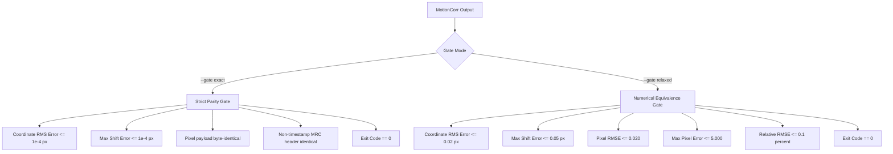

# Reference Outputs and Numerical Acceptance Gates

This document formalizes the reference baselines, numerical acceptance gates, and verification tooling for **MotionCorr Standalone**, resolving [Issue #4](https://github.com/KingAlejandro/MotionCorr-standalone/issues/4).

---

## 1. Reference Baselines and Provenance

MotionCorr Standalone was extracted from **RELION 5.1-beta** (upstream commit `ad0b230ca22095700f6392479326836efb1c911d`).

Reference baselines were established across two distinct hardware and platform configurations:

1. **macOS Reference Platform (Apple Silicon)**:
   - Architecture: ARM64 (Apple M-series)
   - Toolchain: AppleClang (Xcode 16), libc++
   - FFT Engine: FFTW 3.3.10 (single-precision `libfftw3f`)
   - Scope: Verified byte-for-byte exact CPU parity against full RELION 5.1 build.

2. **Linux Server / 4GPU Reference Platform (`4-gpu-vm`)**:
   - Architecture: x86_64, AMD EPYC 7452 32-Core Processor (124 vCPUs, 432 GiB RAM)
   - OS: Ubuntu 24.04.4 LTS (Linux 6.8.0-136-generic)
   - Toolchain: GCC 13.3.0, GNU ld 2.42
   - FFT Engine: FFTW 3.3.10
   - Host: Accessible via SSH alias `4GPUs` (`130.246.80.58`)

---

## 2. Test Datasets and Fixtures

### A. Small Synthetic Fixture (`test-data/fixtures/`)
- **File**: `test-data/fixtures/synthetic_128x128_8frames.mrcs` (513 KB)
- **Generation Recipe**: `test-data/generate_synthetic_fixture.py --profile small`
- **Properties**: 128 × 128 pixels, 8 frames, 20 pseudo-particles, deterministic pseudo-random seed `20260923`.
- **Ground Truth Shifts**: Known applied frame rolls:
  `[(0, 0), (0, 0), (1, -1), (1, -1), (2, -1), (2, -2), (2, -2), (3, -2)]`.
- **Expected Realignment Shifts**:
  `[(0, 0), (0, 0), (-1, 1), (-1, 1), (-2, 1), (-2, 2), (-2, 2), (-3, 2)]`.
- **Reference Output**: Fully versioned in `test-data/fixtures/reference_output/` for zero-setup smoke testing and continuous integration (< 1 second execution).

### B. Standard Benchmark Synthetic Movie
- **Generation Recipe**: `python3 test-data/generate_synthetic_fixture.py --profile standard`
- **Properties**: 512 × 512 pixels, 16 frames, 150 particles, seed `20260923`.
- **Shifts**: `[(round(0.6 * i), round(-0.4 * i)) for i in range(16)]`.
- **Alignment Recovery for this recipe**: On macOS with `--use_own --j 1`, recovered shifts differ from the generated ground truth by at most 0.06419 pixel (coordinate RMS 0.04978 pixel). This is a different synthetic movie from the historical 512 × 512 result in the repository README.

### C. Experimental Tutorial Dataset (RELION SPA Tutorial)
- **Source**: EMPIAR-10204 (CC0 license), official RELION 3.0 tutorial data.
- **Release Reference**: GitHub Release [`spa-tutorial-data-v1`](https://github.com/KingAlejandro/MotionCorr-standalone/releases/tag/spa-tutorial-data-v1).
- **Primary Movie**: `20170629_00021_frameImage.tiff` (SHA256 `df298b1b7741b1e5c9ec3b3e4514745a405d38b997b77a920f9f6b1bf30b99c0`)
- **Gain Reference**: `gain.mrc` (SHA256 `8919cdc7bf0f481cdb3dd5bcb20d83c29e0263b2fcc78b212c74b33a81b1acd1`)
- **Preparation**: `python3 test-data/prepare_movies_star.py relion30_tutorial --limit 1`

---

## 3. Exact One-Thread CPU Parity Baseline

When comparing standalone `motioncorr` against full RELION 5.1 on the same system with a single thread (`--j 1`):

### Results
- **Image Pixel Parity**: Exact byte-for-byte match (Image RMSE = `0.000000e+00`, Max pixel difference = `0.000000e+00`).
- **Motion Trajectory**: Exact match across all frames (Max shift error = `0.000000 px`, Coordinate RMS error = `0.000000 px`).
- **STAR Metadata**: Zero discrepancies in numerical or structural fields.

### Normalization Rules
1. **MRC Header Timestamps**:
   The MRC 2014 file format stores up to ten 80-byte ASCII label lines in bytes 224–1024. The comparison tool normalizes only RELION's date/time string in the first label (for example, `23-Sep-26 12:04:42`). All other header and label bytes must match in the exact gate.
2. **STAR Output Paths**:
   Output directory names (e.g. `standalone_spa_j1/Movies/...` vs `relion_spa_j1/Movies/...`) are normalized to file basenames prior to comparing `_rlnMicrographMovieName`, `_rlnMicrographName`, and `_rlnMicrographMetadata`.

---

## 4. 4GPU VM Execution Metrics (`4-gpu-vm`)

Benchmarks executed on `4-gpu-vm` (Ubuntu 24.04, AMD EPYC 7452, GCC 13.3.0) on the default experimental dataset (`20170629_00021_frameImage.tiff`):

| Metric | Single-Thread (`--j 1`) | Multi-Thread (`--j 4`) | Parity / Scaling |
|:---|:---:|:---:|:---|
| **Command** | `./build/motioncorr --i movies.star --o MotionCorr_j1 --use_own --j 1 ...` | `./build/motioncorr --i movies.star --o MotionCorr_j4 --use_own --j 4 ...` | — |
| **Exit Status** | `0` (Success) | `0` (Success) | Passed |
| **Elapsed (Wall Clock)** | `63.54 s` | `27.60 s` | **2.30x speedup** |
| **User CPU Time** | `57.88 s` | `80.37 s` | Parallel execution |
| **System CPU Time** | `5.64 s` | `8.08 s` | Efficient I/O |
| **CPU Utilization** | `99%` | `320%` | ~3.2 cores active |
| **Peak Memory (RSS)** | `2,864,600 KB` (~2.73 GiB) | `3,087,856 KB` (~2.95 GiB) | +7.8% memory overhead |
| **_rlnAccumMotionTotal** | `16.419638 Å` | `16.421206 Å` | **Δ = 0.0016 Å (< 0.01%)** |
| **_rlnAccumMotionEarly** | `2.504833 Å` | `2.503605 Å` | **Δ = 0.0012 Å** |
| **_rlnAccumMotionLate** | `13.914805 Å` | `13.917601 Å` | **Δ = 0.0028 Å** |

---

## 5. Acceptance Gates and Numerical Tolerances

The verification tool `tools/compare_motioncorr.py` enforces two distinct acceptance gates:



### Gate 1: Strict Parity Gate (`--gate exact`)
Used for single-threaded CPU regression testing against reference outputs on the same platform architecture.

| Parameter | Acceptance Threshold | Description |
|:---|:---:|:---|
| **Max Frame Shift Error** | `<= 0.0001 px` | Max $\max_i (\|\Delta X_i\|, \|\Delta Y_i\|)$ across all frames |
| **Coordinate RMS Shift Error** | `<= 0.0001 px` | $\sqrt{\frac{1}{N} \sum (\Delta X_i^2 + \Delta Y_i^2)}$ |
| **Image RMSE** | `<= 1.0e-7` | Root-mean-square pixel error |
| **Image Max Absolute Error** | `<= 1.0e-7` | Peak individual pixel error |
| **Pixel-Identical Flag** | `True` | Direct byte equivalence of pixel payload |
| **Normalized STAR Schema and Values** | `0 differences` | Static metadata, loop columns/rows, and motion values must match after path normalization |
| **Process Exit Status** | `0` | Successful execution |

### Gate 2: Numerical Equivalence Gate (`--gate relaxed`)
Used for multi-threaded CPU execution (`--j 4+`) and new accelerated backends (CUDA, JAX, ROCm, Metal).

> [!NOTE]
> **Why numerical tolerances are necessary for parallel backends:**
> Floating-point summation is non-associative: $(a + b) + c \neq a + (b + c)$. Parallel reductions and different FFT implementations can alter results. Measure those differences against the same input and reference before judging equivalence; the thresholds below are provisional for future backends.

| Parameter | Acceptance Threshold | Justification |
|:---|:---:|:---|
| **Max Frame Shift Error** | `<= 0.05 px` | Trajectory shifts remain within 1/20th of a detector pixel |
| **Coordinate RMS Shift Error** | `<= 0.02 px` | Global motion drift across all frames is bounded |
| **Image RMSE** | `<= 0.020` | Relative RMSE $< 0.1\%$ of micrograph standard deviation |
| **Image Relative RMSE** | `<= 0.001` | Evaluated independently of absolute RMSE; a constant reference with changed pixels fails |
| **Image Max Absolute Error** | `<= 5.0` | Accommodates isolated edge and hot-pixel interpolation artifacts |
| **Normalized STAR Schema and Static Metadata** | `0 differences` | Blocks, loop labels/row counts, and static values match; global shifts are checked separately. Local motion coefficients and shifts are not yet an independent numerical gate. |
| **Process Exit Status** | `0` | Clean process termination |

---

## 6. Verification Tooling (`tools/compare_motioncorr.py`)

The standalone comparison tool supports both human-readable diagnostics and automated JSON reporting:

Each directory comparison is for one movie. If a directory contains multiple corrected MRC or per-movie STAR files, the tool fails and asks for explicit file paths; run a separate comparison for every movie in a dataset. A file-only comparison is marked as partial coverage, and its PASS/FAIL applies only to the supplied pair. Ground-truth recovery is reported when supplied, but no ground-truth tolerance is applied. A supplied `--test-log` must contain parseable `/usr/bin/time -v` time, memory, and exit status. The regression wrapper also checks the MotionCorr process exit status directly.

### Example Usage

```bash
# 1. Strict exact parity comparison (single-thread CPU)
python3 tools/compare_motioncorr.py \
  --ref test-data/fixtures/reference_output \
  --test my_output_dir \
  --gate exact

# 2. Multi-thread or GPU backend acceptance gate
python3 tools/compare_motioncorr.py \
  --ref relion30_tutorial/MotionCorr_j1 \
  --test relion30_tutorial/MotionCorr_cuda \
  --gate relaxed

# 3. Validation with known synthetic ground truth
python3 tools/compare_motioncorr.py \
  --ref test-data/fixtures/reference_output \
  --test my_output_dir \
  --ground-truth test-data/fixtures/synthetic_128x128_8frames_ground_truth.json \
  --gate exact

# 4. Machine-readable JSON output for CI pipelines
python3 tools/compare_motioncorr.py \
  --ref reference_dir \
  --test test_dir \
  --json-out report.json
```

---

## 7. Reference Summary Table

| Test Case | Environment | Command | Trajectory Max Err | Image RMSE | Peak RSS | Exit |
|:---|:---|:---|:---:|:---:|:---:|:---:|
| **Synthetic 128 (Exact)** | macOS ARM64 | `--use_own --j 1` | `0.000000 px` | `0.000000` | ~85 MB | `0` |
| **Synthetic 512 (Exact)** | macOS ARM64 | `--use_own --j 1` | `0.000000 px` | `0.000000` | ~310 MB | `0` |
| **Tutorial Movie (Exact)** | macOS ARM64 | `--use_own --j 1` | `0.000000 px` | `0.000000` | ~2.8 GB | `0` |
| **Tutorial Movie (j=1)** | Linux x86_64 (`4GPUs`) | `--use_own --j 1` | Baseline | Baseline | 2.73 GiB | `0` |
| **Tutorial Movie (j=4)** | Linux x86_64 (`4GPUs`) | `--use_own --j 4` | `0.006832 px` | `0.005889` | 2.95 GiB | `0` |
| **Tutorial Movie (CUDA PoC)** | Linux x86_64 (`4GPUs`, A100) | `--use_own --gpu 0 --j 4` | `0.005547 px` | `0.003970` | 1.53 GiB VRAM | `0` |
