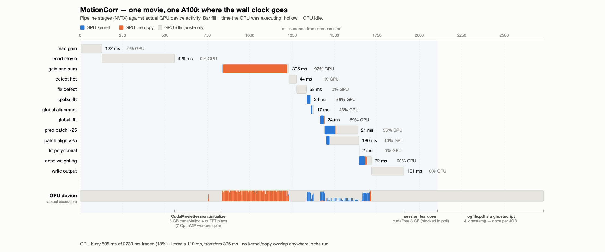
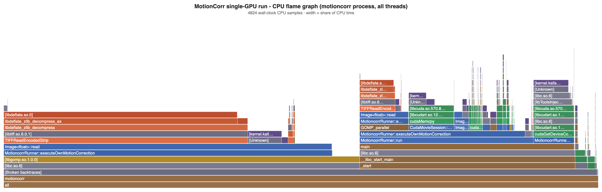
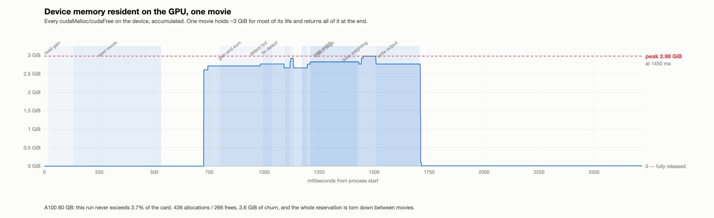
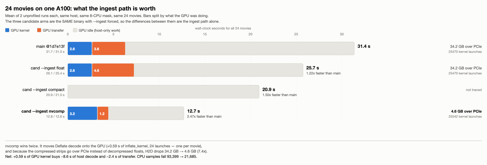
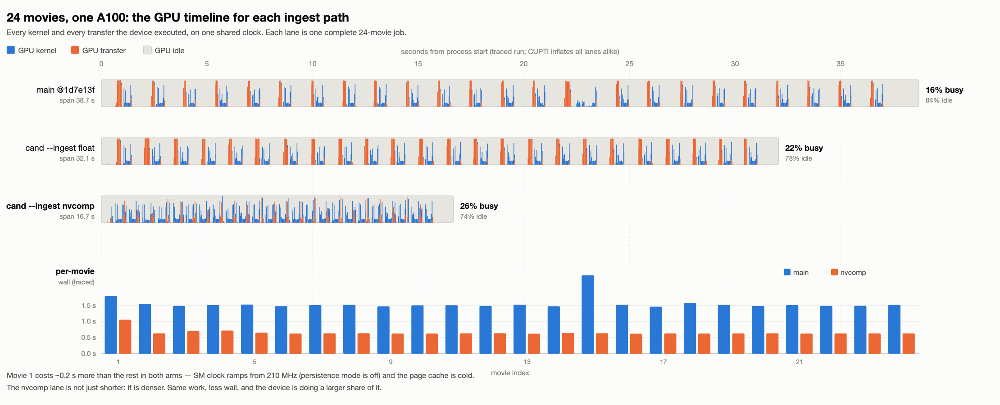
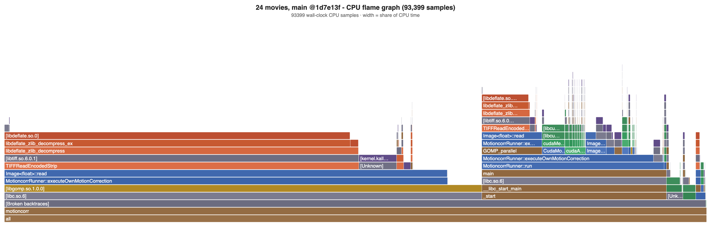
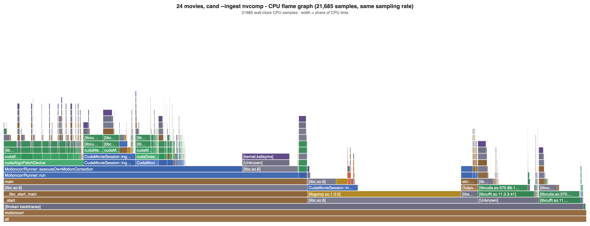
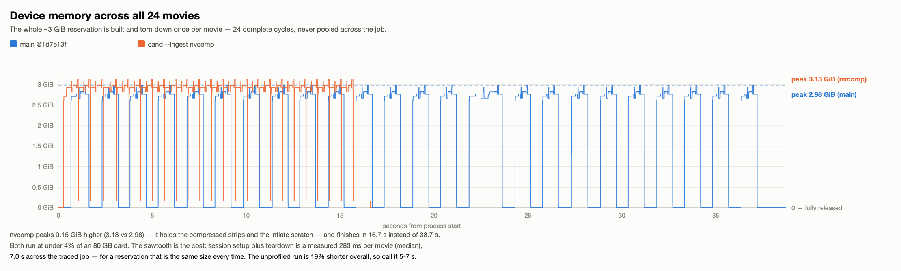

# MotionCorr on one A100: full execution profile

**Date** 2026-10-01 · **Host** `4GPUs` (4-gpu-vm), CPU mask `96-103`, THP `madvise`
**Device** GPU 0 = `GPU-eddb42fe-4f9a-adde-76d3-b924e14add54`, A100 80GB PCIe, 108 SMs, driver 570.86.10, CUDA 12.8
**Source** `main` @ `1d7e13f` (tree `fbe9469`, clean) · **Build** Release `-O3`, `sm_80`, `-lineinfo`, `-g -fno-omit-frame-pointer`
**Workload** sections 1–7: 1 movie `20170629_00022_frameImage.tiff` (3838×5760, 24 frames).
Section 8: all 24 tutorial movies, with the unmerged nvcomp ingest candidate alongside.
Canonical options:
`--use_own --dose_weighting --dose_per_frame 1.277 --patch_x 5 --patch_y 5 --bfactor 150 --gainref Movies/gain.mrc --seed 1 --gpu 0 --j 8`

Every run took `flock /tmp/motioncorr-bench.lock` and passed a settle gate
(no `cc1plus`/`nvcc`/`cicc`/`ptxas`, zero foreign compute apps on the target GPU by UUID,
load1 < 2.0). The box was genuinely idle: all four GPUs at 1 MiB, load1 0.02 at start.

---

## 1. Measurement validity first

`perf_event_paranoid=4` blocks unprivileged CPU sampling, and GPU hardware counters
return `ERR_NVGPUCTRPERM`. Both were obtained by running **the profiler** under `sudo`.
No persistent sysctl or driver parameter was changed on this shared host.

Ten nsys profiles were taken at different instrumentation levels. The device-side
work is bit-stable across all of them, which is what licenses comparing them:

| quantity | across 9 profiles |
|---|---|
| kernel launches | **1066** in every single-movie profile |
| memcpy operations | **435** in every single-movie profile |
| H2D bytes | **1,434,806,904** in every single-movie profile |
| total kernel time | **109.53 – 109.64 ms** (0.1 % spread) |
| memcpy *time* for those same bytes | **176.6 – 383.4 ms** (2.2× spread) |

So: **report transfer bytes as a number and transfer time as a range.** The same
caution killed one early reading — `cuModuleLoadData` showed 732 ms in the
CPU-sampled profile but 27–58 ms everywhere else. It is a sampling artifact, not a cost.

Unprofiled baseline wall, 3 reps each, same binary source:
`build-plain` 2.526 / 2.628 / 2.574 s · `build-prof` (frame pointers) 2.631 / 2.496 / 2.508 s
— frame pointers cost nothing measurable, so the profiling binary is representative.

---

## 2. The headline

**The GPU is idle for 83 % of the run.** (Section 8 repeats this at 24 movies, where it
is 84 %.) Not because the kernels are bad — because
almost nothing in the pipeline is on the GPU, and what is on it runs strictly serially.

| | one movie |
|---|---|
| traced span (least-perturbed profile `p7`) | 2375.8 ms |
| GPU busy (union of kernel ∪ memcpy ∪ memset) | **403.5 ms (17.0 %)** |
| ├ kernels | 109.6 ms |
| ├ transfers | 293.8 ms |
| └ memsets | 0.038 ms |
| GPU idle | **1972.3 ms (83.0 %)** |
| **device-side overlap achieved** | **exactly 0.000000 ms** |

That last line is not a rounding statement. `sum(all device intervals)` equals
`union(all device intervals)` to the nanosecond in all three clean profiles — **no two
device operations were ever in flight at the same time.** The cause is structural:

- all 1066 kernels and all 435 copies are on **one stream (id 7)**, in **one context**
- **one** host thread issues every CUDA call
- all 348 `cudaMemcpy` calls are the **synchronous** form
- all 274 H2D copies are from **pageable** host memory (which cannot overlap by construction)



*Stage bars are filled for the fraction of their span the GPU was executing. The `GPU device`
lane at the bottom is the real device timeline: one dense band of transfers during
`gain and sum`, a few narrow kernel bursts, and nothing at all for the rest of the run.*

---

## 3. Where the wall clock goes

Overhead-corrected: `p10` traces NVTX+OSRT but not CUDA, so it carries no CUPTI cost
(movie = 1789 ms); `p8` adds CUDA tracing (movie = 2101 ms). CUPTI inflation lands almost
entirely on the two stages that make many CUDA calls.

| stage | wall (p10, no CUPTI) | GPU busy | GPU idle | what it is |
|---|---|---|---|---|
| `read movie` | 420.7 ms | 0 | 100 % | TIFF decode, 8 threads |
| `write output` | 203.7 ms | 0 | 100 % | MRC write |
| `gain and sum` | 197.4 ms | ~97 % | 3 % | 1.36 GiB H2D + 1 kernel |
| *(unmarked)* after `read movie` | ~250 ms | ~0 | ~100 % | `CudaMovieSession::initialize` |
| *(unmarked)* after `write output` | ~192 ms | 0 | 100 % | session teardown |
| `patch align` ×25 | 115.6 ms | 10 % | 90 % | 25 serial patch solves |
| `read gain` | 108.9 ms | 0 | 100 % | re-reads gain.mrc **every movie** |
| `dose weighting` | 63.9 ms | ~60 % | 40 % | |
| `fix defect` | 56.1 ms | 0 | 100 % | |
| `detect hot` | 43.9 ms | ~1 % | 99 % | |
| `global ifft` / `global fft` | 24.0 / 22.3 ms | ~89 / 88 % | | |
| `prep patch` ×25 / `global alignment` | 19.5 / 15.1 ms | 35 / 43 % | | |
| `fit polynomial`, `power spectrum`, `binning` | ≤2 ms | | | |
| **after the movie** | **811 ms** | 0 | 100 % | STAR + `logfile.pdf` |

### The four things that are not compute

1. **TIFF decode — 421 ms.** `libdeflate_zlib_decompress` is **47 % of all CPU samples**
   and `Image<float>::read` is **64.7 % inclusive**. It is the one stage that uses all 8
   cores, which is why it dominates CPU time but only ~20 % of movie wall.
2. **Ghostscript — 790 ms**, four `system()` calls building `logfile.pdf`.
   **This is per *job*, not per movie**: the 3-movie run also made exactly 4 `system()`
   calls (876 ms). Across 24 movies it amortises to ~33 ms/movie. On a *one-movie* run it
   is 31 % of wall, which is a trap for anyone benchmarking with a single movie.
3. **CUDA session setup — ~250 ms** (3 GiB `cudaMalloc` + cuFFT plan creation), during
   which **70 % of CPU samples are the 7 idle OpenMP workers busy-spinning in `libgomp`**.
   Under the 8-CPU cap they are competing with the thread doing the real work.
4. **CUDA session teardown — ~192 ms**, of which 191.8 ms is the main thread blocked in
   `poll()` inside the driver, releasing the 3 GiB. Only 3 CPU samples land in this
   window — the thread is not running at all.



*Two towers. Left: the 8 OpenMP workers in `Image<float>::read` -> `TIFFReadEncodedStrip`
-> `libdeflate`. Right: the main thread, where `cudaMemcpy`, `CudaMovieSession` and
`cudaGetDeviceCount` sit. The interactive SVG with per-frame tooltips is
[`charts/flamegraph_motioncorr.svg`](profiling_20261001/charts/flamegraph_motioncorr.svg);
[`charts/flamegraph_all.svg`](profiling_20261001/charts/flamegraph_all.svg) adds the
ghostscript children.*

**Per-movie steady state** (3-movie run): 1850 / 1721 / 1645 ms. The first movie carries
~200 ms of warm-up (SM clock idles at 210 MHz of 1410 with persistence mode off).

---

## 4. Transfers: the one clear, measured win

All 274 H2D copies are pageable. I measured the headroom directly on the same device
with the same payload and the same 24-chunk pattern rather than quoting a spec sheet:

```
PAGEABLE (malloc)      1,434,806,880 B in 24 chunks: 173.37 ms =  8.28 GB/s
PINNED (cudaHostAlloc) 1,434,806,880 B in 24 chunks:  61.55 ms = 23.31 GB/s
```

**2.82×.** The measured pageable rate (8.28 GB/s) matches the fastest in-application
rate observed (8.13 GB/s in `p1`), which is good evidence that 8.1–8.3 GB/s is the real
unprofiled rate and the slower profiles are instrument effects. Pinning the frame
staging buffer is worth **~112 ms per movie** — ~6.5 % of steady-state movie wall, and it
is also the precondition for ever overlapping transfer with compute.

Size distribution: 27 large copies (≥2 MiB) carry 99.99 % of the bytes; 267 of the 435
copies are ≤128 B and cost 0.45 ms in total.

### Host blocked vs GPU working

| blocking call | n | host blocked | GPU working | pure overhead | efficiency |
|---|---|---|---|---|---|
| `cudaMemcpy` | 348 | 309.1 ms | 288.4 ms | 20.6 ms | 93.3 % |
| `cudaEventSynchronize` | 369 | 42.9 ms | 30.2 ms | 12.8 ms | 70.3 % |
| `cudaDeviceSynchronize` | 53 | 36.3 ms | 33.9 ms | 2.5 ms | 93.2 % |
| `cudaMalloc` | 231 | 20.4 ms | 5.9 ms | 14.5 ms | 28.9 % |
| `cudaFree` | 231 | 19.4 ms | **0.0 ms** | 19.4 ms | **0 %** |
| `cudaLaunchKernel` | 349 | 11.1 ms | 2.7 ms | 8.4 ms | 24.4 % |
| **total** | | **439.1 ms** | **361.0 ms** | **78.1 ms** | 82.2 % |

The synchronisations are *not* the problem — when the host blocks, the GPU is genuinely
working 82 % of that time. Removing a `cudaDeviceSynchronize` buys ~2.5 ms. The 78 ms of
pure overhead is dominated by allocator churn: **231 `cudaMalloc` + 231 `cudaFree` per
movie, 3.6 GiB of churn**, plus **109 `cuModuleLoadData` + 109 `cuModuleUnload`** (cuFFT
plans created and destroyed rather than cached) at 57.6 + 4.0 ms.

---

## 5. Kernel quality (Nsight Compute, all 1066 launches)

The big kernels are in good shape. Nothing here is the bottleneck.

| kernel | n | SM % | MEM % | occ % | reading |
|---|---|---|---|---|---|
| `prime_fft_factor<101>` (cuFFT) | 72 | 72.5 | **97.3** | 76.8 | at bandwidth peak |
| `prime_fft_factor<53>` (cuFFT) | 97 | 68.9 | **96.7** | 93.0 | at bandwidth peak |
| `prime_fft_factor<19>` (cuFFT) | 72 | **81.0** | 45.3 | 93.3 | compute-bound, good |
| `applyDoseWeightKernel` | 24 | **76.7** | 12.2 | 96.0 | compute-bound, good |
| `scaleComplexKernel` | 26 | 12.7 | **84.7** | 84.3 | pure bandwidth, near peak |
| `preprocess`/`postprocess` (cuFFT) | 97 | 42–48 | **84–85** | 89 | fine |
| `cropAndGroupPatchResidentKernel` | 25 | 62.9 | 50.3 | 83.0 | balanced |
| `interpolateAndAccumulatePolynomial` | 24 | 58.3 | 46.3 | 89.4 | balanced |
| `fourierShiftKernel` | 54 | 31.7 | 65.0 | 84.7 | memory-bound |
| `fusedGainAndSumKernel` | 1 | **6.2** | 45.5 | 97.5 | longest single kernel (2.84 ms), latency-bound |
| `computeReferenceKernel` | 54 | 4.0 | 28.8 | **12.0** | grid too small to fill 108 SMs |
| `findPeakAndInterpolateKernel` | 54 | 1.5 | 1.1 | **11.7** | grid = 24 blocks |
| `combinePartialsKernel` | 3 | 0.0 | 0.1 | **1.6** | single block (reduction finalizer) |
| `updateDefectKernel` | 1 | 0.0 | 0.4 | **3.5** | single block |

The underfilled kernels are real but immaterial — together they are well under 1 ms of
the 109.6 ms. **Kernel efficiency is not what is costing this run; device occupancy of
the wall clock is.**

---

## 6. Device memory

Peak **2.98 GiB** resident, reached at ~1450 ms, released completely at movie end
(residual 1.3 KiB). 436 allocations / 266 frees, 3.6 GiB of churn. On an 80 GB card the
run never exceeds **3.7 %** of the device — and the whole reservation is built and torn
down per movie, costing ~250 ms in and ~192 ms out.



---

## 7. What the evidence supports doing

Ordered by measured value, for steady-state per-movie wall of ~1.7 s:

1. **Pin the H2D staging buffer** — measured 2.82×, **~112 ms/movie**. Also the
   precondition for any transfer/compute overlap.
2. **Hoist `read gain` out of the per-movie loop** — ~109 ms/movie for a file that
   never changes (`Igain.read()` at `src/motioncorr_runner.cpp:1333`).
3. **Keep the `CudaMovieSession` alive across movies** — ~250 ms setup + ~192 ms
   teardown per movie, both ~100 % GPU-idle. Sizes are constant across a dataset.
4. **Cache the cuFFT plans** — 109 module load/unload pairs per movie, ~62 ms.
5. **`OMP_WAIT_POLICY=passive`** (or a smaller `GOMP_SPINCOUNT`) — stops 7 workers
   busy-spinning through the serial GPU phases under an 8-CPU cap. Free to test.
6. Only then: streams/async for overlap, and don't bother micro-optimising kernels.

Not worth doing: removing synchronisations (82 % of blocked time is real GPU work),
or tuning the small kernels (<1 ms total).

**One caveat on scope.** This is one movie on one GPU, and movie 00022 was chosen
because 00021 is documented as unrepresentative. Items 1–5 are per-movie costs and
should scale; the ghostscript 790 ms is per-job and must not be counted per movie.

**Read this list against section 8 before acting on it.** At 24 movies the ranking
changes. The unmerged nvcomp ingest path already takes the largest single win — moving
Deflate decode to the GPU, 2.47x end to end — and it does so partly by cutting PCIe
traffic 7.4x, which overlaps with item 1 here: pinning buys much less once there are
4.6 GB to move instead of 34.2 GB. Items 2, 3 and 5 are untouched by it and still stand,
and item 5 gets *more* valuable, not less, because the OpenMP spin becomes a fifth of a
much smaller CPU total.

---

## 8. The same job at 24 movies, and what the ingest path is worth

Everything above is one movie. At dataset scale the per-job costs amortise and a
different lever dominates. Measured the same day, same host, same 8-CPU mask, same 24
tutorial movies, 2 unprofiled runs per arm:

| arm | wall, 24 movies | per movie | vs main |
|---|---|---|---|
| `main` @ `1d7e13f` | 31.7 / 31.0 s | 1.50 s (median, traced) | — |
| cand `--ingest float` | 26.1 / 25.4 s | | 1.22x |
| cand `--ingest compact` | 20.9 / 21.0 s | | 1.50x |
| cand `--ingest nvcomp` | **12.8 / 12.6 s** | 0.627 s (median, traced) | **2.47x** |

`main` has no `--ingest` option at all; the three candidate arms are the **same binary**
with the path forced, so the differences between them are the ingest path alone. One
movie costs 2.55 s standalone but 1.29 s inside a 24-movie job — the ~790 ms of
ghostscript is per *job*, and the CUDA context and cuFFT modules stay warm.



**nvcomp wins twice, and the second way is the larger one.** It moves Deflate decode onto
the GPU — `inflate_kernel`, 24 launches, one per movie, 568 ms total, present in the
nvcomp trace and in no other. And because the *compressed* strips cross PCIe instead of
decompressed floats, **H2D drops from 34.2 GB to 4.6 GB (7.4x)** and transfer time from
3.60 s to 1.17 s. Net: **+0.59 s of GPU kernel buys −8.6 s of host decode and −2.4 s of
transfer.**



Steady state is 1.50 s/movie on main against 0.627 s/movie with nvcomp. Movie 1 costs
+0.28 s / +0.43 s over median in the two arms — the SM clock ramps from 210 MHz with
persistence mode off, and the page cache is cold. The 2.42 s spike at movie 15 is
main-lane only; the same movie is dead-median (0.634 s) in the nvcomp lane, so it is a
transient in that run rather than a property of the movie.

The GPU lane gets *denser*, not just shorter: busy share rises 16% → 26%. It is still
idle three-quarters of the time.

### The flame graph is where it is most obvious




Identical sampling rate, so the sample counts are directly comparable:

| | main | nvcomp |
|---|---|---|
| total CPU samples | 93,399 | **21,685** |
| in `libdeflate` | 54,003 (57.8%) | **1 (0.0%)** |
| with `libtiff` on stack | 55,540 (59.5%) | 3,857 (17.8%) |
| with `libgomp` on stack | 63,767 (68.3%) | 5,909 (27.2%) |

Deflate decompression is gone, and it accounts for 75% of the 71,714 CPU samples
eliminated. This is the §3 finding at dataset scale: `libdeflate` was the single largest
consumer of CPU time, and moving it to the device is the largest available win.

**It also makes an earlier recommendation more urgent, not less.** `libgomp` holds 4,435
self samples in the nvcomp arm against 4,808 on main — essentially unchanged in absolute
terms, but now **20.5% of a four-times-smaller total**. The idle OpenMP workers spinning
through the serial GPU phases were 5% of main's CPU; after nvcomp they are a fifth of it.

### Device memory across the job



24 complete allocate/release cycles — the ~3 GiB reservation is built and torn down once
per movie and never pooled, though its size is identical every time. Measured directly on
the 24-movie trace, session setup plus teardown is **283 ms per movie (median), 7.0 s
across the traced job**. (The one-movie figures of ~250 ms in and ~192 ms out would
extrapolate to ~10.6 s; they do not, because the CUDA context and cuFFT modules are
already warm after movie 1. The unprofiled run is 19% shorter overall, so the real figure
is nearer 5–7 s.) nvcomp peaks 0.15 GiB higher (3.13 vs 2.98 GiB) for the compressed
strips and inflate scratch. Neither arm exceeds 4% of an 80 GB card.

### What this does and does not establish

- The candidate branch (`src-cand`, HEAD `abd6827`) is **unmerged**. Nothing here is a
  claim about its correctness, parity or readiness — only about where its time goes.
- The float-vs-compact-vs-nvcomp comparison is clean (one binary, flag forced). The
  `main` → candidate step is **not** attributable to any single change: the branch
  differs in more than ingest, and the 31.4 → 25.7 s gap between main and the float arm
  is that residue, not nvcomp.
- `--ingest auto` is the default and already selects nvcomp on a `USE_NVCOMP=ON` build,
  so "default vs `--ingest nvcomp`" is **not** a control — both measured 12.6 s. The
  controls that isolate the path are `--ingest float` and `--ingest compact`.

---

## 9. Acting on it

Two changes measured against the `a294f3b` tip (197 commits ahead of main, already
carrying PR130's alignment workspace reuse): `OMP_WAIT_POLICY=PASSIVE` gives −18 % CPU-
seconds at no wall cost on the nvCOMP path, and retaining the device gain across movies
gives −4.5 % wall, bit-exact. Together −4.7 % wall, −21.9 % CPU-seconds. Detail and raw
data: [`profiling_20261001/OPTIMISATION_RESULTS.md`](profiling_20261001/OPTIMISATION_RESULTS.md).

Note that this moves the baseline: section 7's recommendations were written against
`main`, where `patch align` costs 4.21 s. On the tip it costs 1.63 s.

---

## 9. Artifacts and how to reproduce

All charts are committed as both SVG (interactive tooltips, re-renderable) and PNG.

| path | contents |
|---|---|
| `profiling_20261001/charts/timeline.*` | stage timeline vs actual GPU activity |
| `profiling_20261001/charts/flamegraph_motioncorr.*` | CPU flame graph, motioncorr process |
| `profiling_20261001/charts/flamegraph_all.svg` | same, including ghostscript children |
| `profiling_20261001/charts/vram.*` | device memory resident over time |
| `profiling_20261001/data/analysis_p3,p5,p7.txt` | full per-profile analysis |
| `profiling_20261001/data/stages_p8.txt`, `gaps_p8.txt` | stage and GPU-idle attribution |
| `profiling_20261001/data/syncs_p8.txt` | streams, blocking calls, transfer distribution |
| `profiling_20261001/data/compare.txt`, `xfer.txt` | cross-profile invariants and transfer rates |
| `profiling_20261001/data/ncu_summary.txt` | per-kernel hardware counters |
| `profiling_20261001/data/flame_main.folded` | folded stacks |
| `profiling_20261001/data/*.json` | chart inputs |
| `profiling_20261001/charts24/arms24.*` | 24-movie ingest-path comparison |
| `profiling_20261001/charts24/timeline24.*` | 24-movie GPU lanes, three arms |
| `profiling_20261001/charts24/flamegraph24_{main,nvcomp}.*` | 24-movie CPU flame graphs |
| `profiling_20261001/charts24/vram24.*` | 24-movie device memory |
| `profiling_20261001/data24/arms24.json` | input for all three 24-movie charts |
| `profiling_20261001/data24/flame24_*.folded` | 24-movie folded stacks |

The analysis scripts are in [`tools/nsys_analysis/`](../tools/nsys_analysis/) and are
parameterised — they take an nsys SQLite export (or the ncu CSV) as an argument and work
against any MotionCorr profile, not just this one. The three charts here regenerate
**byte-identically** from the committed `data/*.json` and `data/*.folded`:

```
python3 tools/nsys_analysis/mktimeline.py out.svg docs/profiling_20261001/data/timeline_p8.json
python3 tools/nsys_analysis/mkvram.py     out.svg docs/profiling_20261001/data/vram.json
python3 tools/nsys_analysis/mkflame.py docs/profiling_20261001/data/flame_main.folded out.svg "title"
python3 tools/nsys_analysis/mkarms24.py out.svg docs/profiling_20261001/data24/arms24.json
python3 tools/nsys_analysis/mktl24.py   out.svg docs/profiling_20261001/data24/arms24.json
python3 tools/nsys_analysis/mkvram24.py out.svg docs/profiling_20261001/data24/arms24.json
```

All seven charts were re-rendered from the committed data and `cmp`-checked. One fix was
needed to get there: `mkflame.py` jittered its colours with `hash()`, which Python salts
per process, so the flame graphs were not reproducible between runs. It now uses
`zlib.crc32`.

See [`tools/nsys_analysis/README.md`](../tools/nsys_analysis/README.md) for the full
capture recipe, including the `sudo`-scoped profiling needed on hosts with
`perf_event_paranoid > 2`.

Raw `.nsys-rep` / `.sqlite` / `ncu_all.csv` (1.7 GB) were not committed; they remain on
`4GPUs` at `/home/alex/mc-profile-20261001/`.

### Relationship to `tools/profile_cuda_movie.py`

That tool is the repeatable *capture* harness (wall, RSS, nvidia-smi sampling, optional
`--nsys`). This campaign is a one-off deep *analysis* of what a single run does
internally. The two do not overlap: `profile_cuda_movie.py` parses MotionCorr's own
`TIMING` stage lines, whose regex is known to drop hyphenated tags; the NVTX approach
used here (`tools/nsys_analysis/patch_nvtx.py`) reads stage boundaries from the trace
instead and does not depend on that parser.

### Scope and limits of this evidence

- One movie, one GPU, one host. No parity or correctness claim is made or affected;
  nothing in `src/` changes in this PR.
- The box was shared but genuinely idle (all four GPUs at 1 MiB, load1 0.02, zero
  foreign compute apps on the target GPU by UUID, settle gate passed before each run).
- Host-side millisecond figures are instrument-dependent and are quoted from the
  profile that does not perturb them, with the correction shown in sections 1 and 3.
  Device-side counts and byte totals are invariant across all nine profiles.
- GPU hardware-metric *sampling* (`--gpu-metrics-devices`) was unavailable: it needs a
  driver module parameter, not just privilege. There is therefore no SM-utilisation
  time series here; GPU busy/idle is derived from the kernel and memcpy activity
  intervals, which is exact for occupancy-of-the-wall-clock but says nothing about how
  full the SMs were while busy. Nsight Compute (section 5) covers that separately.
