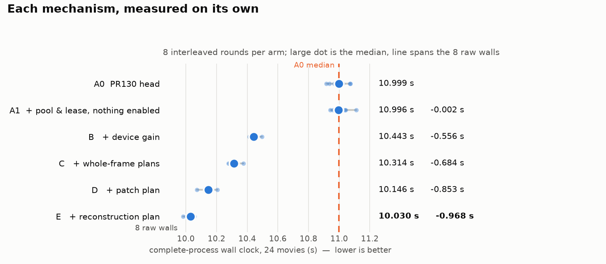
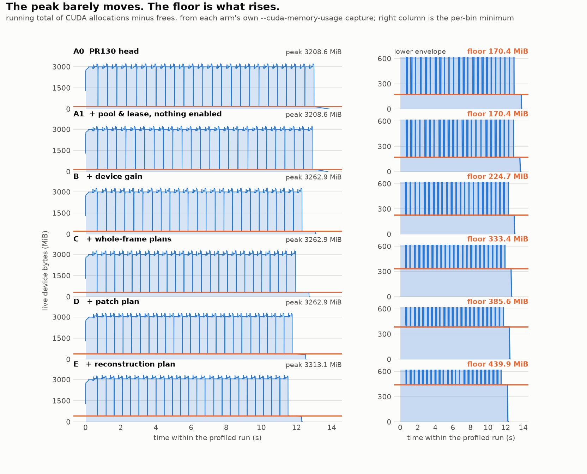
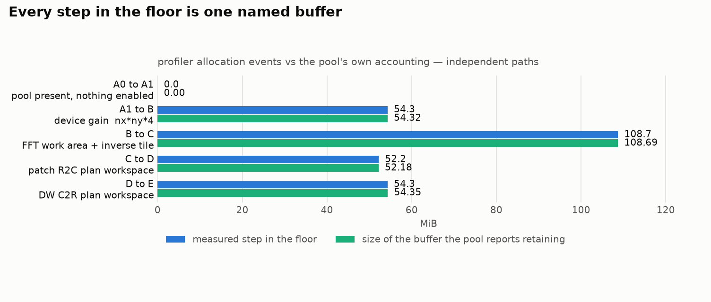
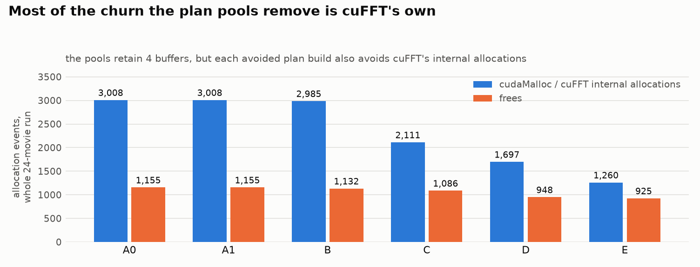
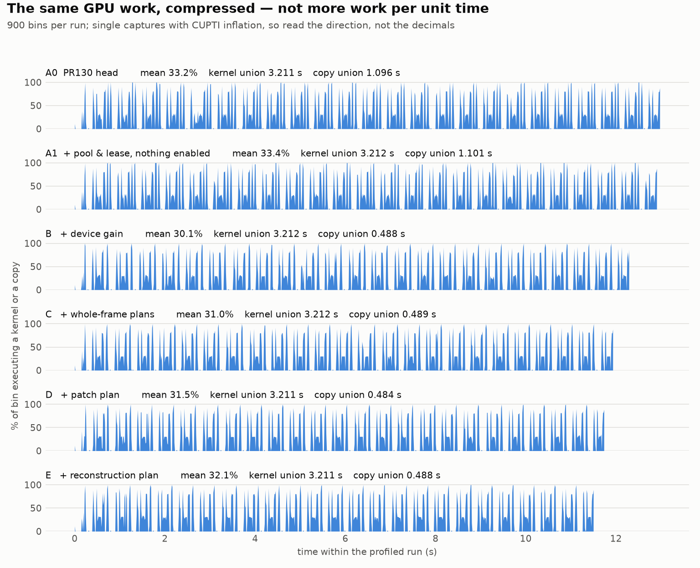

# Reliable reusable single-GPU worker — results

## Source

| | |
|---|---|
| base | PR130 head `1420c8cc4d65ec6fc4b4a868e0135d8042b98bed` (movie-owned patch workspace, open draft) |
| branch | `experiment/reliable-reusable-worker` |
| main at dispatch | `c499b1d3bf1cceec5c3b194f356844d6f493e7f2` — not merged into this branch |

PR133 is a design reference only. Its ancestry also carries the alignment
telemetry experiment that PR130's own follow-up recorded as no demonstrated
gain, and that is not imported here. PR133's defect premask / sparse bad-pixel
change is a host-side runner optimisation, not worker resource reuse, and is
also not imported.

## What the worker reuses

One `mc_cuda::CudaWorkerPool`, owned by `MotioncorrRunner` — the object whose
lifetime *is* the worker lifetime, because `run()`'s movie loop is serial and
belongs to it. Not a `thread_local` and not a process static: with the pool
owned by the runner, "which pool" is never ambiguous, and the runner-local gain
generation counter is a sufficient identity for exactly that reason.

| class | key | retained at tutorial geometry |
|---|---|---|
| device gain | device, nx, ny, host-gain generation | 56,955,920 B |
| whole-frame R2C+C2R plans, shared work area, inverse tile | device, nx, ny | 113,973,248 B |
| batched patch R2C plan | device, patch_w, patch_h, n_groups | 54,710,784 B |
| reconstruction C2R plan | device, nx, ny | 56,986,624 B |
| | **total** | **282,626,576 B (269.5 MiB)** |

A session holds borrowed aliases only. It never destroys one.

## Venue

SCARF `gn0005`, exclusively allocated (job 3521359), NVIDIA A100-SXM4-40GB
`GPU-47d61ef5-38d4-8bab-6e1b-6673e3e1f011`, driver 580.178.04, CUDA 12.8.0,
nvCOMP SDK `/home/vol05/scarf1415/nvcomp-sdk`. Runs are pinned with
`taskset -c 0-7` — eight distinct physical cores on NUMA node 0, which is the
GPU's affinity node — with `OMP_NUM_THREADS=6`, `--j 6 --max_io_threads 6`.

Dataset: the 24 EMPIAR tutorial movies under
`/work4/scd/scarf1415/motioncorr/i53-scarf/runroot`, `movies.star` sha256
`fb998f70b375a4eb8d6972cf3964813c2c10fdfae039ec70c4e5365bf9cf0041`.

Options, every arm:

```
--use_own --dose_weighting --dose_per_frame 1.277 --patch_x 5 --patch_y 5
--bfactor 150 --gainref Movies/gain.mrc --seed 1 --gpu 0 --j 6
--max_io_threads 6 --ingest nvcomp
```

## The arms are what they claim to be

Not inferred from the configure flags. Each arm was run on three movies and the
pool's own counters read back from the run:

| arm | pool line observed |
|---|---|
| A0 | no pool line at all (PR130 source has no pool) |
| A1 | `retained 0 B … gain=0/0 global=0/0 patch=0/0 dw=0/0` |
| B | `gain=2/1` only |
| C | `gain=2/1 global=2/1` |
| D | `gain=2/1 global=2/1 patch=2/1` |
| E | `gain=2/1 global=2/1 patch=2/1 dw=2/1` |

(hits/builds). On the 24-movie runs every class reads `23/1`: one build, 23
hits. All six arms produced the same corrected-image digest on that witness run.

## Measured




Eight interleaved rounds. Within a round every arm runs exactly once, in a
rotated order that is reversed on even rounds, so no arm sits permanently in a
fast or slow slot and a slow period is shared. Paired differences are taken
within a round. The handoff asked for three screening pairs and then at least
five interleaved confirmation pairs; running all six arms in every one of eight
rounds subsumes both and shares drift across the whole set.

48 complete 24-movie runs, every one exit 0, every one producing 24 corrected
images and 25 STAR files.

| arm | median wall | vs A0 (median paired) | faster | median CPU | median peak RSS |
|---|---|---|---|---|---|
| A0 PR130 head | 10.9987 s | — | — | 17.820 s | 565 MiB |
| A1 pool present, nothing enabled | 10.9963 s | **−0.0090 s** | 5/8 | 17.815 s | 565 MiB |
| B + device gain | 10.4427 s | −0.5510 s | 8/8 | 17.315 s | 565 MiB |
| C + whole-frame plans | 10.3144 s | −0.7040 s | 8/8 | 17.245 s | 564 MiB |
| D + patch plan | 10.1458 s | −0.8573 s | 8/8 | 17.210 s | 565 MiB |
| E + reconstruction plan | **10.0305 s** | **−0.9829 s (−8.9%)** | 8/8 | 17.090 s | 564 MiB |

Per mechanism, as the within-round difference from the arm below it:

| mechanism | median | range | faster | median CPU |
|---|---|---|---|---|
| pool and lease, nothing enabled (null control) | −0.0090 s | [−0.1323 .. +0.1239] | 5/8 | −0.065 s |
| device gain retention | −0.5659 s | [−0.6979 .. −0.4851] | 8/8 | −0.455 s |
| whole-frame plans, work area, inverse tile | −0.1266 s | [−0.2191 .. −0.0477] | 8/8 | −0.060 s |
| batched patch plan | −0.1649 s | [−0.2623 .. −0.0877] | 8/8 | −0.035 s |
| reconstruction plan | −0.1237 s | [−0.1646 .. −0.0670] | 8/8 | −0.110 s |

The null control is the row that makes the rest readable: A1 has the pool, the
lease and every ownership rule in place with all four acquires disabled, and it
is indistinguishable from A0 — the median difference is within noise and the
sign is not even stable (5 of 8 rounds faster). The scaffolding costs nothing
measurable; the four mechanisms are what the −0.98 s is.

All raw walls (seconds, rounds 1-8 in order):

```
A0  10.916 10.937 11.073 10.987 11.070 10.966 11.024 11.010
A1  10.986 11.036 10.941 11.111 11.041 10.960 10.995 10.998
B   10.423 10.430 10.456 10.413 10.456 10.462 10.496 10.430
C   10.375 10.324 10.335 10.285 10.294 10.332 10.277 10.304
D   10.155 10.169 10.072 10.130 10.207 10.136 10.167 10.130
E   10.030 10.047 10.005 10.014 10.042 10.056 10.031  9.981
```

An earlier campaign of the same shape, on the tree before the four fixes an
independent source review produced, gave A0 11.0166 s and E 10.0451 s
(−0.9607 s, 8/8) with the same per-mechanism ordering. It is retained in
`campaign2-runs.jsonl`; this section reports the final source.

These are this workload's and this venue's numbers. The differences are not
additive with PR130's own 5.84%, PR131's dose-normalization result or PR133's
figure: those were measured against different bases on different trees.

### Exact output on every run

Every one of the 48 runs produced the identical product inventory digest
(`a9c9c7cd4eb5e303`), the identical corrected-image data digest
(`522645f6fd71417c`) and, after the output root is spelled away, the identical
STAR digest. Each arm is exact against A0 in all 8 of its rounds.

The output root has to be normalised before the STAR files are hashed, because
MotionCorr records that path inside them and each arm writes to its own
directory. Without it, every arm differs from every other for a reason that has
nothing to do with the result.

### One movie: no gain, no regression

Six interleaved pairs on a single movie. A0 median 1.5867 s, E median
1.5688 s, median paired difference **−0.0157 s with 4/6 faster** — null. The
pool's counters for that run read `gain=0/1 global=0/1 patch=0/1 dw=0/1`: one
build of each, no hits, which is all a single movie can produce. Outputs exact
in all six pairs.

This is the expected shape, and it is also the honest limit of the claim: the
result is a property of processing a *sequence* of movies, not of processing a
movie.

```
A0  1.697 1.571 1.592 1.592 1.554 1.581
E   1.619 1.553 1.562 1.603 1.570 1.567
```

## What the retained resources stop the process doing

One `nsys profile -t cuda --cuda-memory-usage` capture per arm, on the
`4-gpu-vm` host (A100 80GB PCIe, `GPU-eddb42fe`, exclusively locked, no
co-tenant on any device) — a **different venue from the timing campaign above**,
chosen because it is the box PR136 profiled on, so the two sets of memory
figures are directly comparable. All six arms produced the identical
corrected-image digest `3ebed4b9cf62c46f` in these captures too.

A profiled run is attribution. It is not a timing claim; the uninstrumented
SCARF campaign is.

| arm | peak | floor between movies | allocs | frees | kernels | kernel union | copy union | H2D |
|---|---|---|---|---|---|---|---|---|
| A0 | 3208.6 MiB | 170.4 MiB | 3008 | 1155 | 24,966 | 3.211 s | 1.096 s | 4.62 GB |
| A1 | 3208.6 MiB | 170.4 MiB | 3008 | 1155 | 24,966 | 3.212 s | 1.101 s | 4.62 GB |
| B | 3262.9 MiB | 224.7 MiB | 2985 | 1132 | 24,966 | 3.212 s | 0.488 s | 3.31 GB |
| C | 3262.9 MiB | 333.4 MiB | 2111 | 1086 | 24,966 | 3.212 s | 0.489 s | 3.31 GB |
| D | 3262.9 MiB | 385.6 MiB | 1697 | 948 | 24,851 | 3.211 s | 0.484 s | 3.31 GB |
| E | **3313.1 MiB** | **439.9 MiB** | **1260** | **925** | 24,851 | 3.211 s | 0.488 s | 3.31 GB |

### The null control holds at the device level too

A1 is not merely *close* to A0 — it is identical in every device counter:
same peak, same floor, same 3008 allocations and 1155 frees, same 24,966
kernels, same 4.62 GB of host-to-device traffic. The pool, the lease and every
ownership rule are present and allocate nothing. That is a stronger statement
than the wall-clock tie, and it is what licenses attributing the −0.98 s to the
four mechanisms rather than to incidental restructuring.

### Peak barely moves; the floor is what rises



Peak rises **104.5 MiB**; the floor between movies rises **269.5 MiB**. The
pooled buffers were already live during a movie, so holding them barely lifts
the high-water mark — it stops the trough returning to baseline. A budget sized
on peak sees +104 MiB; a second concurrent worker on the same card sees
+269.5 MiB.

That 269.5 MiB from profiler allocation events matches the 282,626,576 B
(269.53 MiB) the pool reports on its own `CUDA worker pool: retained` line, by
an entirely independent path.



Every step in the floor is one named buffer, to within 0.02 MiB.

### Most of the churn the plan pools remove is cuFFT's own



The pools retain four buffers but remove 1748 allocations. The gain accounts
for 23 of them — one per avoided movie. The other 1725 are cuFFT's: each plan
build that no longer happens also avoids that plan's internal allocations,
roughly 19 per plan. That is a second-order reason these arms are faster,
independent of the bytes retained, and it is the part that would be missed by
reasoning only about the four buffers the pool names.

The kernel count drops 24,966 → 24,851 at arm D. Those 115 are cuFFT
plan-construction kernels (5 per avoided patch-plan build), not compute: the
**kernel union is unchanged at 3.211 s** and the outputs are bit-identical.

### Copies

`cudaMemcpy` falls 929.4 ms → 222.5 ms over 23 fewer calls, and host-to-device
traffic falls **4.62 → 3.31 GB**. The 1.31 GB difference is exactly
56,955,920 B × 23 avoided gain uploads — the mechanism confirmed from device
counters rather than from the wall clock. Copy union falls 1.096 → 0.488 s.

### The GPU is not busier, the gaps are shorter



Kernel union is flat across all six arms (3.211–3.212 s): the device does
exactly the same work. The trace span contracts 13.88 → 12.35 s and the pattern
compresses horizontally without getting denser. Mean occupancy reads 33.2, 33.4,
30.1, 31.0, 31.5, 32.1% for A0…E — single captures with CUPTI inflation, so the
direction matters and the decimals do not; note it does **not** rise
monotonically, which is the honest shape of "the same work in less time".

This branch shortens host-side gaps between unchanged GPU work. It leaves the
device idle roughly two thirds of the span. The overlap problem is untouched
and remains the largest single opportunity — and it belongs to the
concurrency workstream, not here.

### Large movie buffers: measured, not pursued

The handoff asks for `d_Iframes` / `d_Fframes` / `d_Isum` reuse to be
investigated only if movie-level `cudaMalloc`/`cudaFree` is still material after
plan and workspace reuse. It is not, on this workload. Arm E still spends
225.7 ms across 1260 allocations and 925 frees for the whole 24-movie run — 2.3%
of a 10.0 s run — and reusing the three big buffers would remove 72 of those
2185 calls. Even attributing all of `cudaMalloc` to them puts the ceiling below
0.15 s, against a permanent 3.2 GiB device reservation and a VRAM footprint that
would stop being a function of the current movie. That is not a trade this
evidence supports, so it was not implemented. `cudaMallocAsync` was not compared
for the same reason: there is not enough left for a better allocator to win.

## Failure controls

`tests/cuda_worker_pool.cpp`, a new native CTest (`CudaWorkerPool`), drives the
production entry points on a real A100 with `--wrap` interposition confined to
that executable. Injection sets RETURNED STATUS; it does not poison real
hardware, and cuFFT's internal allocations are outside the accounting. The
harness's resource ledger is always on — only injection is gated — so a
resource allocated with injection off and freed with it on is not miscounted,
and anything retained across a quiet window is still visible.

Twelve control groups, all passing:

1. cold worker, warm worker, the same geometry three times — exact against an
   unpooled run, one build and two hits per resource class;
2. A -> B -> A geometry — three exact results, every key rebuilt, nothing left;
3. changed frame count reuses the batch-one whole-frame plans (frame count is
   not part of what they describe) while a changed group count rebuilds the
   batched patch plan; both exact;
4. gain A, A again, B, A again, none, A, then a failed replacement — seven
   exact results and no stale gain. The two test gains and the no-gain case
   are first shown to produce *different* sums, so the control can see a wrong
   gain;
5. eleven create/plan/work-area/allocation construction failures — no leaked
   handle, no published key, exact recovery afterwards;
6. four pooled plan drops failing in turn — each fails its acquire closed; plus
   a late fatal free, which latches the poisoning code, makes the retry verdict
   `CUDA_RETRY_FATAL`, retires the pool, releases what it held, and is not
   resurrected by the next session's clean failure state;
7. the lease: B refused nine times while A keeps its resources and executes a
   real `cufftExecC2R` on its plan after the refusals, then A releases and B
   acquires the same plan and executes;
8. a lease-refused session owning its own resources, exact, with the holder's
   lease intact;
9. admission pressure — eviction and one retry, exact; with the negative
   control that the same injection without a pool still fails, so the control
   is observing the retry and not a harmless injection;
10. a pool decline after an earlier recoverable failure still completes the
    movie exactly, and a decline records no failure of its own;
11. cross-device replacement — cleanup selects the owning device, construction
    re-selects the requested one, and the current device afterwards is the
    requested one;
12. a cross-device admission retry — the eviction destroys on the devices that
    own the released entries, and the retry still allocates on the device this
    movie asked for. Controls 11 and 12 are skipped, loudly, with fewer than
    two visible devices.

### Each control is powered

Twelve compiled mutants, each reintroducing one specific defect, run against the
unchanged test. Every one is rejected, and by the assertion that claims to cover
it rather than by an unrelated earlier one:

| mutant | rejected by |
|---|---|
| alias keeps destroy authority | `warm movie 2 differs from unpooled` |
| key published before construction completes | `movie after an injected construction failure` |
| drop result ignored | `a failed drop still produced a published replacement` |
| no device re-select after a drop | `construction did not re-select the requested device` |
| lease not required to acquire | `B acquired a plan without the lease` |
| key published before the gain upload succeeds | `a failed gain replacement left a retained gain` |
| retired pool still serves | `a poisoned context did not retire the pool` |
| handle adopted only after planning succeeds | `0 buffer(s) and 1 plan(s) outstanding` |
| `n_groups` dropped from the patch key | `3-group movie differs` |
| sticky failure state read directly | `a pool decline after a recoverable failure was treated as a pool failure` |
| no admission eviction/retry | `the movie admitted after eviction differs` |
| no device re-select after an eviction | `the movie admitted after a cross-device eviction differs` |

Two of these were written surgically only after a coarser first version was
rejected by the wrong assertion — a mutant that also breaks the healthy path
proves the test notices *something*, not that the oracle it targets works. A
third silently disappeared when a production edit moved the text its patch
anchored on; the runner skipped it without printing, which is a negative
control that stopped existing. It now reports `ANCHOR_LOST` and `BUILD_FAILED`
as loudly as a survivor.

## Requested-option matrix

Fifteen option rows, each running A0 and E and comparing the complete product
trees: inventory, MRC (acquisition timestamp masked) header, extended header and
payload, STAR and `.log` and `.eps` text with the output root spelled away and
measured-duration lines dropped, PDFs inventoried. A row is rejected unless both
arms exit 0 *and* produced at least 24 corrected images — two trees that both
produced nothing compare equal, which is not evidence about either of them.
(An earlier version of this matrix lacked that precondition and two rows passed
vacuously: `--gainref ""` is rejected by the parser, and `--float16` requires
`--grouping_for_ps`. Both are fixed and both now produce real products.)

**15 of 15 PASS, 0 differing files.**

| row | products compared |
|---|---|
| `--ingest nvcomp` / `float` / `compact` / `auto` | 24 MRC, 25 STAR, 56 text, 4 PDF |
| no `--gainref` | same |
| no `--dose_weighting` | same |
| `--save_noDW` | 48 MRC |
| `--group_frames 3` | 24 MRC |
| `--first_frame_sum 3 --last_frame_sum 20` | 24 MRC |
| `--patch_x 3 --patch_y 3` | 24 MRC |
| `--patch_x 1 --patch_y 1` (global only) | 24 MRC |
| `--even_odd_split` | 72 MRC |
| `--grouping_for_ps 3` | 48 MRC |
| `--skip_defect` | 24 MRC |
| `--float16 --grouping_for_ps 3` | 48 MRC |

The backend is witnessed per movie with `--ingest_witness`, not inferred from a
matching digest: 24/24 `nvcomp`, 24/24 `float`, 24/24 `compact` on their rows.

### Strict gate

`docs/issue85_laneC/compare_output_trees.py` additionally *validates* each tree
against a pinned manifest — MRC dimensions and mode, per-movie identity tags,
joint-STAR path containment — before comparing, and only applies to the default
product set. On that configuration:

```
Validated 24 movies, 24 MRC images, 25 STAR files, 341735520 pixels per arm
Comparison: complete non-PDF tree; status=PASS; different files=0
```

No `--allow-added-log-line` was needed: the per-movie logs are byte-identical.
Both arms report the same `Peak VRAM: 217.33 MiB` reconstruction telemetry and
the same `pinned staging pool grown to 167772160` — the pooled plan carries its
`cufftGetSize` through, so the logged number does not move.

## Memory

Host peak RSS is unchanged: median 565 MiB on A0 and 565 MiB on E across the
campaign. Nothing moved to the host.

Device memory, sampled every 50 ms across a complete 24-movie run on the
target GPU. The sampler watched all four GPUs on the exclusively allocated
node, and in every arm the target UUID was the only one whose memory moved —
a positive witness that the runs used the intended silicon rather than an
assumption about ordinals.

| arm | sampled peak | retained by the pool (its own accounting) |
|---|---|---|
| A0 | 3497 MiB | — |
| A1 | 3497 MiB | 0 B |
| B | 3553 MiB | 56,955,920 B |
| C | 3553 MiB | 170,929,168 B |
| D | 3553 MiB | 225,639,952 B |
| E | 3599 MiB | 282,626,576 B |

Peak rises by 102 MiB (2.9%), not by the 269.5 MiB retained, and the two
numbers differ for a reason worth stating. Most of what the pool retains was
already live at the moment of peak use, so keeping it between movies does not
raise the maximum — it raises the floor. The exceptions are the gain, which
`releasePreprocessingBuffers()` used to free before the FFT phase (+56 MiB on
the peak at arm B), and the reconstruction plan's work area, which cuFFT used
to allocate and free inside the reconstruction (+46 MiB at arm E).

The campaign runner's own per-process device sampler reported 0 for every run:
`nvidia-smi --query-compute-apps` returns nothing inside a job on this cluster.
The table above comes from per-GPU sampling on the exclusive node instead, which
is why the GPU-identity witness is part of it.

Pinned host staging is unchanged — the nvCOMP staging pool is untouched by this
change and keeps its own worker-lifetime lifecycle and its 256 MiB cap. Its
bytes are reported alongside the pool's rather than moved into it: re-owning the
ingest path belongs to the input/backend workstream, not this one.

## Build and test matrix

Three build shapes at the candidate source, and the same suite at the PR130
baseline source in the same environment, so an environmental failure is
attributed rather than assumed.

| build | result |
|---|---|
| candidate, CUDA + nvCOMP | 40/41 pass |
| candidate, CUDA without nvCOMP | 39/40 pass |
| candidate, CPU only | 31/32 pass |
| baseline PR130, CUDA + nvCOMP | 39/40 pass |
| baseline PR130, CPU only | 31/32 pass |

(run at the final source; `ctest4-*.log`)

The single failure is `CiFailClosedControls`, in every one of the five
including both baseline builds. These trees are `git archive` exports with no
`.git` directory, and that test asserts on the message a specific git-ref
failure produces; the fail-closed path itself is working. It is not this
change.

The candidate's CUDA+nvCOMP suite has one more test than the baseline's: the
new `CudaWorkerPool`.

`CudaPreprocessingFailurePaths` is worth naming because it did fail on an
earlier revision of this branch, and correctly: an earlier version of
`retireForFatalContext` discarded the pool's entries on a poisoned context
*without* attempting to free them, and that control checks at process exit that
no owned CUDA allocation is outstanding. The deliberate leak was wrong, the
control saw it, and retirement now performs the same checked release every
other owner in this codebase performs on a poisoned context.

Compilation and a green suite are a regression gate, not a performance or
scientific claim.

## Verdict against the acceptance gate

| gate | |
|---|---|
| exact same-backend output | 48/48 campaign runs and every option row |
| required error controls | twelve native control groups, twelve mutants rejected |
| complete application wall improves above variation | −0.9607 s median, 8/8 rounds, each of the four mechanisms 8/8 on its own |
| memory bounded | 269.5 MiB retained, +102 MiB on the device peak, host RSS unchanged, eviction before refusal |
| complexity proportional to benefit | one class, four keyed entries, one lease |
| ownership reviewable | one owner per resource; the ADR states the eight properties and each is a named control |

All four mechanisms are kept. None is dropped: the smallest, the reconstruction
plan at −0.128 s, is still eight wins from eight and costs one keyed entry on a
class the pool already has.

## Not done, and why

- **Large movie buffer reuse** (`d_Iframes`, `d_Fframes`, `d_Isum`,
  `cudaMallocAsync`). Measured and not pursued; see above. Reopen it if a
  workload appears where per-movie allocation is a larger share.
- **The two remaining per-movie cuFFT plans.** The global-alignment entry point
  and the patch-alignment workspace each still build one plan per movie, plus
  the global-alignment path's eight device buffers and eight events. On the
  per-plan evidence here that is worth roughly 0.1–0.2 s more. Both have a
  complete key already (PR130's `PatchAlignmentWorkspace::Impl::Key`), so the
  extension is bounded — but it needs the same control set, and keeping this
  change to the four mechanisms the handoff named keeps the diff reviewable.
- **PR133's defect premask and sparse bad-pixel traversal.** A host-side runner
  optimisation, not worker resource reuse. `TIMING_FIX_DEFECT` is 1.29 s of the
  24-movie run in the retained PR130 profile, so it is worth someone's time —
  but not under this heading.
- **A mixed-geometry end-to-end dataset.** The transition branches are covered
  natively; they are not covered by an application run, because no such dataset
  exists here.

## Limits

- **One geometry and one gain end to end.** The 24-movie tutorial set has a
  single movie geometry and a single gain reference, so the geometry-transition
  and changed-gain branches of the keys are exercised natively (controls 2, 3
  and 4 above, through `CudaMovieSession` on real hardware) but not across a
  24-movie application run. A mixed-geometry dataset would be the stronger
  evidence and does not exist here.
- **Injected status, not poisoned silicon.** Every fatal-path control returns a
  poisoning error code from an interposed call. No control runs on a genuinely
  dead context.
- **PDFs are inventoried, not content-compared.** Ghostscript stamps dates.
- **One venue.** A100-SXM4-40GB on SCARF, one node, one GPU, one dataset. No
  claim is made about other GPUs, other toolkits, or other workloads.
- **Peak device memory is a 50 ms sampled maximum**, not an instrumented
  high-water mark.
- **Profiled runs are not timing claims.** The uninstrumented campaign is.

## Evidence

Retained under `/work4/scd/scarf1415/motioncorr/worker-pool-20261002` (SCARF,
requires cluster access):

| file | what |
|---|---|
| `venue.txt`, `GPU_UUID`, `occupancy-start.txt` | node, GPU UUID, CPU mask, empty-GPU precondition |
| `campaign2-runs.jsonl` | every run of the final campaign, one JSON object each |
| `campaign2-summary.json` | medians, paired differences, per-arm digests |
| `phase-1.log` | mechanism witness, pool counters per arm |
| `onemovie3-runs.jsonl`, `onemovie3-summary.json` | the single-movie null result |
| `phase-11.log` | mechanism witness, campaign, one movie, device memory, CUDA API attribution |
| `phase-12.log`, `options4/*.json` | requested-option matrix, per-row comparison reports |
| `strict4/strict-report.json` | manifest-validated strict product gate |
| `vram3/*.csv` | device-memory traces and the physical-GPU witness |
| `ctest4-*.log` | the three build shapes, candidate and baseline |
| `profile3/*` | CUDA API attribution (SCARF) |
| `logs4/`, `arms4/` | configure/build logs and binary digests per arm |
| `campaign2-runs.jsonl`, `ctest-*.log`, `vram/`, `profile/` | the superseded pre-review-fix campaign, retained |

Mutant campaign under `/home/alex/mc-worker-20261002/mutants-v4/` on the
`4-gpu-vm` host (A100 80GB PCIe, GPUs 2 and 3), `summary.json`.

Device-memory and GPU-execution profiling under
`/home/alex/mc-worker-20261002/prof/` on the same host (A100 80GB PCIe,
`GPU-eddb42fe`, bench lock held): six `.nsys-rep` captures, their SQLite
exports, `profile-summary.json`, `profile-series.json` and `charts/`. The
capture script, the analysis and the chart code are committed as
`tools/worker_pool/capture_profiles.sh`, `analyse_profile.py` and
`make_charts.py`; `docs/worker_pool/profile/profile-summary.json` is the
retained per-arm result.

Source tarball digests: candidate `mcwp4.tar.gz`
`0bfb1bd275223985ded0c81dd4c02db441b2cf0857fb8917414266091534d971`,
baseline `mcA0.tar.gz`
`72458ef706dc8d293f8089fa15b57d49deba5db5514d28425a37b4b53ee55a1f`.
The branch head differs from the measured candidate tarball in **two comments
and nothing else** (`git diff` over `src/`, `tests/` and `CMakeLists.txt`
changes zero non-comment lines).

SCARF allocation 3521359 completed and was released at
2026-10-02T09:38:54+01:00 with an empty compute-app inventory.
