# MotionCorr Multi-Agent Development Lifecycle

```mermaid
flowchart TD
    %% Styling Classes
    classDef stage fill:#1e293b,stroke:#3b82f6,stroke-width:2px,color:#f8fafc;
    classDef gate fill:#0f172a,stroke:#eab308,stroke-width:2px,color:#fef08a;
    classDef pass fill:#064e3b,stroke:#10b981,stroke-width:2px,color:#a7f3d0;
    classDef agent fill:#312e81,stroke:#818cf8,stroke-width:2px,color:#e0e7ff;
    classDef artifact fill:#374151,stroke:#9ca3af,stroke-width:1px,color:#f3f4f6;

    Issue["<b>GitHub Issue / Optimization Task</b><br/><code>skills/github-issues-parser</code>"]:::artifact

    %% Phase 1: Dialectic Refinement Loop
    subgraph P1["<b>Phase 1: Dialectic Specification Loop (Pre-Code)</b>"]
        Loop{"<b>refine_specification.py</b><br/>Dialectic Refinement"}:::gate
        Arch["<b>Architecture Agent</b><br/>(Generator)<br/>Drafts ADR & Math Formulation"]:::agent
        SpecDraft["<b>Design Draft</b><br/>(Round R)"]:::artifact
        ConfCritic["<b>Spec Conformance Agent</b><br/>(Critic)<br/>Audits Acceptance Criteria"]:::agent
        CertifiedSpec["<b>Certified Specification</b><br/><code>agents/designs/issue_N_design.md</code><br/><i>Explicit File Whitelist & Parity Gates</i>"]:::pass
    end

    %% Phase 2: Bounded Implementation
    subgraph P2["<b>Phase 2: Scope-Bounded Implementation</b>"]
        Impl["<b>Implementation Agent</b><br/>C++17 / CUDA / CMake / Python<br/><i>Strictly confined to file whitelist</i>"]:::agent
        Code["<b>Source & Test Code</b><br/><code>src/</code>, <code>tests/</code>"]:::artifact
    end

    %% Phase 3: Multi-Agent Verification Gates
    subgraph P3["<b>Phase 3: Multi-Agent Verification & Parity Gates</b>"]
        DualGate{"<b>Multi-Agent Verification Gate</b>"}:::gate
        
        Rev["<b>Review Agent</b><br/><i>Memoryless Auditor</i><br/>• OpenMP Race Conditions<br/>• Heap Allocations in Loops<br/>• Thread Determinism"]:::agent
        
        SpecAudit["<b>Spec Conformance Agent</b><br/><i>Reverse Scope Auditor</i><br/>• Zero Collateral Diffs<br/>• 100% Forward Completeness"]:::agent
        
        TestAgent["<b>Testing Agent</b><br/><code>run_build_and_test.py</code><br/>• CMake & Out-of-Source Build<br/>• Golden Parity: Image RMSE = 0.0<br/>• Shift Δ = 0.0 px (Bit-Exact)"]:::agent
        
        GatePass{"<b>All Verification<br/>Gates Passed?</b>"}:::gate
    end

    %% Phase 4: Compliance, Hygiene & Autonomous Commit
    subgraph P4["<b>Phase 4: Compliance, Hygiene & Traceable Commit</b>"]
        LicenseAgent["<b>License Compliance Agent</b><br/><code>audit_licenses.py</code><br/>GPL-2.0 & OSI Audit"]:::agent
        CleanupAgent["<b>Cleanup & Hygiene Agent</b><br/><code>cleanup_repo.py</code><br/>Purge review dumps & caches"]:::agent
        CommitSkill["<b>AI Git Commit Skill</b><br/><code>ai_commit.py</code><br/>Traceable Attribution & Issue Links"]:::pass
        GitRepo[("<b>Merged to Git Branch</b><br/><code>dev_milan</code>")]:::artifact
    end

    %% Phase 5: Telemetry, Profiling & Visualization
    subgraph P5["<b>Phase 5: Telemetry, Benchmarking & Visual Reporting</b>"]
        Bench["<b>Profiling & Benchmark Suite</b><br/><code>tools/profile_cpu_benchmark.py</code><br/>Stage Timings & Peak RSS"]:::agent
        VizAgent["<b>Visualization Agent</b><br/><code>agents/visualization_agent/</code><br/>Scaffolds standalone plotting tools"]:::agent
        Plots["<b>Timestamped Plots & Reports</b><br/><code>plots/YYYYMMDD_HHMMSS/</code><br/>• Speedup Scaling (SVG / PNG)<br/>• Sub-Stage Breakdown (SVG / PNG)<br/>• 2D Motion Trajectory (SVG / PNG)"]:::artifact
    end

    %% Meta-Governance
    subgraph Governance["<b>Ecosystem Governance</b>"]
        MetaAuditor["<b>Agent Meta-Auditor</b><br/><code>audit_agents.py</code><br/>Audits ecosystem prompts, tools & scripts"]:::agent
    end

    %% Flow Connections
    Issue --> Loop
    Loop --> Arch
    Arch --> SpecDraft
    SpecDraft --> ConfCritic
    ConfCritic -->|SPEC_REVISION_REQUESTED| Loop
    ConfCritic -->|SPEC_APPROVED| CertifiedSpec
    CertifiedSpec --> Impl
    Impl --> Code
    Code --> DualGate
    DualGate --> Rev
    DualGate --> SpecAudit
    DualGate --> TestAgent
    Rev --> GatePass
    SpecAudit --> GatePass
    TestAgent --> GatePass
    GatePass -->|CHANGES_REQUESTED| Impl
    GatePass -->|PASSED| LicenseAgent
    LicenseAgent --> CleanupAgent
    CleanupAgent --> CommitSkill
    CommitSkill --> GitRepo
    GitRepo --> Bench
    Bench --> VizAgent
    VizAgent --> Plots

    Governance -.->|Continuous Audit| P1
    Governance -.->|Continuous Audit| P3
```

---

## Agent Roles & Quality Controls

| Agent | Core Mandate | Primary Tooling | Key Output |
| :--- | :--- | :--- | :--- |
| **Architecture Agent** | Designs mathematically rigorous formulations and memory staging budgets | `generate_architecture.py` | Architectural Decision Record (`issue_N_design.md`) |
| **Spec Conformance Agent** | Generator-critic dialectic loop and scope isolation auditor | `verify_spec_conformance.py` | Conformance reports (`SPEC_CONFORMANCE_PASSED`) |
| **Implementation Agent** | Executes code changes strictly bounded by whitelist | C++17, CUDA, CMake | Modular source changes & unit tests |
| **Review Agent** | Stateless code auditor for concurrency, allocations, and portability | `review_code.py` | Objective review reports (`READY_TO_MERGE`) |
| **Testing Agent** | Orchestrates CMake builds and runs exact golden parity test suites | `run_build_and_test.py` | Build and regression test verdicts (`BUILD_TEST_PASSED`) |
| **License Compliance Agent** | Audits open-source license compliance (GPL-2.0 / OSI-approved) | `audit_licenses.py` | License compliance reports |
| **Cleanup Agent** | Maintains repository hygiene and purges transient review dumps | `cleanup_repo.py` | Clean repository working tree |
| **Visualization Agent** | Scaffolds standalone plotting tools and generates dual SVG/PNG charts | `visualize.py` | Speedup scaling, breakdown, and trajectory plots |
| **Agent Meta-Auditor** | Audits all peer agents for schema, CLI, and prompt consistency | `audit_agents.py` | Agent ecosystem audit matrix |
