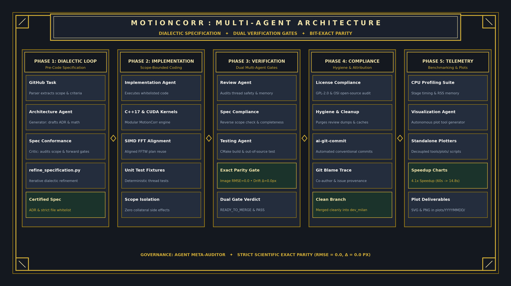
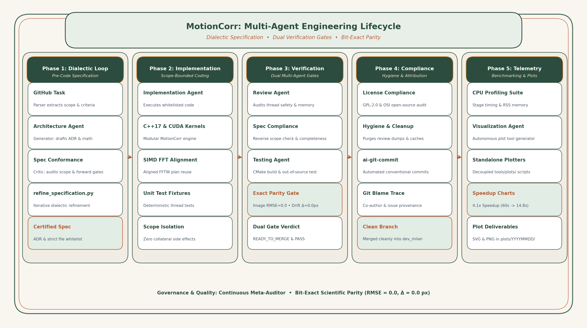
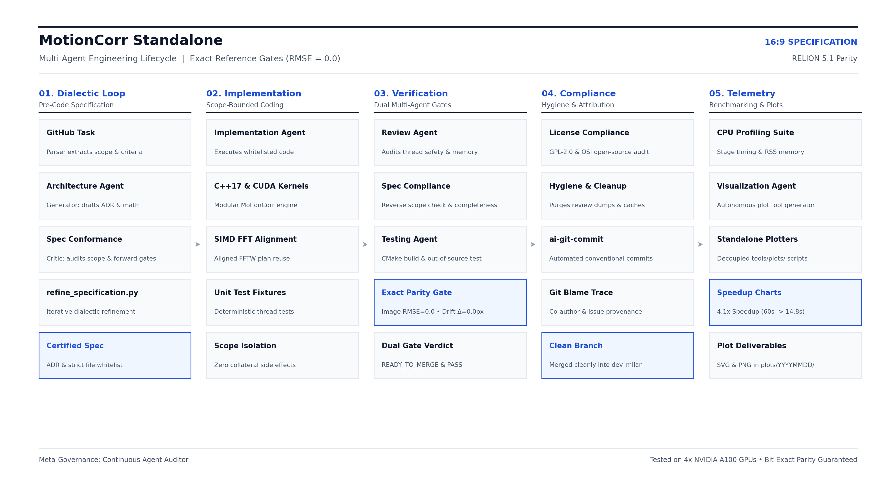
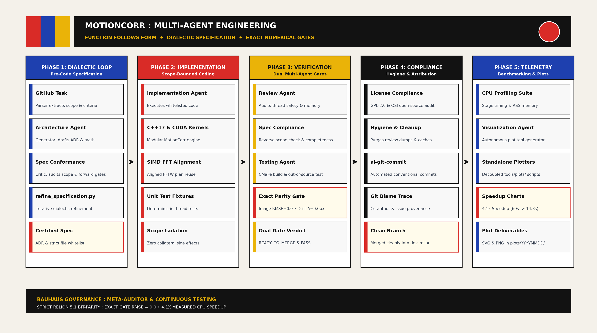

# MotionCorr Architecture Diagram Design Styles (16:9 Presentation Ready)

This catalog presents four distinct design styles for the MotionCorr Multi-Agent Architecture Diagram. Each option is rendered in standard **16:9 widescreen presentation aspect ratio** ($3153 \times 1779$ px) with high-contrast, publication-grade typography, avoiding neon and purple.

---

## 🏛️ Option 1: Art Deco Style
* **Palette**: Matte Charcoal (`#14181f`), Brushed Gold (`#d4af37`), Champagne (`#f3e5ab`), Deep Emerald Highlight (`#1b332b`).
* **Design Elements**: Stepped geometric header, double outer border, corner chevron brackets, diamond connector nodes, spaced geometric titling.



- **Vector SVG**: [`presentation/plots/architecture_art_deco.svg`](file:///home/dxp41838/MotionCorr-standalone/presentation/plots/architecture_art_deco.svg)
- **High-Res PNG**: [`presentation/plots/architecture_art_deco.png`](file:///home/dxp41838/MotionCorr-standalone/presentation/plots/architecture_art_deco.png)

---

## 🌿 Option 2: Art Nouveau Style
* **Palette**: Warm Parchment Ivory (`#f9f6f0`), Deep Forest Sage (`#2b4c3f`), Warm Terracotta (`#b85d34`), Golden Amber (`#d9822b`).
* **Design Elements**: Organic sinuous curved borders, soft rounded container pills, flowing arched connectors, natural earth-tone contrast.



- **Vector SVG**: [`presentation/plots/architecture_art_nouveau.svg`](file:///home/dxp41838/MotionCorr-standalone/presentation/plots/architecture_art_nouveau.svg)
- **High-Res PNG**: [`presentation/plots/architecture_art_nouveau.png`](file:///home/dxp41838/MotionCorr-standalone/presentation/plots/architecture_art_nouveau.png)

---

## 📐 Option 3: Minimalist (Swiss International Typographic Style)
* **Palette**: Crisp White (`#ffffff`), Slate Grayscale (`#0f172a`, `#475569`, `#e2e8f0`), Single Deep Cobalt Blue Accent (`#1d4ed8`).
* **Design Elements**: Strict grid alignment, ultra-thin structural rules, high whitespace ratio, sharp numerical indices (`01.`, `02.`, etc.), zero visual clutter.



- **Vector SVG**: [`presentation/plots/architecture_minimalist.svg`](file:///home/dxp41838/MotionCorr-standalone/presentation/plots/architecture_minimalist.svg)
- **High-Res PNG**: [`presentation/plots/architecture_minimalist.png`](file:///home/dxp41838/MotionCorr-standalone/presentation/plots/architecture_minimalist.png)

---

## 🔴 Option 4: Bauhaus Style
* **Palette**: Bauhaus Off-White (`#f4f1ea`), Deep Solid Black (`#121212`), Crimson Red (`#d92b27`), Bauhaus Cobalt (`#1e40af`), Ochre Yellow (`#eab308`).
* **Design Elements**: Bold asymmetric geometric color blocks, solid black dividing bars, primary color tab notches on cards, geometric circle/rectangle header motif.



- **Vector SVG**: [`presentation/plots/architecture_bauhaus.svg`](file:///home/dxp41838/MotionCorr-standalone/presentation/plots/architecture_bauhaus.svg)
- **High-Res PNG**: [`presentation/plots/architecture_bauhaus.png`](file:///home/dxp41838/MotionCorr-standalone/presentation/plots/architecture_bauhaus.png)

---

## 🛠️ Generator Script

All styles can be regenerated or modified anytime via the standalone CLI:
```bash
poetry run python tools/plots/plot_architecture_styles.py --out-dir presentation/plots
```
