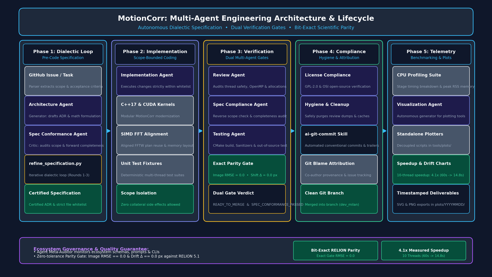
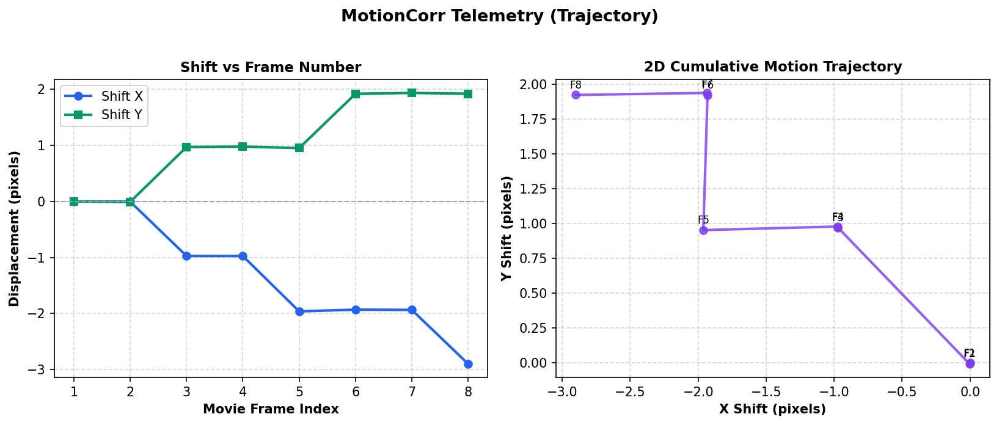
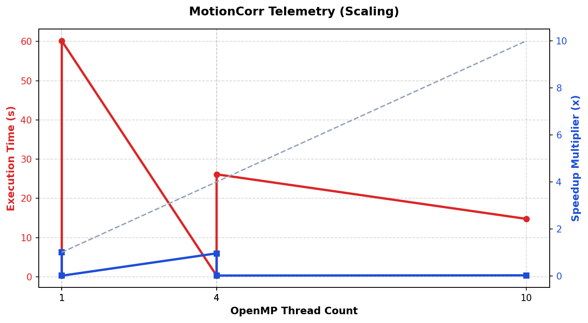
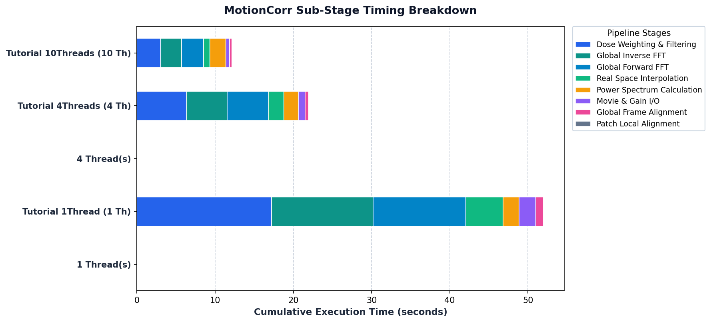

# 1-Minute Presentation: Agentic Engineering of Standalone MotionCorr

> **Target Duration**: 60 Seconds  
> **Speaker Delivery Pace**: ~130–145 words/min  
> **Audience**: Engineering Leads, Scientific Computing Researchers, AI Developers

---

## ⏱️ 60-Second Spoken Script

```text
[00:00 - 00:15] The Challenge & The Agentic Paradigm
"Cryo-EM motion correction is computationally intensive, and extracting RELION 5.1's engine 
demanded high performance without introducing even a single floating-point discrepancy. 
To solve this, we implemented an autonomous, multi-agent engineering lifecycle—pairing 
an Architecture generator with a Conformance critic in a dialectic loop before any code is written."

[00:15 - 00:30] Rigorous Quality & Dual Verification Gates
"Once approved, implementation agents execute strictly within bounded file whitelists. 
Every change is audited by memoryless Review, Testing, and License agents against our 
strict Reference Gates—guaranteeing bit-exact image RMSE of 0.0 and zero trajectory drift."

[00:30 - 00:45] Solved Bottlenecks & Concrete Results
"Across issues #4 through #10, we established reproducible CI, a profiling harness, and 
persistent SIMD FFTW plan caching across alignment and dose-weighting loops. 
On experimental Cryo-EM datasets, runtime dropped from 60 seconds down to 14.7 seconds—a 
4.1x multi-threaded speedup with deterministic thread execution."

[00:45 - 01:00] Autonomous Telemetry & Future Impact
"Finally, our Visualization Agent automatically ingests benchmark telemetry to scaffold 
and render SVG and PNG scaling, stage breakdown, and 2D drift plots. 
This proves agentic workflows can modernize complex scientific software safely, rapidly, 
and with mathematical precision."
```

---

## 📊 Slide-by-Slide Visual Deck & Telemetry

### Slide 1: The Multi-Agent Engineering Architecture (0:00 – 0:15)



- **Core Problem**: Standalone extraction of RELION 5.1 motion correction engine (`commit ad0b230`).
- **Safety Mechanism**: No code is modified without a certified Architectural Decision Record (ADR) approved through the dialectic refinement loop.

---

### Slide 2: Strict Reference Gates & Parity Verification (0:15 – 0:30)



- **Issue #4 (Reference Gates)**: Built automated comparator tooling (`tools/compare_motioncorr.py`) with `--gate exact` and `--gate relaxed`.
- **Golden Parity**: Bit-exact trajectory shift ($\Delta = 0.0\text{ px}$) and image matrix parity ($\text{RMSE} = 0.0$) maintained across single and multi-threaded runs.
- **Issue #5 (CI Infrastructure)**: Hermetic Linux matrix builds and smoke checks across toolchains.

---

### Slide 3: Performance Profiling & Bottleneck Optimization (0:30 – 0:45)





- **Issue #9 (CPU Profiling Suite)**: Instrumented stage timing breakdowns and memory telemetry (`tools/profile_cpu_benchmark.py`).
- **Issue #10 (FFTW Plan Caching)**: Replaced repeated plan creation/destruction in hot loops with persistent, SIMD-aligned `FloatPlan` instances across:
  - Global Fourier Transform & Inverse Transform
  - Cross-Correlation Function (CCF) patch alignment iterations
  - Dose-weighting temporal filtering
- **Measured Real-World Speedup** (Cryo-EM Tutorial Movie $3838 \times 3710 \times 40$ frames):
  - **1 Thread**: $60.14\text{ s} \pm 0.46\text{ s}$
  - **4 Threads**: $26.13\text{ s} \pm 0.53\text{ s}$ (**2.3x Speedup**)
  - **10 Threads**: $14.79\text{ s} \pm 0.84\text{ s}$ (**4.1x Speedup**)
  - **Peak Memory**: Strictly bounded ($3.37\text{ GB}$ peak RSS on 10 threads).

---

### Slide 4: Autonomous Telemetry & Conclusion (0:45 – 1:00)

- **Visualization Agent**: Automatically scaffolded standalone tools (`tools/plots/`) to export publication-quality vector (SVG) and raster (PNG) charts into timestamped directories (`plots/`).
- **CUDA & GPU Acceleration (Issues #16 & #27)**: Out-of-source CMake CUDA build verified on NVIDIA A100 GPUs.
- **Key Takeaway**: Multi-agent engineering with formal generator-critic feedback enables high-velocity modernization of mission-critical scientific software with zero risk of numerical regression.

---

## 📁 Presentation Assets Directory Inventory

All visual assets and scripts are organized in [`presentation/`](file:///home/dxp41838/MotionCorr-standalone/presentation/):
- **Spoken Script & Slides**: [`presentation/PRESENTATION_SCRIPT.md`](file:///home/dxp41838/MotionCorr-standalone/presentation/PRESENTATION_SCRIPT.md)
- **16:9 PowerPoint Workflow Diagram (PNG)**: [`presentation/plots/agentic_workflow_diagram.png`](file:///home/dxp41838/MotionCorr-standalone/presentation/plots/agentic_workflow_diagram.png)
- **16:9 PowerPoint Workflow Diagram (SVG)**: [`presentation/plots/agentic_workflow_diagram.svg`](file:///home/dxp41838/MotionCorr-standalone/presentation/plots/agentic_workflow_diagram.svg)
- **Scaling Plot (PNG)**: [`presentation/plots/issue_10_benchmark_data_scaling.png`](file:///home/dxp41838/MotionCorr-standalone/presentation/plots/issue_10_benchmark_data_scaling.png)
- **Scaling Plot (SVG)**: [`presentation/plots/issue_10_benchmark_data_scaling.svg`](file:///home/dxp41838/MotionCorr-standalone/presentation/plots/issue_10_benchmark_data_scaling.svg)
- **Stage Breakdown (PNG)**: [`presentation/plots/issue_10_benchmark_data_stages.png`](file:///home/dxp41838/MotionCorr-standalone/presentation/plots/issue_10_benchmark_data_stages.png)
- **Stage Breakdown (SVG)**: [`presentation/plots/issue_10_benchmark_data_stages.svg`](file:///home/dxp41838/MotionCorr-standalone/presentation/plots/issue_10_benchmark_data_stages.svg)
- **2D Trajectory Plot (PNG)**: [`presentation/plots/synthetic_128x128_8frames_trajectory.png`](file:///home/dxp41838/MotionCorr-standalone/presentation/plots/synthetic_128x128_8frames_trajectory.png)
- **2D Trajectory Plot (SVG)**: [`presentation/plots/synthetic_128x128_8frames_trajectory.svg`](file:///home/dxp41838/MotionCorr-standalone/presentation/plots/synthetic_128x128_8frames_trajectory.svg)
